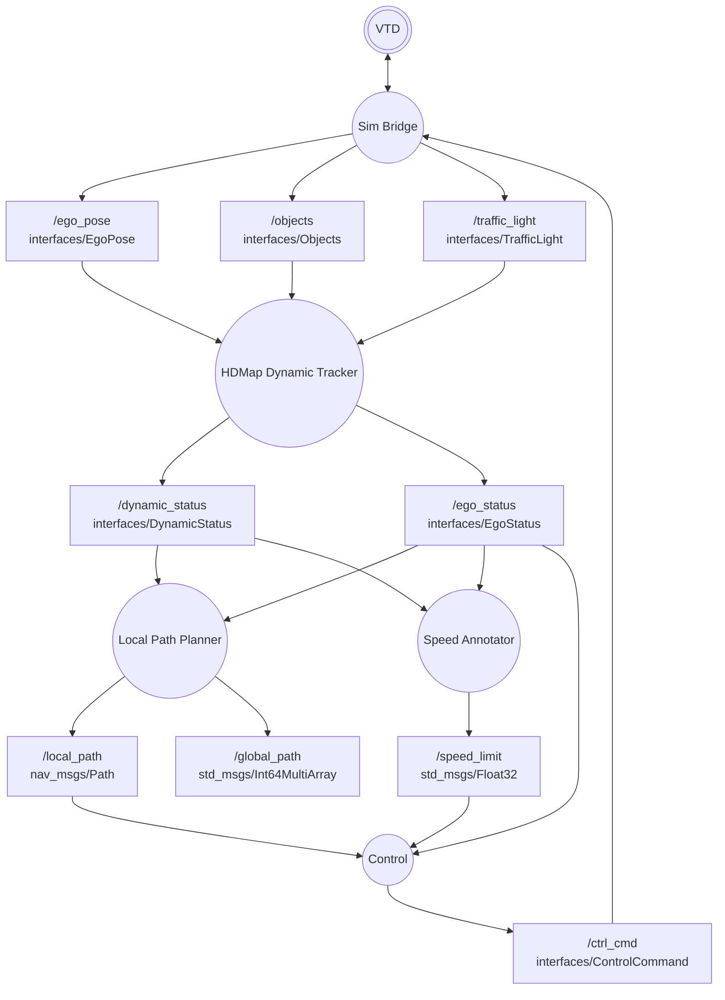
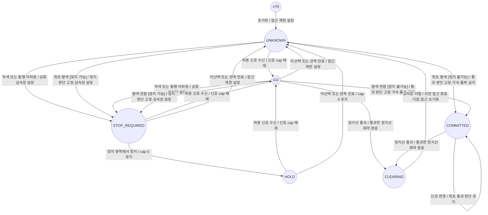
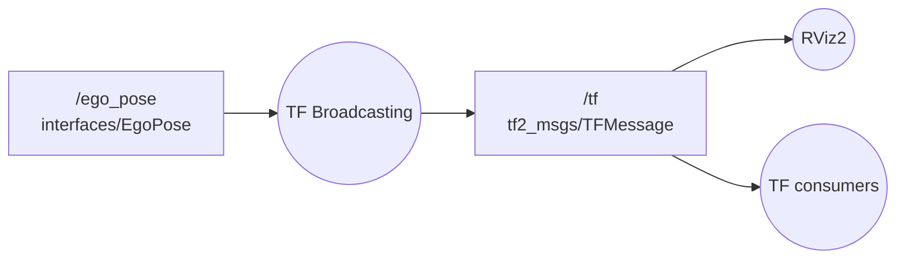
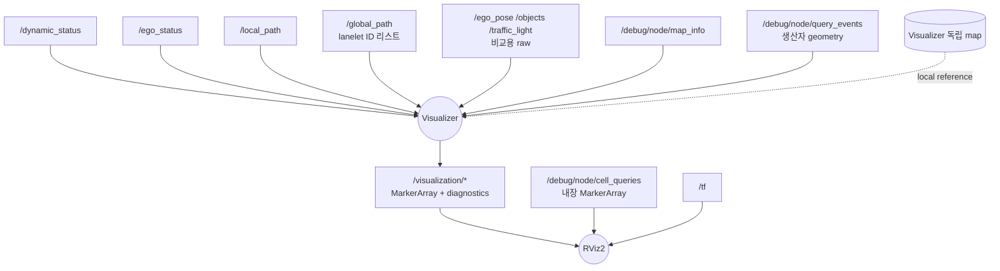

# HL-FMA2026-sim-stier

HL Mando Future Mobility Award 2026 시뮬레이션 부문을 위한 ROS 2 Jazzy 자율주행 SW 설계.
카메라 인지 없이 대회 API의 Ego·객체·신호 정보를 사용한다. Planner는 정적 지도·dynamic status·ego status로 계획하며 Controller는 local path·ego status·speed limit만 구독한다.

> 설계 계약 초안. C++17 Cell·CellTree·Lanelet 로더·hdmap_init·정지선 역색인·신호 레지스트리·Python binding과 오프라인 지도 제작 도구는 구현했다. 정적 지도는 `map/hdmap.bin`에 생성했으며, 신호 매핑·법정 제한속도 범위가 일부 미확정이므로 대회 주행 승인본은 아니다. 신호 규칙/Tracker·실행 노드·ROS marker adapter·launch는 아직 구현하지 않았다. 설정 YAML과 custom msg 6종도 후속 구현의 초안이며 현재 빌드 가능한 ROS workspace가 아니다.
> [VTD 종합 검토·심 계약·검증 과제](docs/04-vtd-design-review.md)를 함께 읽는다. 배포 확인값, 설계 기본값, 실측 미확인을 구분한다.

## Convention

코드·설정·스크립트의 들여쓰기는 탭 대신 공백 4칸을 사용한다. 문법상 탭이 필수인 Makefile recipe만 예외다. 별도 편집기 설정 파일 없이 이 Convention을 따른다.

### 좌표계 및 Fixed Frame

| 항목 | 계약 |
|---|---|
| Fixed Frame | `map` |
| `map` | VTD/XODR 지도에 고정된 XYZ 좌표. 자동차가 움직이거나 회전해도 원점·축은 움직이지 않음. 오른손 좌표계, +z 위 |
| `base_link` | Ego 후륜축 중심의 중립 하중 노면 기준점. +x 전방, +y 좌측, +z 위 |
| 단위 | m, s, m/s, m/s², rad. heading/yaw, pitch, roll은 rad |
| 기본 RViz | top-down, 화면 위 +x, 왼쪽 +y. 차량 중심을 따라가되 월드 방향 고정 |
| TF | 모든 TF는 `tf_broadcasting` 노드만 발행 |

화면 방향은 RViz 카메라 설정으로 맞추며 지도 좌표를 회전시키지 않는다. 차량 프레임은 차체 pitch/roll에도 움직인다. 충돌 box 중심은 후륜축과 다르므로 차량 config의 오프셋을 적용한다. 2D 충돌 근사와 3D 표시의 차이를 공개한다.

### Timestamp

- `/clock` 없이 `use_sim_time=false`를 사용한다.
- Bridge는 같은 API 패킷에서 나온 토픽들에 동일한 `Header.stamp`를 넣는다. 이 값은 수신 시각이다.
- Tracker의 `/ego_status`와 `/dynamic_status`는 입력 Header 시각을 계승한다.
- Planner·Annotator는 필요한 두 입력의 Header 시각을 맞춰 사용한다. Path와 TF도 원본 시각을 계승한다.
- 여러 입력을 사용하는 알고리즘의 기준 시각은 Ego 입력 Header다. 제어 명령 Header는 명령 생성 시각이다.
- `/speed_limit`은 Float32 하나라 Header가 없다. 따라서 값만 알 수 있고 어느 시각의 계산 결과인지는 알 수 없다.
- 별도 sequence/session/reset ID, valid 플래그, map_version 메시지 필드는 지금 넣지 않는다.

### QoS 및 큐잉

주행 토픽은 발행·구독 모두 **BEST_EFFORT / VOLATILE / KEEP_LAST(1)**.

- BEST_EFFORT: 전달 실패 시 재전송 보장을 요구하지 않는다.
- VOLATILE: 구독을 시작하기 전의 과거 값을 전달하지 않는다.
- KEEP_LAST(1): 대기 중인 메시지는 최신 하나만 보관한다. 이미 계산 중인 콜백을 취소하는 기능은 아니다.
- 알고리즘 입력도 최신 한 벌만 보관하고 무한 대기열을 만들지 않는다.
- QoS deadline/lifespan 같은 추가 옵션은 현재 별도로 설정하지 않는다. TF는 tf2 기본 QoS를 따른다.

deadline은 기대하는 메시지 간격, lifespan은 오래된 메시지의 보관 수명이다. watchdog은 일정 시간 입력이 오지 않는지 확인하는 로컬 타이머를 뜻한다. 지금은 별도 QoS 옵션을 추가하지 않는다.

설정은 루트의 [config/runtime.yaml](config/runtime.yaml), 차량 제원은 [config/vehicle.yaml](config/vehicle.yaml)에 둔다. bringup 패키지는 두지 않고 루트 `run.sh`가 실행을 담당한다.

## 패키지 구조 설계

```text
src/
├── interfaces/                  # 주행 토픽의 custom msg 6종
├── hdmap/                       # 정적 맵 코어·R-tree·binding
├── sim_bridge/                  # 계획: 참가자 TCP API 중계
├── hdmap_dynamic_tracker/       # 계획: ego 추정, 예측기, 신호 상태기, cell 갱신
├── local_path_planner/          # 계획: checkpoint routing, 시간 고려 Hybrid A*
├── speed_annotator/             # 계획: 현재 ego cell cap 발행
├── control/                     # 계획: 별도 담당 MPC, 제한·watchdog
├── tf_broadcasting/             # 계획: 모든 TF 발행 전담
└── visualization/               # 계획: 독립적인 raw/debug 표시
```

루트 `config/`에는 runtime.yaml, vehicle.yaml과 오프라인 지도 제작용 map.yaml을 둔다.
지도 생성본은 루트 `map/`, 재생성·에셋 분석·오프라인 검사 도구는 `map/tools/`에 둔다. 주행 중 사용하는 지도 라이브러리는 `src/hdmap/`에 유지한다.

실행 노드 간에는 ROS로 통신한다. `interfaces`, `hdmap` 공용 의존성은 허용한다. 실행 노드 소스를 서로 import하지 않는다. 동일 C++ 지도 라이브러리와 Python 바인딩을 배포하며 코드를 각 노드에 복사하지 않는다.

### 정적 지도 및 CellTree

- 생성된 지도는 [map/hdmap.bin](map/hdmap.bin)이다. [제작 결과·에셋 보강 근거·재생성 방법](docs/06-static-map.md)에 좌표 보정, 미확정 항목, native 로드·경로 검사 결과를 기록한다.
- 필요한 노드는 `hdmap::hdmap_init(path)`를 한 번 호출해 Lanelet2·cell·R-tree를 자기 메모리에 구성한다. 지도 서버·조회 RPC·프로세스 간 공유 singleton은 두지 않는다.
- cell ID는 사전 확정하며 dynamic 배열의 인덱스로 사용한다. 메모리 로드 때 ID를 다시 만들지 않는다.
- lanelet을 진행 방향으로 약 1m씩 나누고 차선 전체 폭을 사용한다. 마지막 cell과 정지선 경계에서는 더 짧을 수 있다.
- Cell geometry는 lanelet 경계의 Point3d를 자른 polygon이다. bounding box는 R-tree 후보 조회용이고, 최종 교차는 cell polygon과 객체 box로 검사한다.
- lanelet 조회는 기존 Lanelet2 라이브러리를 사용한다. 별도 get_lanelet wrapper는 만들지 않는다.
- Lanelet과 사전 제작 Cell polygon을 함께 저장한 `hdmap.bin`을 읽는다. R-tree는 저장된 Cell bounding box/ID로 bulk-load한다. 트리 내부 노드 구조를 파일에서 역직렬화하는 방식은 아니며, 런치 때 Cell 분할이나 ID 생성은 하지 않는다.
- C++와 Python 모두 같은 코어를 사용한다. Python 빌드·설치법은 [hdmap README](src/hdmap/README.md)의 Python 항목을 따른다.

**C++ — 프로세스마다 초기화**

```cpp
#include "hdmap/hdmap.hpp"

auto static_map = hdmap::hdmap_init("/path/to/hdmap.bin");
const auto& lanelet_map = static_map->laneletMap();
const auto& cells = static_map->cells();
const auto& cell_tree = static_map->cellTree();
const auto& stopline_cells = static_map->stoplineCells();
const auto& signals = static_map->signalRegistry();
const auto lanelet = lanelet_map.laneletLayer.get(cells.at(0).parent().lanelet_id);
```

`static_map`은 노드 멤버로 보관해 조회하는 동안 유지한다. HdMap의 복사/이동은 금지하며 반환된 unique_ptr 자체는 이동할 수 있다. 모든 Cell 배치를 마친 뒤 R-tree와 역색인을 만들고 previous를 연결한 후 반환한다. Lanelet 지도만 필요하면 별도 wrapper 없이 `lanelet::load(path, projector)`를 직접 사용한다. `.bin`은 사전에 확정한 map 좌표를 유지한다. `.osm` 전체 초기화는 `hdmap_init(path, projector)`에 변환 때와 같은 명시적 Lanelet2 projector를 전달해야 한다.

hdmap은 Lanelet2의 동일 기능·자료형을 재선언하지 않는다. bounding box는 `lanelet::BoundingBox3d`, XY polygon은 `lanelet::BasicPolygon2d`, Lanelet/정지선 ID는 `lanelet::Id`를 사용한다. 형상 변환·bounding box 계산·지도 로드는 `lanelet::traits::toBasicPolygon2d`, `lanelet::geometry::boundingBox2d/3d`, `lanelet::load`를 직접 호출한다. Cell ID는 dynamic 배열 인덱스 계약 때문에 uint32를 유지한다. CellTree는 Cell ID 반환·높이 필터·debug callback이라는 고유 역할만 더한다. 경계 접촉도 포함하는 교차 검사는 Lanelet2 타입의 Boost Geometry 어댑터로 `boost::geometry::intersects`를 사용한다.

**사전 데이터 계약**

Lanelet2 map의 polygonLayer에 다음 속성을 가진 Cell polygon을 저장한다. Polygon ID는 Lanelet2 primitive ID이고 `cell_id`와 별개다. polygon의 Point3d는 사전 분할한 경계점이며 ID와 좌표를 로드 중 바꾸지 않는다.

| polygon 속성 | 의미 |
|---|---|
| `type=hdmap_cell` | 일반 polygon과 Cell 구분 |
| `cell_id` | 0부터 빈 번호 없이 사전 확정한 dynamic 배열 인덱스 |
| `parent_lanelet_id` | 같은 map의 부모 Lanelet ID |
| `index_in_lanelet` | 부모 진행 방향 시작부터 0-based 순서 |
| `stopline_ids` | 선택 속성; 쉼표로 구분한 정지선 ID, 없으면 빈 목록 |
| `previous_cell_id` | 선택 속성; 사전 확정한 이전 Cell ID, 특히 lanelet 경계 연결에 사용 |

Cell 저장소는 저장된 ID 순으로 배치하지만 ID를 재할당하지 않는다. previous가 생략되면 같은 부모의 index-1을 연결하고 index=0은 nullptr다. 합류점의 상류를 임의 선택하지 않는다. 데이터가 없는 일반 Lanelet 지도만 넣으면 자동으로 1m 분할하지 않고 초기화 오류로 알린다. 현재 Cell 데이터는 오프라인에서 생성해 `hdmap.bin`에 포함했다. 지도나 분할 설정을 바꿔 재생성하면 ID가 달라질 수 있으므로 모든 프로세스는 같은 생성본을 사용한다. `.bin`은 [Lanelet2 IO의 바이너리 포맷](https://docs.ros.org/en/ros2_packages/kilted/api/lanelet2_io/index.html)을 사용하며 제작/배포 Lanelet2·Boost 버전을 맞춘다.

**C++ — 현재 Cell API**

```cpp
#include "hdmap/cell.hpp"

const auto& cell = cells[cell_id];
const auto id = cell.id();
const auto lanelet_id = cell.parent().lanelet_id;
const auto order = cell.parent().index_in_lanelet;
const auto& polygon = cell.polygon3d();
const auto& box = cell.boundingBox3d();
const auto& stoplines = cell.stoplineIds();
const bool on_stopline = cell.isStopline();
const auto stopline_cells = hdmap::makeStoplineCellIndex(cells);
```

**Python — 공식 Lanelet2 Python 타입과 호환**

```python
from hdmap import hdmap_init

static_map = hdmap_init("/path/to/hdmap.bin")
cells = static_map.cells()
cell = cells[cell_id]
cell_id = cell.id
lanelet_id = cell.parent().lanelet_id
order = cell.parent().index_in_lanelet
polygon = cell.polygon3d()
box = cell.boundingBox3d()
stoplines = cell.stoplineIds()
on_stopline = cell.isStopline()
stopline_cells = static_map.stoplineCells()
```

**CellTree — 구현된 C++ API**

```cpp
lanelet::BoundingBox3d query_box(
    lanelet::BasicPoint3d(0.0, 0.0, -0.5),
    lanelet::BasicPoint3d(10.0, 5.0, 2.0));
const auto candidates = cell_tree.search(query_box);

lanelet::BoundingBox2d xy_box(lanelet::BasicPoint2d(0.0, 0.0), lanelet::BasicPoint2d(10.0, 5.0));
const std::vector<hdmap::CellId> xy_candidates = cell_tree.search(xy_box);

lanelet::BasicPolygon2d object_footprint{
    {1.0, 1.0}, {3.0, 1.0}, {3.0, 2.0}, {1.0, 2.0}};
const auto overlaps = cell_tree.queryOverlaps(object_footprint, -0.5, 2.0);
```

**Python — 같은 CellTree 조회**

```python
from lanelet2.core import BasicPoint2d, BoundingBox2d

cell_tree = static_map.cellTree()
query_box = BoundingBox2d(BasicPoint2d(0, 0), BasicPoint2d(10, 5))
candidates = cell_tree.search(query_box)
object_footprint = [BasicPoint2d(1, 1), BasicPoint2d(3, 1), BasicPoint2d(3, 2), BasicPoint2d(1, 2)]
overlaps = cell_tree.queryOverlaps(object_footprint, -0.5, 2.0)
```

search는 3D 축 정렬 box와 겹친 후보 ID를 반환한다. queryOverlaps는 객체 footprint의 후보 조회 후 실제 Cell polygon과 XY 교차를 검사한다. 회전 객체는 map 좌표로 회전·이동한 꼭짓점을 전달한다. 경계 접촉도 교차이며, z는 [min_z, max_z]와 Cell 높이 범위의 겹침으로 거른다. 이는 3D mesh 충돌이 아니며 경사로의 정확한 표면 교차를 계산하지 않는다. 반환 순서는 R-tree 탐색 순서이며 주행 순서를 뜻하지 않는다.

두 조회 메서드는 결과가 없어도 연결된 debug sink를 호출한다. `hdmap_init(path, sink)`의 sink에는 `(operation, vector<const Cell*>)`가 전달되며 실제 조회한 프로세스의 Cell geometry/bounding box다. callback은 동기 호출이고 포인터는 HdMap 수명 내에서만 유효하다. 기본 코어는 ROS를 요구하지 않으며 publisher 연결과 MarkerArray 집계/삭제 adapter는 아직 미구현이다. 따라서 sink를 연결하지 않은 조회가 이미 RViz에 표시된다고 보지 않는다.

## ROS architecture

노드는 원, 토픽은 사각형. Visualizer와 TF 노드는 별도 그림으로 분리한다.



### Nodes

#### Sim Bridge

심 API ↔ ROS topic 중계. API 데이터를 ROS 메시지로 번역하고 ROS 제어 명령을 심 API 형식으로 번역한다.

#### HDMap Dynamic Tracker

- 같은 시각의 pose·objects·traffic light를 받아 cell의 speed cap과 occupancy를 갱신한다.
- `/dynamic_status`는 Header와 모든 cell의 speed cap/occupancy 배열만 담는다.
- `/ego_status`는 Header와 x/y/z/heading/pitch/roll/speed만 담는다. 위치는 map 기준 후륜축 위치다.
- 속도는 연속 pose의 XY 이동 거리를 Header 시각 차이로 나눈 값이다. 첫 입력·0 이하 시간 차이·설정한 300km/h 초과 점프는 0으로 처리한다. 별도 상태 플래그는 추가하지 않는다.
- 현재 객체와 교차한 cell은 점유 1.0. 미래는 0.5초 구간 중 잠깐이라도 교차하면 점유 처리한다.
- 예측기는 `motion_predictor.hpp / ekf_predictor.cpp`로 분리해 다른 담당자가 구현한다. CV는 등속도 모델이며 카메라가 아니다.
- 객체 reference point를 box 중심으로 바꾸는 작업은 [별도 조사](docs/05-object-reference-resolution.md)를 따른다. 실행 비교는 지도 제작 단계에서 함께 한다.

#### Speed Annotator 및 Control 입력

Annotator는 EgoStatus의 x/y/z로 현재 cell을 찾고 DynamicStatus의 해당 speed cap을 `/speed_limit`으로 발행한다. ego cell ID를 메시지에 따로 넣지 않으며 Path를 구독하지 않는다. 현재 cell을 찾지 못하면 cap=0으로 처리한다.

Control은 `/ego_status`, `/local_path`, `/speed_limit`만 구독한다. 위치·자세·속도는 EgoStatus에서 받고 전체 DynamicStatus나 raw 객체/신호는 구독하지 않는다. `/speed_info`는 만들지 않는다.

#### 신호 선택과 상태기

확인한 플러그인의 API ID는 램프의 `signal id`가 아니라 **controller ID**다.

controller는 여러 lamp의 상태를 제어하는 단위이며 교차로 ID가 아니다. 한 교차로에 여러 controller가 존재할 수 있다. movement는 그 접근 차선이 교차로에서 수행할 직진/좌회전/우회전 통행이다. 연결은 자동으로 주어지는 직렬 체인이 아니라 두 관계다: `controller → 물리 lamp IDs`는 XODR control 참조, `(controller, 통행 방향) → 해당 차선의 stopline cell IDs`는 검증해 탑재할 규칙 매핑이다. 예를 들어 같은 controller 아래 직진은 red, 좌회전은 허용인 경우 어떤 정지선의 cap을 내릴지 구별하는 용도다.

신호 식별 전용 ROS 노드는 추가하지 않는다. offline 매핑을 Tracker에 로드해 raw API controller ID를 lookup하고 상태기/유효성 검사만 수행한다. 기존 Visualizer는 controller에 연결된 물리 lamp 집합을 표시한다. 미등록 ID와 80/82/84/86은 unknown으로 남기며 최종 지도 대조 때 해결한다. 물리 lamp별 현재 색을 API 하나로 모두 알 수 있다고 표시하지 않는다.

```text
(XODR road_id, sign(lane_id)) → plugin 선택 controller_id
→ XODR controller/control/@signalId → 정지선 / cell 목록 / movement / 허용 state
```

내장 선택 테이블은 135개. 거리순이 아니며 같은 부호의 lane은 같은 항목에 매칭된다. 같은 맵·플러그인·매핑이면 재등장/재시작으로 ID를 새로 발급하지 않는다. 다른 지도 버전에서 물리 위치만 같다고 같은 ID를 보장하지 않는다.
**controller 80/82/84/86은 매핑·시나리오에는 있으나 배포 XODR 최상위 controller에는 없다.** 해당 접근로는 검증 완료로 표시하지 않는다. [상세 근거](docs/04-vtd-design-review.md#5-신호-id-lamp가-아니라-controller)

상태기는 controller+접근로+movement별. 별도 stop_constraint 토픽 없이 cell cap으로 반영한다.



도식은 구현 예정 설계다. 상태는 원, 간선은 `이벤트 [조건] / 액션`으로 표시한다. 신호 cap 해제는 객체·정적 속도 제한까지 해제한다는 뜻이 아니다. UNKNOWN에서도 접근 제한을 유지한다. STOP_REQUIRED/HOLD에서 황색이 계속되면 정지 판단을 유지하고, COMMITTED는 최초 황색 판단을 해당 접근 동안 유지한다. COMMITTED/CLEARING에서도 객체 충돌 제약은 해제하지 않는다. 차량 재배치나 새 시나리오는 현재 접근 상태를 초기화한다.

| 상태 | 규칙 |
|---|---|
| UNKNOWN | 미선택·0·미매핑·만료·reset. green 추정 금지, 정지선 접근 제한 |
| GO | 해당 movement 허용 상태 확인. 신호 cap 제거, 객체 제약 유지 |
| STOP_REQUIRED | red 또는 yellow 최초 관측 시 정지 가능. 상류 감속장 설정 |
| HOLD | 정지 영역에서 정지/저속. 허용 신호 전 cap=0 |
| COMMITTED | yellow 최초 판단에서 검증된 정지거리 내 정지 불가능. 판단 latch, 가속 돌파 금지 |
| CLEARING | 정지선 통과 후 교차로 이탈까지. 뒤쪽 정지선 때문에 중간 정지 금지, 객체 위험 제약 유지 |

yellow 판단은 최초 전환에 latch한다. API ID 교체는 이전 controller의 색상 변경이 아니다. 이전 색상은 history이며 최신 통과 허용이 아니다. 이미 진입한 CLEARING은 통과 종료까지 유지한다.
초기 보수 허용 mask는 직진 {3,5}, 좌회전 {4,5}. 우회전/비보호는 대회 규칙별 검증한다. state 6은 점멸 색을 모르므로 임의 통과 허용 금지.
정적 매핑은 좌회전/직진 정지선·cell을 구분한다. 공용 cell의 허용이 충돌하면 cap의 min으로 처리하고 scalar 표현 한계로 막힐 수 있음을 표시한다.
선택이 늦은 신호도 정적 접근로 매핑으로 미리 UNKNOWN 제한을 적용한다. 미관측 신호를 시나리오 주기로 추정해 green으로 만들지 않는다.

#### 선형 Speed Cap 및 Control

Tracker가 정지선 상류 cell에 거리 기준 선형 감소장을 기록한다. Annotator는 현재 cell만 읽으며 Path를 구독하지 않는다.

최종 cell speed cap은 정적 차선 제한과 모든 동적 제한의 최솟값인 유한 비음수 m/s다. 정적 제한이 없으면 명시적 설정이 필요하며, 미설정 구간은 cap=0으로 처리한다. 차량 치수·모델값은 [vehicle.yaml](config/vehicle.yaml), 미보정 제동값과 표시 설정은 [runtime.yaml](config/runtime.yaml)에 분리한다. YAML은 설계 schema이며 아직 ROS parameter 파일이 아니다.

확인된 어린이 보호구역의 운용 cap은 `speed.school_zone_speed_cap_mps=8.0` 기본값으로 설정한다. 원본 제한이 30km/h라면 지도 규칙의 출처 값과 운용 여유 cap을 구분하고 더 낮은 제한이 있으면 최솟값을 사용한다. 모든 도로의 기본 제한을 8로 바꾸는 설정이 아니다. 정적 Cell에는 제한속도를 중복 저장하지 않고 부모 Lanelet2 규칙과 구역 설정에서 조회한다.

```text
d_brake(v_entry) = 실측 제동거리 표 또는 초기 v_entry² / (2 × a_design)
d_linear_base    = max(d_brake(v_entry), v_entry² / a_design)
d_ramp           = braking_distance_factor × d_linear_base
d_start          = v_entry × latency_budget + stop_margin + d_ramp
speed_cap(d)     = v_entry × clamp((d - stop_margin) / d_ramp, 0, 1)
```

`d`는 cell 내 가장 정지선에 가까운 후륜축 위치에서 앞범퍼까지 반영한 경로상 여유 거리. v_entry는 접근 episode 기준값으로 고정하고 매 frame 현재 속도로 감속장을 축소하지 않는다. 지연 여유 동안 v_entry가 유지될 수 있도록 d_start를 확보한다.
factor>=1, 1이 가장 늦고 적극적인 감속이다. **최대제동거리 v²/(2a)에서 선형 v(d)를 시작하면 초입 요구 감속이 2a라서 불가능하다.** 선형장 base 거리를 별도 산정하고 보정을 config/표시에 공개한다. 0에 점근하는 선형장은 stop_margin 영역 cap=0과 저속 HOLD로 마무리한다. 실제 feasibility는 cell 이산화·지연·경사까지 시험한다.
Controller는 `v_actual > v_cap + overspeed_tolerance`이면 설정한 최대 음의 targetAccel로 override한다. 페달 답력 명령이 아니다. MPC 제동과 override를 구분해 기록하고 작은 초과로 가속/최대제동이 교대하지 않도록 hysteresis를 검증한다. 가속도 0은 정지 명령이 아니다.

#### Control 최대제동 override 계약

위 초과속도 조건에서는 MPC 가속 명령보다 최대제동 요청을 우선한다. 전송값은 config의 검증된 음수 `speed.emergency_target_acceleration_mps2`다. 해제는 `v_actual <= v_cap + overspeed_release_tolerance`일 때이며 release tolerance는 진입 tolerance보다 작게 설정한다. 명령은 최대 감속을 요구하는 것이지 `brakePedal=1.0` 또는 실제 최대제동 달성을 보장하는 것이 아니다. API에는 페달 필드가 없다. 제동 보정값 null/비음수 또는 차량 보정 미완료 상태에서는 motion enable을 금지한다. 신호 제약 cap=0에서 정지 유지를 위한 HOLD도 필요하다.

제동 보정은 실제 차량이 아니라 VTD Operation의 동일 Ego 모델에서 수행한다. 여러 초기 속도로 직선 주행한 뒤 설정 범위 안의 음의 targetAccel을 단계적으로 시험하고 명령 송신→감속 시작 지연, 실제 속도 감소율, 정지까지 이동 거리, 정지 유지 여부를 기록한다. 더 강한 요청에도 감속이 늘지 않는 포화와 정상 동작 범위를 확인해 emergency target을 선택하고, 측정 제동거리 표와 보수적인 design deceleration/latency budget을 config에 기록한다. 마지막으로 cap 초과 override와 선형 감속장에서 앞범퍼의 정지선 미침범을 재검증한다. 수신 시각만 있으므로 real-time 조건과 네트워크 지연을 함께 기록하고 현재 API 속도 추정 오차도 고려한다. 이번 Cell 코어 작업에서 이 실험은 수행하지 않았다.

#### Local Path Planner

- checkpoint CSV의 순서와 x/y를 사용한다. 단위 m, frame은 map. 예제는 최종 평가 경로가 아니다.
- 남은 checkpoint를 `shortestPathVia`로 통과한다. ego lanelet은 heading·이전 route·위치로 결정한다.
- 바로 다음 lanelet을 목표로 삼으며 옆 차선도 정상 목표. 그 안의 도달 가능한 pose를 local goal로 정한다.
- primitive마다 `min(target_speed, cell.speed_cap, static_lane_speed_limit)`과 가감속 한계로 도착시간 적분. 탐색 key는 시간·속도 차이를 구분한다.
- ego 전체 box의 swept footprint와 시간 구간을 대조한다. snapshot 이후 계산/전송 지연도 반영한다. 6초 범위 밖을 free로 보지 않는다.
- Path는 기하 경로다. Controller 속도가 내부 계획과 달라질 수 있어 도착시간 창·10Hz 재계획을 사용하고 허용 추종 오차 초과 시 정지한다. Path+Float32만으로 엄밀한 timed trajectory 실행은 보장하지 않는다.
- 중심 선호는 soft cost, 충돌·금지 실선 횡단은 hard constraint. FOLLOW/CHANGE/SETTLE 상세는 Planner 세션에서 확정한다.
- 경로 없음은 빈 Path. 과거 경로를 새 stamp로 재포장하지 않는다. Controller는 빈/만료 경로에서 정지한다.

#### 글로벌 경로 계산과 표시

RoutingGraph는 프로세스 초기화 때 한 번 만들고, Planner의 10Hz 계획 tick마다 현재 ego lanelet에서 남은 checkpoint를 통과하는 shortestPathVia를 계산하는 단순안을 우선 구현한다. 지도 재로드/graph rebuild는 매 tick 하지 않는다. 이미 통과한 checkpoint는 다시 via에 넣지 않으며 같은 lanelet을 재방문하는 경우에도 checkpoint 순서를 보존한다. 실제 그래프 성능은 변환 후 측정한다.

Lanelet2 shortestPathVia는 연속 경유지 쌍마다 shortestPath를 호출한다. 현재 XODR은 좌우 driving lane-section 2,480개다. 변환 후 수천~낮은 수만 노드의 희소 그래프를 예상하므로 10Hz 자체를 비현실적이라고 판단하지 않는다. 이는 실측 성능이 아니다. 글로벌 탐색의 초기 예산은 10ms/tick, 전체 계획 deadline은 100ms 미만으로 잡고 p50/p95/max를 측정한다. 예산을 넘을 때만 checkpoint suffix 캐시 등의 최적화를 적용한다. 동적 점유는 우선 local 회피 대상으로 둔다.

Planner는 shortestPathVia 결과의 lanelet ID 리스트를 순서 그대로 `/global_path`로 발행한다. 타입은 `std_msgs/msg/Int64MultiArray`, data=ordered lanelet IDs, layout.dim=[], layout.data_offset=0. 반복 ID를 제거하지 않는다. 탐색 실패/유효하지 않은 입력은 빈 리스트를 발행하고 이전 경로를 성공 결과처럼 반복하지 않는다. BEST_EFFORT / VOLATILE / KEEP_LAST(1), 계산 결과당 한 번 발행한다. 별도 GlobalRouteDebug 타입과 geometry payload는 사용하지 않는다.

Visualizer는 lanelet ID 리스트를 자기 Lanelet2 맵에서 조회해 그린다. 이는 Planner의 원본 geometry가 아니라 Visualizer 맵으로 복원한 표시임을 구분한다. 서로 다른 맵을 로드한 경우를 숨기지 않으며 차선변경 연결을 실제 local 궤적처럼 매끈하게 이어 그리지 않는다.

#### Cell 클래스 (C++17 코어 구현)

정적 Cell과 frame별 DynamicStatus는 별도로 둔다. [cell.hpp](src/hdmap/include/hdmap/cell.hpp)에 Cell 값 타입과 정지선 역색인을 구현했다. 신호 허용 규칙은 Tracker 책임이며 미구현으로 남긴다. 별도 signal_mapping.hpp는 두지 않는다. [상세 API/예제](src/hdmap/README.md)를 따른다.

실제 코드에서 구현 본문과 일부 접근자만 생략한 구조 요약이다. 별도 Point3d/BoundingBox를 선언하지 않고 Lanelet2 자료형을 사용한다.

```cpp
using CellId = std::uint32_t;
using StoplineId = lanelet::Id;

struct CellParent {
    lanelet::Id lanelet_id;
    std::uint32_t index_in_lanelet;
};

class Cell {
public:
    Cell(CellId id, CellParent parent, lanelet::ConstPolygon3d geometry,
         std::vector<StoplineId> stopline_ids = {});

    const lanelet::ConstPolygon3d& polygon3d() const noexcept;
    const lanelet::BoundingBox3d& boundingBox3d() const noexcept;
    bool isStopline() const noexcept;
    const Cell* previous() const noexcept;
    void setPrevious(const Cell* previous) noexcept;

private:
    CellId id_;
    CellParent parent_;
    lanelet::ConstPolygon3d geometry_;
    lanelet::BoundingBox3d bounding_box_;
    std::vector<StoplineId> stopline_ids_;
    const Cell* previous_ = nullptr;
};
```

`index_in_lanelet`은 부모 lanelet의 주행 시작점부터 진행 방향으로 0,1,2,…다. s_begin/s_end는 삭제하며 index를 거리로 해석하지 않는다. 마지막/정지선 경계 cell 길이가 달라도 실제 polygon이 형상을 보존한다. `inverted`는 Lanelet2의 역방향 view 표시였지만 여기서는 삭제한다. 사전 지도에서 방향별 lanelet ID와 주행 방향을 고정하며 하나의 ID를 양방향 cell 순서로 쓰지 않는다.

geometry는 잘린 좌측 경계의 Point3d를 진행 방향으로, 우측 경계의 점을 역순으로 이어 구성한다. 원래 점은 재사용하고 절단 위치가 점 사이면 보간한 Point3d를 새 고정 ID로 사전 생성한다. 곡선 중간 점을 버리거나 단순 사각형으로 바꾸지 않는다. bounding_box는 polygon의 XYZ extrema에서 계산한다. 공유 PointData는 로드 후 부모 map까지 수정 금지이며 수정이 필요하면 bundle 전체 재로드로 처리한다.

여기서 사전 변환 작업은 제공 XODR을 Lanelet2로 바꾸고 cell geometry/고정 ID를 만들어 배포하는 단계다. 예전에 쓴 '지도 빌더'는 이 개발용 작업을 뜻했으며 새로운 주행 노드나 메모리 로더가 아니다. launch 때는 이미 완성된 산출물을 각 프로세스 메모리에 로드한다.

신호의 정적 레지스트리도 `hdmap_init`에서 프로세스별로 구성한다. `signalRegistry()`는 참가자 API의 int32 controller ID → 읽기 전용 Lanelet2 TrafficLight 목록이다. 별도 신호 클래스나 signal_mapping.hpp는 만들지 않는다. 신호 점등 상태·허용 판단·상태기·speed cap 갱신은 Tracker의 향후 구현 책임이다. stopline→cell 역색인은 Cell.stoplineIds()에서 생성하므로 신호 테이블에 cell 목록을 중복 저장하지 않는다. lanelet 연결·좌우 변경 가능 여부는 RoutingGraph를 우선 사용한다. speed cap/occupancy[13]/timestamp는 DynamicStatus에 둔다.

**신호 사전 탑재 계약**

- 같은 `hdmap.bin`의 regulatoryElementLayer에 Lanelet2 `TrafficLight`를 저장하고 적용 lanelet의 regulatory element로 연결한다.
- 각 TrafficLight의 `controller_id` 속성은 API의 controller ID다. 누락된 TrafficLight는 초기화 오류로 처리하며 위치로 임의 추정하지 않는다. 신호가 전혀 없는 지도는 빈 registry로 로드한다.
- `movement`와 `permitted_states` 속성은 예를 들어 `straight`/`3,5`, `left`/`4,5`처럼 저장한다. 레지스트리는 이를 해석하거나 상태를 판단하지 않고 원본 속성을 유지한다.
- 정지선 또는 허용 movement가 다르면 별도 TrafficLight regulatory element로 만든다. 같은 controller ID 아래 여러 항목이 들어갈 수 있다. 같은 TrafficLight의 trafficLights()에는 같은 신호를 표시하는 물리 형상들만 묶는다.
- `stopLine()`은 실제 정지선 LineString을 반환하며 그 ID가 Cell의 stoplineIds와 일치해야 한다. `trafficLights()`는 원본 Lanelet2 신호 형상을 반환한다. API controller ID, regulatory element ID, 물리 신호 primitive ID는 서로 다른 ID다. 원본 XODR signal ID가 필요하면 형상의 `xodr_signal_id` 속성에 별도로 보존한다.
- 실제 대회 ID 대응은 지도 제작 때 확정한다. docs/examples의 가상 YAML은 로드하지 않는다. 객체 목록에서 신호가 사라져도 이 정적 registry는 삭제하지 않는다.

```cpp
const auto& registry = static_map->signalRegistry();
const auto entry = registry.find(api_controller_id);
if (entry != registry.end()) {
    for (const auto& signal : entry->second) {
        const auto lamps = signal->trafficLights();
        const auto stopline = signal->stopLine();
        const auto movement = signal->attribute("movement").value();
        if (stopline) {
            const auto& cell_ids = static_map->stoplineCells().at(stopline->id());
        }
    }
}
```

역색인은 필요한 노드가 launch 후 초기화할 때 `makeStoplineCellIndex(cells)`로 한 번 생성해 자기 메모리에 둔다. Cell ID 재할당이나 polygon 재분할은 하지 않는다.

previous 포인터는 신호 정지선부터 상류로 speed cap을 기록할 때 사용한다. 기본값은 nullptr이며, **cell 저장소와 R-tree 로드를 완료한 뒤, 노드가 조회를 시작하기 전에** 연결한다. 포인터 대상은 R-tree 내부 엔트리가 아니라 실제 Cell 저장소다. 핵심은 Cell 주소가 확정돼 있다는 점이며 R-tree 생성 순서 자체가 필수 조건은 아니다. 아래는 cells[0]이 cells[1]의 바로 이전 cell인 경우다.

```cpp
cells[1].setPrevious(&cells[0]);
const hdmap::Cell* upstream = cells[1].previous();
```

```python
upstream = cells[1].previous()
```

Python은 hdmap_init에서 연결한 previous를 조회한다. setPrevious는 Python에 노출하지 않는다. C++ 포인터는 비소유이며 각 프로세스 안에서만 유효하고, Python Cell/트리 view는 HdMap 소유권을 유지한다. 연결 후 cell 저장소를 재할당/정렬/복사하지 않고 읽기 전용으로 사용한다. 이전 가지가 여러 개인 합류점은 이 단일 포인터로 모두 표현하지 못하므로 후속 분기 처리가 필요하다. 순회는 감속에 필요한 거리까지만 한다.

### Topics

주행 토픽의 custom msg는 EgoPose, Objects, TrafficLight, DynamicStatus, EgoStatus, ControlCommand 6종을 작성했다. ROS 패키지 빌드 설정과 실행 노드는 아직 미구현이다. 공간 데이터 frame은 `map`, 신호 frame은 빈 문자열, 제어 명령 기준은 `base_link`.

| Topic | 타입 | Fixed/reference frame | 발행 → 구독 | 의미 |
|---|---|---|---|---|
| `/ego_pose` | `interfaces/msg/EgoPose` | `map` | Bridge → Tracker, TF | Header, XYZ, heading/pitch/roll |
| `/objects` | `interfaces/msg/Objects` | `map` | Bridge → Tracker | Header, length, 고정 길이 id/x/y/z/heading/speed/size_x/size_y/size_z 배열(각 30개) |
| `/traffic_light` | `interfaces/msg/TrafficLight` | 해당 없음; frame_id 빈 문자열 | Bridge → Tracker | Header, raw controller ID/state 하나 |
| `/dynamic_status` | `interfaces/msg/DynamicStatus` | `map` | Tracker → Planner/Annotator, Visualizer | Header, 모든 cell 상태; Ego 없음 |
| `/ego_status` | `interfaces/msg/EgoStatus` | `map` | Tracker → Planner/Annotator/Control, Visualizer | Header, x/y/z/heading/pitch/roll/speed |
| `/local_path` | `nav_msgs/msg/Path` | `map`; 각 pose도 동일 | Planner → Control | source stamp, rear-axle poses |
| `/global_path` | `std_msgs/msg/Int64MultiArray` | `map`의 ID 참조; Header 없음 | Planner → Visualizer | shortestPathVia 결과 lanelet ID 순서; 빈 리스트=유효 경로 없음 |
| `/speed_limit` | `std_msgs/msg/Float32` | 해당 없음; 스칼라, Header 없음 | Annotator → Control | 현재 cell의 cap m/s |
| `/ctrl_cmd` | `interfaces/msg/ControlCommand` | `base_link` 차량 기준; fixed frame 아님 | Control → Bridge | 생성 Header, steering, target_accel, turn_signal |

### Custom 메시지 파일

- [EgoPose.msg](src/interfaces/msg/EgoPose.msg): Header + x/y/z/heading/pitch/roll.
- [Objects.msg](src/interfaces/msg/Objects.msg): Header + length + id/x/y/z/heading/speed/size_x/size_y/size_z 배열(각 30개).
- [TrafficLight.msg](src/interfaces/msg/TrafficLight.msg): Header + id/state. id는 API가 선택한 controller ID다.
- [DynamicStatus.msg](src/interfaces/msg/DynamicStatus.msg): Header + speed_cap_mps[]/occupancy_probability[].
- [EgoStatus.msg](src/interfaces/msg/EgoStatus.msg): Header + x/y/z/heading/pitch/roll/speed.
- [ControlCommand.msg](src/interfaces/msg/ControlCommand.msg): Header + steering/target_accel/turn_signal.

`Objects.length`는 객체 길이가 아니라 채워진 배열 원소 수(0~30)다. 각 배열은 항상 30개 슬롯이며 같은 인덱스가 같은 객체를 나타낸다. 소비자는 [0, length)만 읽고 Bridge는 나머지 슬롯을 0으로 채운다. id는 uint32, 나머지 객체 필드는 float32다. size_x/size_y/size_z는 원본 API의 length/width/height에 대응하는 전체 길이/폭/높이(m)다. x/y/z는 map 기준 객체 reference point(m), heading은 자세(rad), speed는 XY 속력(m/s)이므로 heading을 속도 방향으로 단정하지 않는다. 원본 API가 제공하지 않는 reference point → 박스 중심 오프셋은 여전히 별도 확인이 필요하며 크기만으로 추정하지 않는다.

표준 타입인 `/local_path`, `/global_path`, `/speed_limit`의 custom msg는 만들지 않는다.

RViz Fixed Frame은 `map`이다. 위 표에서 reference frame은 메시지 값의 기준이며 모든 토픽이 TF frame을 갖는다는 뜻은 아니다.

`occupancy[cell_id*13+bin]`: -1 unknown, [0,1] 모델 점유값. bin 0은 현재, bin 1..12는 `((bin-1)*0.5, bin*0.5]`초. 정확한 0.5초는 bin 1, 0초는 bin 0. 경계 자체를 중복 기록하지 않되 실제 교차가 경계를 넘어 지속되면 양쪽 모두 점유다. 단순 시점 sampling 대신 연속 이동 영역/보수적 오차 상한 검사를 사용하며 0.001초 교차도 누락하지 않는다.

### External inputs and outputs

확인한 `libHLVTD.so.1.0.0` SHA-256: `6059d5466def4821a243835c52c116b86f613db83729f113fb8e766aab6eca4e`.

| 항목 | 배포 계약 |
|---|---|
| 참가자 → VTD | 9910/TCP, little-endian `<ffB`, 9B, 헤더 없음 |
| VTD → 참가자 | 같은 연결, 1,109B. Ego 6 float32 + 30×(uint32+8 float32) + int32 controller ID + uint8 state |
| 객체 선정 | 내부 후보에서 Ego 제외, XY 80m 이내, 가까운 순 최대 30. 남은 슬롯 0. 전체 환경 관측 보장은 아님 |
| 송신 주기 | sim time 0.05s 목표. 물리 수신 간격 50ms 보장 아님 |
| 상태 enum | 0 unknown, 1 red, 2 yellow, 3 green, 4 left, 5 green+left, 6 blink. 구현의 실제 도달 가능 출력과 구분 |
| 없는 정보 | sim timestamp/frame counter, 객체 geometry offset/분류, 신호 위치/전체 신호 상태 |

플러그인과 RDB 정의 대조 결과 steering은 바퀴 목표각 `steeringTgt`, targetAccel은 `accelTgt`로 전달된다. steering ratio를 곱해 핸들각으로 바꾸지 않는다. 참가자 API에 brakePedal은 없다. 허용 범위·제동 성능은 설정값과 실측을 구분한다.

## TF broadcasting

`tf_broadcasting`이 이 SW의 모든 TF를 전담한다. 현재 `map → base_link` 하나. Tracker·Visualizer·Controller의 TF 발행은 금지한다.



Bridge pose를 직접 받아 raw Ego 기준 TF를 발행한다. parent=map, child=base_link, source stamp 그대로.  timeout 때 과거 pose에 현재 stamp를 찍어 재발행하지 않는다. reset/respawn jump를 숨기지 않는다. `/tf_static`은 실제 static frame이 필요해질 때만 이 노드가 발행한다.

## Debugging and visualization

### 솔직한 표시

- Visualizer의 로컬 지도는 Visualizer의 reference이며 다른 프로세스의 실제 지도라고 대신 표시하지 않는다.
- 각 노드가 `/debug/<node>/map_info`에 파일 경로·artifact hash·실제 in-memory geometry hash·cell count·library version·instance ID를 보고한다. manifest 문자열만 복사해 일치 판정하지 않는다.
- query event에는 생산자가 실제 사용한 box·반환 cell geometry를 전달한다. Visualizer가 ID를 자신의 지도에 조회해 대체하지 않는다.
- node/instance별 layer·namespace 분리. 같은 ID인데 geometry가 다르면 둘 다 표시하고 MISMATCH. 자동 snap·정렬·평균화 금지.
- 서로 다른 정적 맵을 기준으로 표시한 결과를 일치하는 원본처럼 보이게 하지 않는다.
- raw 객체 기준점과 보정 OBB는 별도 layer. 추정 offset은 ASSUMED. 미선택 신호는 UNKNOWN, 이전 green을 최신으로 보이지 않음.
- source stamp의 map geometry 그대로, frame_locked=false. 과거 box를 최신 TF로 현재 위치에 옮기지 않는다.
- Header 시각, 수신 나이, 사용하는 정적 맵을 표시한다. BEST_EFFORT이므로 모든 호출을 빠짐없이 볼 수 있다는 보장은 없다.

### Query marker와 집계 공개

| 모드 | 동작 | 반드시 표시 |
|---|---|---|
| raw 선택 | 호출별 event. 임의 중복 제거·보간·throttle 없음 | 호출 시각, 결과 |
| aggregate 기본 | window 안의 동일 node/cell/result 및 동일 geometry만 병합 | AGGREGATED, window, 호출/병합/drop 수 |

**집계는 원시 trace가 아니다.** 중복 호출 순서·개별 시각이 화면에서 사라지는 보정을 숨기지 않는다. geometry/hash가 다르면 병합하지 않는다. 유한 buffer 포화는 drop 수로 보고하고 주행 계산을 대기시키지 않는다.
Marker lifetime=0(영구), 자동 수명 없음. 현재 선택한 query event를 강조하고 다음 event에서 명시적으로 교체한다. 0.2초 flash는 하지 않는다. raw history는 기록/step inspection으로 확인한다. DELETE 누락으로 유령 마커가 남지 않도록 생산자 전용 토픽/표시를 full replacement로 갱신한다. 공유 토픽에 DELETEALL 금지. 생산자가 끊기면 마지막 결과를 최신화하지 말고 STALE 표시.

기본 `aggregation_enabled=true`, `query_mode=aggregate`, 집계 window=0.05s다. raw로 전환할 때는 enabled=false/mode=raw를 함께 설정하며 모순된 조합은 초기화 오류로 처리한다. aggregate는 호출별 데이터가 아니라 window 결과를 표시한다. marker 자동 만료와 집계 window는 별개이며 lifetime은 계속 0이다.

다음은 ROS adapter의 구현 예정 샘플이다. Python hdmap_init/debug_sink는 구현했지만 QueryDebugSink 클래스와 마커 발행 adapter는 아직 없으므로 아래 전체 코드는 실행할 수 없다.

```python
from rclpy.qos import QoSProfile, ReliabilityPolicy, DurabilityPolicy, HistoryPolicy
from visualization_msgs.msg import MarkerArray
from hdmap import hdmap_init, QueryDebugSink

qos = QoSProfile(history=HistoryPolicy.KEEP_LAST, depth=1,
                 reliability=ReliabilityPolicy.BEST_EFFORT,
                 durability=DurabilityPolicy.VOLATILE)
publisher = node.create_publisher(MarkerArray, "/debug/planner/cell_queries", qos)
sink = QueryDebugSink(node=node, publisher=publisher, mode=config.visualization.query_mode)
static_map = hdmap_init(map_bundle_path, debug_sink=sink)
cell_ids = static_map.cellTree().queryOverlaps(object_footprint, min_z, max_z)
```

sink는 원시 query metadata도 발행하도록 구현한다. object_footprint는 객체 기준점·박스 중심 오프셋·크기·자세를 적용한 map 기준 꼭짓점이다. 높이 범위도 같은 map 기준이며 도로면과 객체의 높이 관계를 반영한다. Visualizer 자체 조회에는 sink를 붙이지 않아 재귀 debug를 피한다.

### Visualizer 전용 diagram



표시 반경은 config의 100m 기본값. ROI 잘림·표시 상한도 공개한다. lanelet 경계·중심선·방향·solid/broken/double solid·정지선·controller/lamp 관계를 그린다. 물리 신호 위치·raw API state·Tracker 판단은 별도 layer. 미검증 geometry/선종류를 그럴듯하게 보완하지 않는다.
`occupancy_bin`은 화면에 색칠할 예측 구간이다. 0=현재, 1=(0,0.5]초, …, 12=(5.5,6]초. Planner 계산을 바꾸지 않는다. source stamp와 상대시간을 함께 표시한다.

## Bringup

배포 환경은 Ubuntu 24.04 / ROS 2 Jazzy이며 프로젝트 루트는 `/home/physicar/physicar_ws`다. 전체 프로그램은 어느 디렉터리에서든 다음 명령 하나로 빌드하고 실행할 수 있어야 한다.

```bash
source /home/physicar/physicar_ws/run.sh
```

아래는 구현할 실행 계약이다. 현재 `run.sh`, 노드 실행 파일, `visualization/launch.sh`는 아직 없으므로 이 명령으로 실행할 수 있는 상태는 아니다. 현재 개발 checkout을 배포 경로로 이동하거나 이름을 변경하지 않는다.

`run.sh`는 빌드·새 노드 실행 전에 **배포 계정과 같은 사용자로 실행 중인 기존 ROS 2 노드·launch·RViz·ROS 2 daemon을 모두 종료**하고 깨끗한 프로세스 상태에서 시작한다. 이 단계는 이 프로젝트의 이전 실행뿐 아니라 같은 계정의 다른 ROS 프로젝트도 중단하므로 전용 배포 계정을 전제로 한다. VTD·라이선스 서버·IDE·호출한 셸과 다른 사용자의 프로세스는 종료 대상이 아니다. 단순히 모든 python/bash 프로세스를 죽이는 방식은 쓰지 않는다. SIGINT 후 유예를 두고 남은 대상에 SIGTERM, 필요하면 SIGKILL을 보내며 잔여 대상이 있으면 새 실행을 시작하지 않는다. 프로세스 정리이지 환경변수나 모든 시스템 파일을 초기화한다는 뜻은 아니다.

`run.sh`는 source 호출을 감지하면 별도의 Bash 프로세스에서 bringup을 수행한다. 호출한 셸의 옵션·작업 디렉터리·trap·환경변수를 변경하지 않고 완료 상태만 반환해야 한다. 직접 Bash로 실행해도 같은 동작을 제공한다. 실행 프로세스는 스크립트 자신의 위치로 프로젝트 루트를 결정한다. 빌드 전에 ROS 2 Jazzy·colcon·rosdep·lanelet2_core·Eigen/Boost 등 누락된 공개 SW 의존성을 설치하고 package.xml 기반 rosdep 의존성 해결을 수행해야 한다. 이미 충족된 의존성은 재설치하지 않는다. 최초 설치에 필요한 sudo 권한을 안내하고 실패/비대화형 권한 부재에서는 원인을 출력해 빌드 전에 종료한다. 인증서 검증을 끄지 않으며 임시 `/tmp` 라이브러리에 의존하지 않는다. VTD 본체·상용 라이선스·대회 전용 자산은 자동 취득 대상이 아니라 설치 전제조건으로 검사한다. 이후 `/opt/ros/jazzy/setup.bash`를 불러오고 프로젝트 루트에서 다음을 수행한다.

```bash
colcon build --cmake-clean-cache
source install/setup.bash
```

빌드 실패 시 노드를 시작하지 않는다. config/map manifest와 필요한 파일·실행 명령을 검증한 뒤 Sim Bridge → HDMap Dynamic Tracker → TF Broadcasting → Local Path Planner → Speed Annotator → Control → Visualizer/RViz 순서로 프로세스를 시작한다. 시작 순서는 데이터 준비 완료를 의미하지 않으며 임의 sleep으로 readiness를 판단하지 않는다.

Planner와 Annotator는 같은 Header 시각의 `/ego_status`·`/dynamic_status` 쌍을 받을 때까지 대기한다. Control은 ego pose·local path·speed limit 입력이 준비되기 전에는 가속하지 않는다. `allow_motion=false`가 기본값이다. 예제 프로젝트의 Object Detection·일회성 Traffic Light·Calibration 노드 및 `/gosign`은 이 VTD 설계에 도입하지 않는다. 신호 처리는 Tracker가 주행 중 계속 수행하며 TF는 전담 노드만 발행한다.

각 실행 노드 패키지는 `run.sh`를 위해 한 줄의 `ros2 run` 명령을 기본으로 제공한다. 실행 파일 이름은 다음 계약을 따른다. `interfaces` 메시지 패키지와 `hdmap` 라이브러리는 이 실행 규칙의 대상이 아니다.

```bash
ros2 run sim_bridge sim_bridge_node
ros2 run hdmap_dynamic_tracker hdmap_dynamic_tracker_node
ros2 run tf_broadcasting tf_broadcasting_node
ros2 run local_path_planner local_path_planner_node
ros2 run speed_annotator speed_annotator_node
ros2 run control control_node
./src/visualization/launch.sh
```

패키지별 환경변수·모델·파라미터·지도 경로 초기화가 필요하면 같은 역할의 `./src/<pkgname>/launch.sh`를 둘 수 있다. 이 경우 담당 개발자가 `run.sh`의 해당 `ros2 run` 줄을 명시적으로 바꾼다. `run.sh`는 `launch.sh` 존재 여부를 자동 감지하지 않는다. 다음은 선택적 경로 예시이며 실제 파일이 추가된 패키지에만 적용한다.

```bash
./src/sim_bridge/launch.sh
./src/hdmap_dynamic_tracker/launch.sh
./src/tf_broadcasting/launch.sh
./src/local_path_planner/launch.sh
./src/speed_annotator/launch.sh
./src/control/launch.sh
```

`visualization`은 Visualizer와 설정된 RViz를 함께 실행하는 `./src/visualization/launch.sh`를 제공하고 `run.sh`가 직접 호출한다. RViz Fixed Frame은 `map`이다. Lanelet2 경계/중심선/선종류·정지선/신호·cell bounding box·Ego·`/global_path`·`/local_path`·선택 occupancy bin·query debug가 미리 설정돼 있어야 한다. 시각화 집계 여부, timestamp, map 불일치, stale/drop을 표시한다. 원본 `/scan`, RDDF, 별도 SIM `/state` 요청은 이 프로젝트의 인터페이스가 아니므로 추가하지 않는다.

SIM 연결이 없으면 Bridge만 재접속을 시도하고 나머지 노드는 입력 대기/STALE을 유지한다. Visualizer는 사용 가능한 정적 맵을 계속 표시하되 Ego가 없으면 마지막 위치 또는 명시적 기본 뷰를 사용하고 실제 관측처럼 꾸미지 않는다. 별도 SIM API를 직접 조회하지 않는다. 입력이 없는데 주행 가능한 비시뮬레이션 모드로 전환하지 않는다.

`run.sh`가 관리하는 상시 프로세스 중 하나가 종료되면 전체 실행을 종료한다. `Ctrl+C`·SIGTERM·부분 시작 실패에서도 자신이 시작한 모든 노드와 RViz를 함께 정리한다. 패키지 `launch.sh`는 자식을 방치하거나 daemonize하지 않으며 단일 실행은 exec, 복수 실행은 자식 감시·종료 전달을 수행한다. 실행 종료 시에는 시작 전 일괄 정리와 달리 이번 실행의 자체 프로세스 그룹만 SIGINT→유예→SIGTERM→최종 SIGKILL 순으로 정리하고 모두 wait한다. 실행 도중 새로 시작된 다른 ROS 작업까지 종료하지 않는다. 정상 신호 종료와 비정상 노드 종료의 exit status를 구분한다.

종료 시 Bridge 연결이 살아 있으면 가능한 범위에서 정지 요청을 시도하지만, 프로세스/네트워크 단절 시 시뮬 차량 정지를 보장하지는 않는다. Visualizer는 주행 계산 의존성은 아니지만 기본 bringup에서 함께 실행했다면 위 전체 종료 규칙의 관리 대상이다.

지도 생성과 VTD 주행·제동 실험은 이후 단계에서 수행한다.

공식 ROS 정의: [QoS](https://raw.githubusercontent.com/ros2/ros2_documentation/jazzy/source/Concepts/Intermediate/About-Quality-of-Service-Settings.rst), [Path](https://raw.githubusercontent.com/ros2/common_interfaces/jazzy/nav_msgs/msg/Path.msg), [Marker](https://raw.githubusercontent.com/ros2/common_interfaces/jazzy/visualization_msgs/msg/Marker.msg), [Time](https://design.ros2.org/articles/clock_and_time.html).
