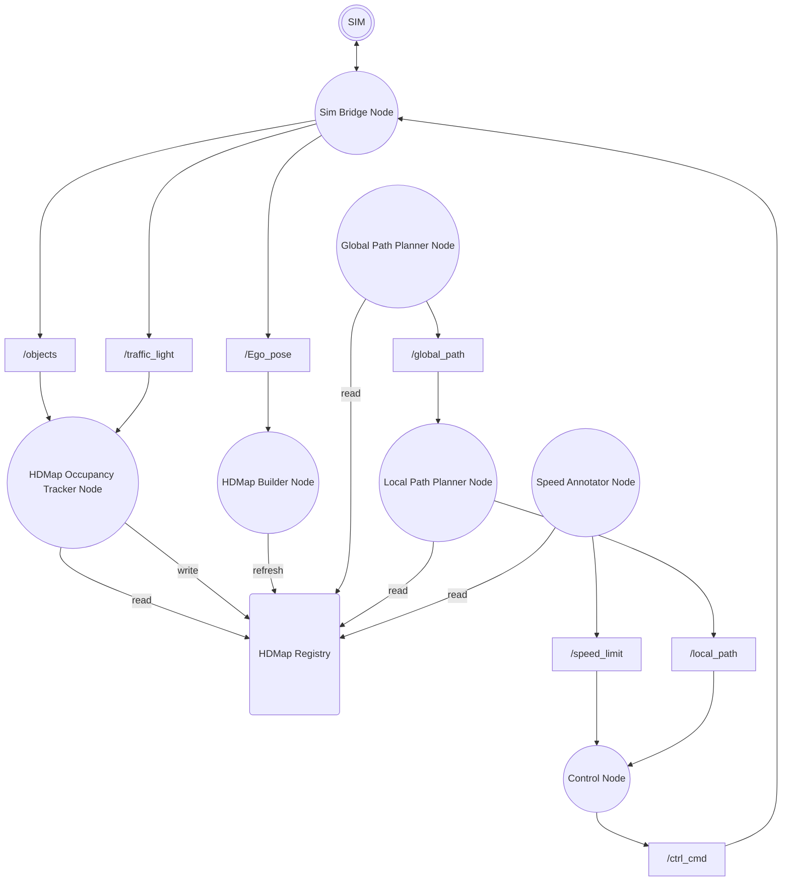

# HL-FMA2026-sim-stier
HL Mando Future Mobility Award 2026 자율주행 경진대회 시뮬레이션 부문 출전을 위한 자율주행 ROS2 jazzy SW.

## Convention

### 좌표계 및 Fixed Frame
#### 로컬 좌표계
- base_link 이용
- 차량의 진행 방향 `+x`
- 진행 방향의 왼쪽 `+y`
#### 글로벌 좌표계
- map 이용
- rviz 기준 위 방향 +x
- rviz 기준 왼쪽 방향 +y


## 패키지 구조 설계

- 각 패키지의 소스 코드, 설정, 모델, 테스트 및 패키지 전용 실행 스크립트는 반드시
  `src/<package_name>/` 안에 둔다. 패키지를 개발하면서 저장소 루트나 다른 패키지
  폴더에 소스 코드가 역류하지 않도록 주의한다.
- 프로젝트 내부 패키지는 메시지 전용 `interfaces` 패키지를 제외한 다른 내부 패키지를
  직접 참조하지 않는다. 다른 패키지의 Python 모듈을 import하거나 소스 파일을 상대
  경로로 읽지 않으며, `package.xml`과 빌드 설정에도 다른 내부 패키지 의존성을 추가하지
  않는다.
- 내부 패키지 간 데이터 전달은 ROS 토픽, 서비스 또는 액션으로만 수행한다. 패키지
  사이에서 공유해야 하는 메시지·서비스·액션 타입은 `interfaces`에 정의한다.
- `roscpp`, `rospy`, `std_msgs`, `sensor_msgs`, `nav_msgs`와 같은 ROS  패키지 및 필요한
  외부 라이브러리 의존성은 각 패키지에서 명시적으로 선언할 수 있다.
- Git에는 `src/` 아래의 패키지 소스와 저장소 루트의 개발 설정만 추적한다. Catkin의
  `build/`, `devel/`, `install/`, ROS 로그·bag 및 로컬 개발 도구 산출물은 `.gitignore`로
  제외한다.

### 패키지 구성

```text
src/
├── interfaces/
├── visualization/
├── tf_broadcasting/
├── ...
└── control/
```

`interfaces`, `visualization`, `tf_broadcasting`를 제외한 각 실행 패키지는 동명의 노드 하나와 1:1로 대응한다.
`interfaces`는 실행 노드 없이, 노드 패키지 사이에서 공유하는 사용자 정의 메시지, 서비스 및 액션 타입만 제공한다.
`visualization`은 Rviz2 시각화를 담당한다. 단일 노드가 권장이나, 필요할 경우 복수의 노드로 구성 될 수 있다.
`tf_broadcasting`는 ROS2 `fixed frame`사이를 중계하는 TF를 발행하는 노드를 제공한다. 해당 ROS2 소프트웨어에서 필요로 하는 모든 TF를 일괄적으로 이곳에서 담당한다.

## ROS architecture

ROS 관례에 따라 노드는 원으로, 토픽은 사각형으로 표현한다. 토픽 사각형은
구분선 위에 토픽 이름, 아래에 ROS  메시지 타입을 표시한다.





### Nodes


### Topics


### External inputs and outputs


## Bringup
실행 환경은 Ubuntu 24.04, ROS .

```bash
source /opt/ros//setup.bash
rosdep install --from-paths src --ignore-src -r -y
catkin_make
source devel/setup.bash
```

전체 프로그램용 `run.sh`는 전체 SW를 실행한다. 단일 명령으로 빌드, 실행까지 수행한다.
순서로 노드를 시작한다. 상시 실행 노드가
종료되면 전체 프로그램도 종료하고, `Ctrl+C`를 누르면 스크립트가 실행한 모든 노드를
함께 종료한다.

`run.sh`는 기존 ROS master와의 연결을 확인하고, master가 없으면 `roscore`를 시작한다.
센서 드라이버와 차량 인터페이스는 `run.sh`의 관리 대상이 아니며 내부 노드를 시작하기
전에 실행 호스트에서 별도로 준비한다. 실행 호스트의 workspace 루트에서 전체 프로그램을
다음과 같이 시작한다.

```bash
source ./run.sh
```

각 실행 노드 패키지는 `run.sh`를 위해 해당 노드를 올리는 한 줄의 `rosrun` 명령을 제공해야 한다.
패키지 전용 초기화가 필요한 경우에는 같은 역할을 하는 `./src/<pkgname>/launch.sh`를
추가할 수 있다. 메시지 전용 `interfaces` 패키지는 이 규칙의 대상이 아니다. 노드 내부
알고리즘이나 의존성이 추가되더라도 아래 실행 계약은 유지한다.

```bash

rosrun control control_node
```

예를 들어 패키지별 환경변수, 모델 경로, 파라미터 파일 등의 초기화가 필요해
`launch.sh`를 추가했다면, 해당 패키지 개발자는 `run.sh`의 `rosrun` 실행 줄을
다음 `launch.sh` 실행 줄로 직접 교체해야 한다. `run.sh`는 `launch.sh`의 존재 여부를
자동으로 감지하지 않는다. 아래 스크립트는 선택적 실행 계약의 경로 예시이며, 실제
파일을 추가한 패키지에만 적용한다.

```bash
./src/control/launch.sh
```
