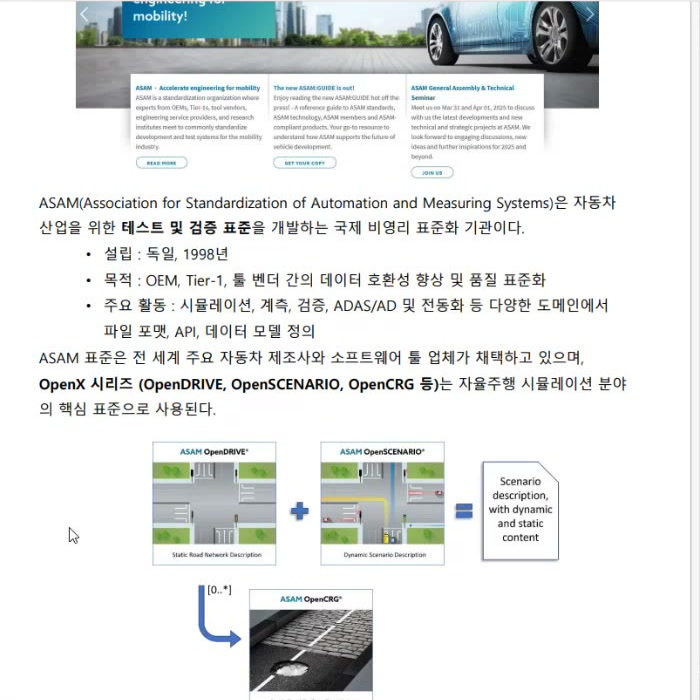
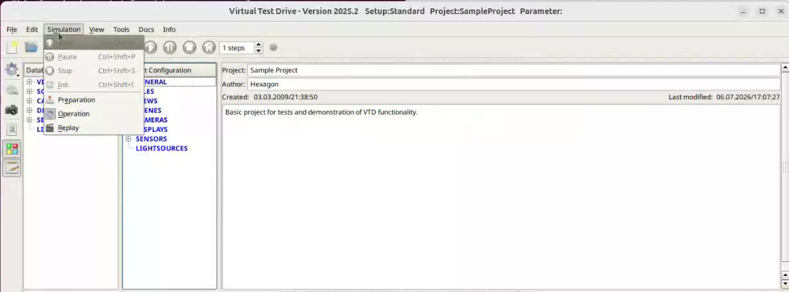
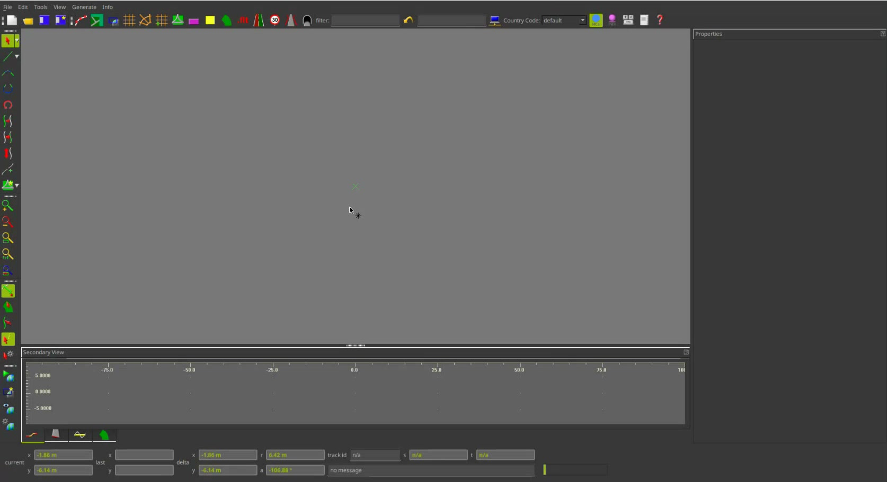
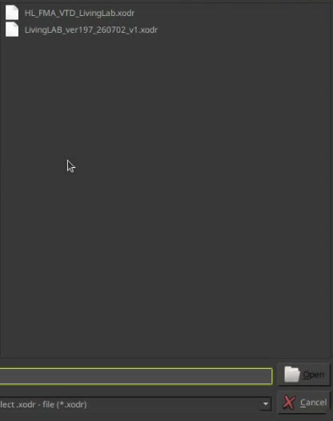
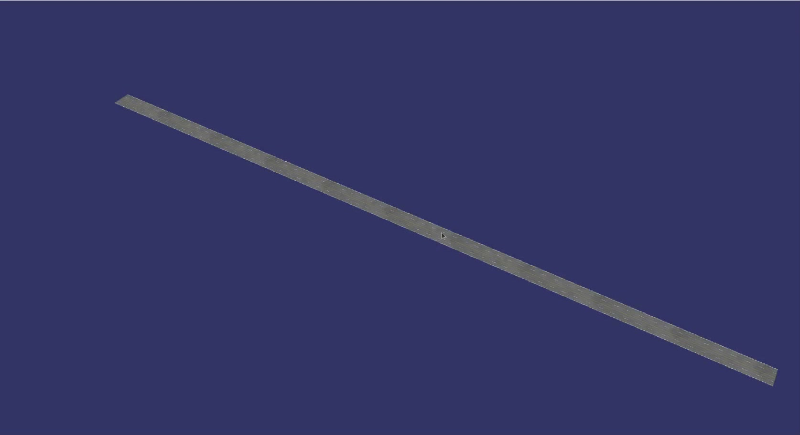
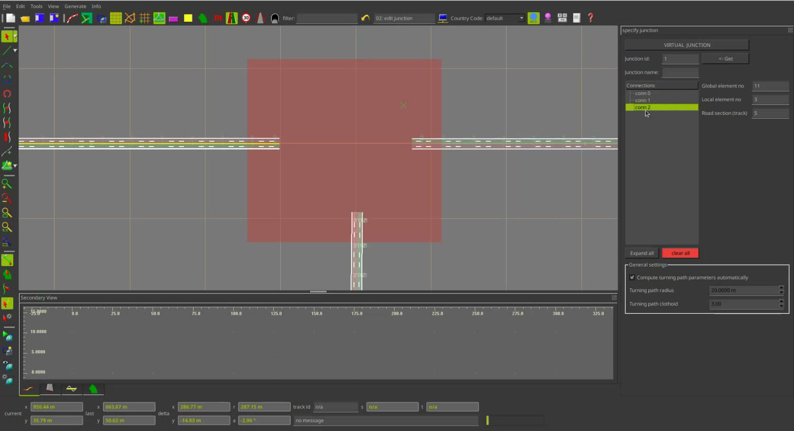
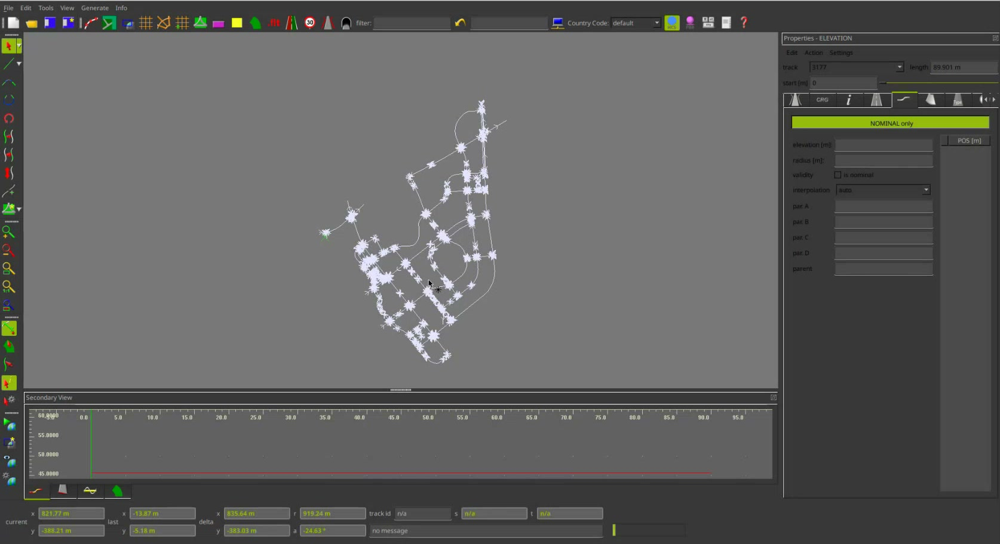
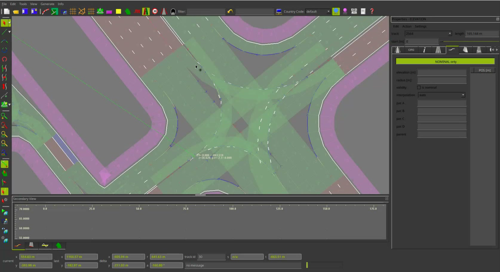

# 세션 1 — VTD와 ROD Road Designer 실무 정리

> **교육:** 2026 HL FMA Cadence & iVH 시뮬레이션 대회 교육 · 오전 ROD 교육  
> **화면 기준:** 2026-08-13, VTD/ROD 2025.2 · VTD `Setup: Standard`/`Project: SampleProject` · ROD `DefaultProject`  
> **전사 유효 구간:** 00:00:02.050–01:05:01.040(약 1시간 5분, 원 영상 표기 약 1:05:18)  
> **프라이버시:** 참가자 패널과 개인정보가 노출될 수 있는 화면 가장자리는 캡처에서 잘랐다.


*그림 1. 교육 표지(영상 약 00:00).*

## 1. 소스와 메타데이터

| 소스 | 확인한 내용 |
|---|---|
| [`transcripts/session-1.md`](transcripts/session-1.md) | 1,768개 자막 전체, 00:00:02.050–01:05:01.040 |
| 자동 전사 산출물(`SRT`·`TXT`·`JSON`) | 한국어(`ko`), 번역 비활성, `ggml-large-v3-turbo-q5_0` 계열 모델; SRT/TXT 본문 순서와 1,768개 JSON 상위 구간을 상호 대조 |
| `docs/assets/session-1/*.jpg` | 원본 영상 프레임을 필요한 UI 영역만 자른 화면 캡처 11장 |

타임라인은 SRT와 JSON의 **상위 구간 시각**을 기준으로 잡았다. 그림의 시각은 전사 내용과 화면 상태를 대조한 대략값이다.

## 2. 타임스탬프 기반 목차

| 시각 | 내용 |
|---:|---|
| 00:00:02 | 교육 목표·오전/오후 일정·질문 방식 |
| 00:01:36 | 실습 전제, VTD 설치와 라이선스 활성화 |
| 00:02:37 | 9월 사전 테스트 목적·신청·준비물 |
| 00:04:26 | VTD 실행, Standard Setup, 라이선스 상태 확인 |
| 00:06:29 | ASAM과 OpenX: OpenDRIVE·OpenSCENARIO·OpenCRG |
| 00:09:02 | 표준 교육자료와 이번 실습 범위의 차이 |
| 00:09:27 | 배포 데이터와 IONIQ 리소스 다운로드 |
| 00:10:35 | VTD GUI 소개, Setup/Project와 Database 확인 |
| 00:19:36 | ROD 시작, 대회 지도 변경 금지, OpenDRIVE 불러오기 |
| 00:22:51 | 새 도로: Grid·Tile·Line·Track·Lane·Road Mark·Width |
| 00:33:36 | TDO 저장, OpenDRIVE/OSGB 생성, 3D 미리보기 |
| 00:38:38 | 차선 폭 변화와 배포 교재의 심화 예제 안내 |
| 00:39:37 | Spline 곡선과 Track 연결(`Outer Side`는 잠정 판독) |
| 00:41:31 | T자 교차로용 세 도로, Lane 부호·폭·속성 복사 |
| 00:47:10 | `Move Element` 정밀 이동과 도로 전체 속성 복사 |
| 00:49:00 | Junction·Connection·Path·Track 생성과 삭제 |
| 00:55:45 | Fillet ID와 교차로 노면 누락 문제 |
| 00:58:47 | 질의응답, 운영상 주의, 오후 교육 준비와 마무리 |

## 3. 교육 일정, 사전 테스트, 준비물

### 3.1 당일 일정과 진행 방식 — 00:00:02

- 오전 교육은 11:30까지로 안내됐으며, 흐름에 따라 중간 휴식을 넣거나 연속 진행한다.
- 오후에는 **Scenario Editor 실습**과 **제어기 연동**을 진행한다. 제어기 빌드 절차를 간소화해 원래 배정한 2시간보다 일찍 끝날 수 있고, 남는 시간은 시험 관련 질의응답에 쓴다.
- 온라인 교육은 발표자 외 음소거가 원칙이다. 질문은 회의의 손들기 또는 채팅으로 받는다.
- 오전 녹화를 마친 뒤 점심시간을 갖고 **13:00에 재개**한다고 마무리했다.

### 3.2 사전 테스트 — 00:02:37

- 대회일은 **2026-09-12**로 안내됐다.
- 사전 테스트는 **2026-09-03(목)** 또는 **09-04(금)** 중 하루만 신청한다.
- 날짜별 **21개 팀 선착순**이다.
- 사전 테스트는 예선이 아니다. 참가팀 제어기가 VTD 평가 시스템과 정상 연동되는지, 평가가 동작하는지, 계획 경로를 제대로 주행하는지 미리 확인하는 지원 절차다.
- 주최 측이 VTD PC와 평가 시스템을 준비하므로 참가팀은 **제어기 PC만** 가져간다.
- 단, 배포된 Setup 환경을 제어기 PC에 미리 설치하고 팀 내부 연동 시험까지 끝낸 뒤 방문해야 현장에서 평가 시스템을 실행할 수 있다.

### 3.3 실습 전 준비물

- VTD 2025.2 설치와 팀 라이선스
- 배포 Setup 환경
- Living Lab 시나리오·OpenDRIVE·그래픽 파일 3종
- 별도 `Data` 리소스 묶음(IONIQ 차량 포함)
- 배포된 VTD 사용자 매뉴얼·Scenario Editor 매뉴얼 등 문서 3건
- 오후 실습에서 배포 시나리오 XML을 열 수 있는 PC

## 4. 라이선스 활성화와 VTD 실행 — 00:01:56–00:06:20

라이선스 시작에는 시간이 걸리므로 강의 시작과 동시에 각 팀이 먼저 활성화한다. 화면에서 확인되는 라이선스 서버 작업 디렉터리와 명령은 다음과 같다.

```bash
cd /msc/MSC.Software/MSC.Licensing/Beryllium
sudo ./lmgrd -c license.dat
```

이 경로와 `license.dat`는 교육 PC 기준이다. 팀별 설치 경로가 다르면 제공 매뉴얼과 실제 라이선스 파일 위치를 따른다.

VTD 실행 흐름은 다음과 같다.

1. `<VTD_ROOT>/bin`으로 이동한다. 화면의 교육 PC는 사용자 홈 아래 `VIRES/VTD.2025.2`에 설치돼 있었으며, 로컬 계정명은 재사용할 설정값이 아니므로 생략한다.
2. 배포 매뉴얼의 실행 명령으로 Launcher를 연다. **정확한 실행 명령은 전사와 캡처에서 판독되지 않아 확인 필요**다.
3. 팀마다 다른 Setup 번호를 선택한다. 교육 PC에서는 **30번 `Standard` Setup**으로 접속했지만 팀별 환경에서는 번호가 다를 수 있다.
4. 기본값이 `NO IG`이면 시뮬레이션 영상이 나오지 않으므로 영상 출력이 있는 설정으로 바꾼다.
5. 실행 뒤 툴바의 **초록색 체크**가 표시되는지 확인한다. 체크가 없으면 라이선스가 활성화되지 않은 상태다.

라이선스 체크가 없을 때는 **재활성화 → PC 재부팅 → Redmine 일감 문의** 순서로 대응한다. 재부팅만으로 복구되는 사례도 있다고 설명했다.

## 5. ASAM OpenX 표준의 역할 — 00:06:29–00:09:08



*그림 2. ASAM과 OpenDRIVE·OpenSCENARIO·OpenCRG 관계(영상 약 00:07).*

ASAM(Association for Standardization of Automation and Measuring Systems)은 자동차 산업의 테스트·검증 표준을 개발하는 국제 비영리 표준화 조직이다. 강의 자료는 1998년 독일 설립, OEM·Tier-1·툴 공급사 간 데이터 호환성과 품질 향상, 파일 형식·API·데이터 모델 표준화를 핵심으로 설명한다.

| 표준 | 이 교육에서의 역할 | 대표 내용/형식 |
|---|---|---|
| **ASAM OpenX** | 자율주행 시뮬레이션 관련 개방형 표준군의 묶음 | OpenDRIVE + OpenSCENARIO + OpenCRG 등 |
| **OpenDRIVE** | 정적 도로 네트워크와 도로 로직 | XML 기반 `.xodr`; 기준선(Reference Line), 기하, 차선·폭·마킹·고도 |
| **OpenSCENARIO** | 동적 상황과 이벤트 | 차량·보행자 등 동적 객체, 동작/이벤트, 신호 상태를 포함하는 시나리오 기술 |
| **OpenCRG** | 상세 노면 형상 | 요철·거친 노면·보도블록처럼 미세한 표면 특성 |

대회는 주로 **OpenDRIVE와 OpenSCENARIO**를 배포·평가에 사용한다. OpenCRG는 자율주행 과제에서 활용도가 낮아 이 교육의 실습 범위에서는 제외했다. OpenDRIVE는 Reference Line 진행 방향을 기준으로 좌우 차선을 정의하며, 다른 도구에서 만든 호환 `.xodr`도 ROD로 가져올 수 있다.

## 6. VTD 프로젝트 준비와 파일 배치 — 00:09:02–00:19:36

업로드된 표준 과정 자료는 이번 대회 실습 화면과 완전히 같은 절차서가 아니라 더 넓은 정규 교육 범위를 담는다(00:09:02–00:09:17). 따라서 메뉴·예제 차이는 실제 VTD 2025.2 화면과 대회 배포 공지를 우선해 확인한다.

### 6.1 VTD GUI와 Setup/Project 확인


*그림 3. VTD 메인 GUI, `Setup: Standard`와 `Project: SampleProject`(영상 약 00:11).*

1. 왼쪽 Database 창이 없으면 `View > Show Database`를 켠다.
2. 창 제목에서 현재 **Setup**과 **Project**를 항상 확인한다. 교육은 `Standard`와 `SampleProject`를 사용했다.
3. Database에는 `VIEWS`, `SCENES`, `CAMERAS`, `DISPLAYS`, `SENSORS`, `LIGHTSOURCES`가 보인다.
4. View 항목을 더블클릭하면 오른쪽 구성에 추가되고, 추가된 View를 다시 더블클릭하면 해당 시점으로 시뮬레이션을 본다. 대회용 View는 미리 설정되므로 임의 변경할 필요가 없다.



*그림 4. Simulation 메뉴의 Run/Pause/Stop/Init과 Preparation·Operation·Replay(영상 약 00:12).*

상단에는 `File`, `Edit`, `Simulation`, `View`, `Tools`, `Docs`, `Info` 메뉴가 있다. Simulation 메뉴의 실행·일시정지·정지·초기화와 Preparation/Operation/Replay 단계가 보이지만, 본 대회 운영은 배포 Setup을 기준으로 하므로 이 시간에는 개별 설정을 깊게 다루지 않았다.

### 6.2 배포 파일의 위치

교육에서 배포한 3종을 다음 위치에 둔다. Linux는 대소문자를 구분하므로 설치본에서 실제 디렉터리 이름을 확인한다.

| 파일 | 용도 | 교육 PC 기준 배치 위치 |
|---|---|---|
| `*.xml` | VTD 시나리오 | `<VTD_ROOT>/Data/Projects/SampleProject/Scenarios/` |
| `*.xodr` | OpenDRIVE 도로 로직 | `<VTD_ROOT>/Runtime/Tools/ROD/DefaultProject/Odr/` |
| `*.osgb` | 시뮬레이션용 3D 그래픽 DB | `<VTD_ROOT>/Runtime/Tools/ROD/DefaultProject/Database/` |

화면에서 `.xodr` 이름 `HL_FMA_VTD_LivingLab.xodr`와 `LivingLAB_ver197_260702_v1.xodr`가 확인된다. 어느 파일이 최종 대회 배포본인지, XML/OSGB의 정확한 동반 파일명은 **배포 공지에서 확인 필요**다.

파일을 둔 뒤 VTD GUI의 시나리오 트리를 접었다 펼치면 새 XML이 나타난다. 보이지 않으면 경로·확장자·Project가 `SampleProject`인지 먼저 점검한다.

### 6.3 IONIQ 차량 리소스와 `Data` 병합

Scenario Editor에서 배포 시나리오를 열 때 리소스 오류가 나거나 IONIQ 차량이 없으면 Redmine에 새로 올라온 별도 자료를 내려받아 압축을 푼다.

1. 압축 안의 `Data` 폴더를 통째로 복사한다.
2. `<VTD_ROOT>`에 붙여 넣어 기존 `<VTD_ROOT>/Data`와 **병합**한다.
3. 병합 대화상자에서 모든 파일·폴더에 적용하고, 배포본이 지정한 충돌 파일은 교체한다.
4. Scenario Editor를 다시 열어 IONIQ 항목을 확인한다.

강의자는 IONIQ 항목 수를 “6개, 5개”라고 짧게 정정하듯 말해 **정확한 수는 확인 필요**다. 항목 수보다 리소스 누락 없이 선택 가능한지가 핵심이다.

강의 녹화본도 당일 또는 다음 날 Redmine에 올리고 완료 뒤 알릴 예정이라고 안내했다.

### 6.4 Project Configuration

왼쪽은 예시 모델, 오른쪽은 실제 Project에 적용되는 설정이다. 카메라 화각, 디스플레이 해상도, 사용할 센서 등을 여기서 구성할 수 있다. 대회용 카메라와 LiDAR 등은 Setup에 미리 구성되므로 대회 준비 중에는 배포값을 유지한다.

## 7. ROD Road Designer 기본 조작 — 00:19:36–00:33:36

### 7.1 시작 화면과 대회 지도 원칙

VTD의 `Tools > Road Designer`를 열면 ROD 2025.2가 실행된다. 하단 상태 표시에는 현재 마우스 좌표(`current`), 마지막 클릭 좌표(`last`), 두 점의 차이(`delta`)가 표시된다.



*그림 5. `ROD 2025.2 - DefaultProject` 초기 화면(영상 약 00:20).*

> **대회 운영 원칙:** 참가팀은 제공된 Living Lab 지도를 수정해 대회용으로 사용하면 안 된다. 연습 중 사본을 수정하더라도 실제 대회 평가는 주최 측 원본 지도로 진행된다.

제공 지도는 화성시청 인근 화성 Living Lab 구간을 실측해 고도, 노면 표지, 신호등 위치 등을 반영한 디지털 트윈이다. 원본 `.xodr`와 `.osgb`는 별도 보존한다.

### 7.2 OpenDRIVE 불러오기 — 00:20:54

ROD의 OpenDRIVE 가져오기 기능에서 `.xodr`를 선택한다. 강의 음성은 “Import OpenDRIVE Data”라고 했고 화면 대화상자 제목은 `load OpenDRIVE Data`다. **상단 메뉴의 정확한 위치(File/Edit)는 확인 필요**지만, 기능명으로 찾을 수 있다.



*그림 6. `DefaultProject/Odr`에서 `.xodr`를 고르는 화면(영상 약 00:21).*

- 다운로드 폴더에 파일이 있으면 직접 선택한다.
- 미리 배치했다면 `<VTD_ROOT>/Runtime/Tools/ROD/DefaultProject/Odr/`로 이동한다.
- 불러온 뒤 우클릭의 전체 선택 기능으로 네트워크를 선택하고, 상단 Lane 표시를 켜 도로 면·차선을 확인한다. 전체 선택 메뉴의 정확한 문구는 **확인 필요**다.
- 새 도로를 연습하려면 반드시 원본이 아닌 새 작업 파일에서 가져온 요소를 지운다.

### 7.3 Grid와 기본 Tile — 00:22:51

- `Show Grid`를 켠 뒤 격자가 보이지 않으면 Grid 간격을 확인한다. 강의에서는 `0.1 m`가 너무 촘촘해 보이지 않아 `100 m`로 바꿨다.
- 진한 X/Y 축의 교점이 `(0, 0)`이다.
- Snap 아이콘을 켜면 클릭점이 격자에 붙는다.
- 빈 화면에서 우클릭해 `Add Tile`을 선택하면 ROD 내장 도로 조각을 고를 수 있다.
- Tile은 클릭한 위치에 생긴다. 두 Tile의 노란 연결 박스를 `Ctrl`을 누른 채 이동해 가까이 두면 Snap으로 붙일 수 있다. 강의에서는 이 방식으로 왕복 6차로 예시를 보였다.

### 7.4 처음부터 Reference Track 만들기 — 00:25:39

1. 왼쪽의 **Line Mode**(초록 선)를 선택한다.
2. 시작점과 끝점을 차례로 클릭한다. 길이는 화면에 실시간 표시된다.
3. 새 선을 더 만들지 않고 기존 선을 선택하려면 먼저 빨간 **Pointer** 도구로 돌아간다.
4. 초록 선을 선택하고 `Combine Edge Track`을 실행해 흰 선으로 바꾼다.
5. 흰 선이 OpenDRIVE 도로의 **Reference Line/Track**이 되며, 이후 차선 속성을 붙일 수 있다.

초록 선은 아직 도로가 아닌 가이드다. Pointer로 전환하지 않고 화면을 클릭하면 선택이 아니라 새 선 생성이 시작되는 것이 반복 실수 지점이다.

### 7.5 Lane, 폭, Road Mark — 00:27:14

Reference Line의 차선 번호는 `0`이다. `Drive Lane`의 Position 영역에서 새 Lane을 만들고 Reference Line의 왼쪽/오른쪽을 지정한다. UI의 세부 우클릭 문구는 설치본에서 확인하되, 다음 순서를 지킨다.

1. Lane `Type`을 `Driving`으로 바꾼다. VTD 내장 자율주행 기능이 주행 가능 차선으로 인식하려면 필요하다.
2. Width 탭에 폭 구간을 추가하고 값을 입력한다. 강의 예시는 국내 일반 차선 폭으로 `3.5 m`를 사용했다.
3. 값 입력 또는 드래그로 폭을 확인한다.
4. Road Mark 탭에 구간을 추가해 `Broken`, `Solid`, `Solid Yellow` 등을 선택한다.
5. 같은 방식으로 Lane을 추가해 왕복 4차로 예시를 만든다.

### 7.6 외곽 Border와 속성 복사 — 00:30:38

전사의 “보도”는 화면 기능 문맥상 보행자용 Sidewalk가 아니라 도로 외곽의 **`Border` Lane**을 뜻한다.

- 가장 바깥에 `Border`를 두어 Junction 연결과 속성 복사가 정상적으로 이뤄지게 한다.
- 폭은 `0.1–0.2 m`를 시험한 뒤 강의 예시에서 `0.3 m`로 정했다.
- Border에는 Road Mark가 반드시 필요하지 않다.
- 완성된 Driving Lane/Border 속성을 복사해 원하는 Lane의 왼쪽 또는 오른쪽에 붙여 넣을 수 있다.
- 잘못된 순서에 붙였으면 대상 Lane을 선택하고 `Move Lane`으로 좌우 이동한다.
- 한쪽 차선 구조를 반대편에 복제하고 외곽 실선, 차선 점선, 중앙선 `Solid Yellow`를 맞추면 반복 입력을 줄일 수 있다.

## 8. 저장·내보내기·3D 미리보기와 고급 편집 — 00:33:36–00:41:31

### 8.1 TDO를 먼저 저장

ROD의 네이티브 편집 형식은 `.tdo`다. 그래픽 생성과 재편집을 계속하려면 먼저 TDO로 저장한다.

- `.xodr`만 불러오면 도로 로직·형상은 보이지만 원래 디지털 트윈 제작 데이터 전체가 복원되는 것은 아니다.
- 제공 Living Lab `.xodr`만 다시 가져와 Database를 생성하면 주최 측 제공 `.osgb`와 다른 그래픽이 나온다.
- 따라서 원본 `.xodr`/`.osgb`를 덮어쓰지 말고, 연습용 TDO와 출력은 별도 이름으로 저장한다.

### 8.2 OpenDRIVE와 OSGB 생성

1. `Generate > OpenDRIVE`로 `.xodr`를 출력한다.
2. 그래픽 생성 전에는 **아무 요소도 선택되지 않은 상태**인지 확인한다. 강의에서 선택 범위가 출력에 영향을 준다고 명시한 대상은 OpenDRIVE가 아니라 Database/그래픽 생성이다(00:57:21).
3. `Generate > Database` 또는 왼쪽 아래 지구본/기어의 DB Generation을 연다.
4. 기본 출력이 `VIG Viewer`이면 `OSGB`로 바꾸고 저장한다.
5. `Generate Database`를 실행해 3D 그래픽을 확인한다.



*그림 7. 차선·마킹이 적용된 직선 도로 Database 미리보기(영상 약 00:36).*

### 8.3 미리보기 조작

- `L`: 조명 밝기 전환
- `/` 또는 `?` 키: 큰 지도에서 보이는 스케일을 넓히는 기능으로 설명됐으나 전사에서 키 설명이 한 차례 `L`로 섞여 **정확한 키는 H 도움말에서 확인 필요**
- 오른쪽 마우스 드래그: 확대/축소
- 왼쪽 마우스 드래그: 화면 이동
- 숫자 `4`: 부드러운 Driving Mode 이동
- `H`: 도움말 표시

### 8.4 폭 변화, 곡선과 Track 연결 — 00:38:38–00:41:17

- Width 구간 값을 달리하면 진행 방향을 따라 넓어지거나 좁아지는 도로를 만들 수 있다(00:38:38–00:38:50).
- Line 도구의 하위 메뉴에서 **Spline Mode**를 선택하고 여러 점을 찍으면 곡선 Reference Track을 만든다.
- 별도 Reference Track 두 개를 하나의 도로로 잇고 싶으면 두 끝점을 `Shift`로 선택한 뒤 연결 도구를 적용한다. 00:40:39–00:40:48에 들리는 두 번째 모드명은 **`Outer Side`로 잠정 판독**했으며 실제 UI 표기는 확인 필요다.
- Pointer의 Move 기능으로 끝점을 드래그해 Track 끝점을 옮길 수 있다.

전체 4지 교차로 제작 예제는 이 구간에서 배포 교육자료 **3장 12쪽부터** 참고하라고 먼저 안내했다(00:38:51–00:39:25). 00:58:01에도 시간 제약 때문에 자료를 따라 해보라는 취지로 다시 상기했다.

## 9. Junction 생성과 Connection·Path·Track·Fillet — 00:41:31–00:58:06

### 9.1 T자 Junction용 도로 준비

강의는 수평 도로 양쪽과 아래쪽 접근로, 총 세 도로로 T자 교차로를 만들었다.

- 각 초록 가이드를 `Combine Edge Track`으로 흰 Reference Track으로 바꾼다.
- 각 도로에 같은 수의 Driving Lane, `3.5 m` 폭, Broken/Solid 마킹, `0.3 m` Border를 구성한다.
- 하나를 완성한 뒤 도로 속성 전체를 다른 Track에 복사하면 빠르다.

Reference Track의 **진행 방향**이 차선 부호를 결정한다(00:43:04–00:44:32).

| Reference Track 기준 | Lane ID |
|---|---|
| 진행 방향 오른쪽 | `-1`, `-2`, `-3`, … |
| 진행 방향 왼쪽 | `+1`, `+2`, `+3`, … |
| Reference Line | `0` |

따라서 Track을 왼쪽→오른쪽으로 그렸을 때와 오른쪽→왼쪽으로 그렸을 때, 화면상 같은 위/아래 위치라도 Lane 부호와 생성 방향이 뒤집힌다. 연결될 도로끼리 폭을 같게 하는 것이 안전하며, 이 주의는 00:45:15–00:45:44에 설명됐다. 폭이 달라도 생성은 되지만 Junction 형상이 달라질 수 있다.

00:47:10–00:48:11에는 요소를 선택한 뒤 가운데 마우스 메뉴의 `Move Element`에 X/Y 이동량을 넣어 정밀 이동하는 법을 보였다. 예시는 X `+100 m`, `-200 m`였다. 이어 00:48:22–00:48:44에는 완성한 도로 전체 속성을 다른 Reference Track에 붙여 Lane/Mark/Border 구성을 한 번에 재사용했다.

### 9.2 Junction 영역과 Connection — 00:49:00

1. 왼쪽의 `Create Junction`을 선택한다.
2. 세 도로 끝을 모두 포함하도록 사각형의 첫 모서리와 반대 모서리를 **클릭–클릭**한다. 드래그가 아니다.
3. 생성 직후 Pointer로 돌아간다. 그렇지 않으면 다음 클릭에서 Junction이 하나 더 생긴다.
4. Junction을 선택하면 오른쪽에 `conn 0`, `conn 1`, `conn 2` 같은 Connection이 보인다. 각 항목을 클릭하면 대응 접근 도로가 밝아진다.



*그림 8. T자 영역과 `conn 0–2`가 표시된 Junction 편집(영상 약 00:50).*

| 객체 | 의미 |
|---|---|
| **Junction** | 여러 접근 도로와 내부 연결을 묶는 교차로 영역 |
| **Connection** | Junction에 들어오거나 나가는 접근 도로의 연결 단위 |
| **Path** | 출발 Driving Lane과 도착 Driving Lane 사이의 허용 이동 관계 |
| **Track** | 이 Junction 문맥에서는 Path를 따라 생성되는 내부 연결 도로 형상. ROD 일반 문맥의 Reference Track까지 포함하는 더 넓은 용어다. |
| **Fillet ID** | 외곽 Track의 Border 속성에 설정해 포장 면 생성 범위를 묶는 식별자 |

### 9.3 Path와 Track 생성 — 00:50:07

1. 출발 Connection을 우클릭하고 `Add Path`를 선택한다. 음성 전사의 “Add Pass”는 기능 문맥상 `Add Path`다.
2. **현재 Connection의 출발 Driving Lane부터** 선택한다.
3. 이동할 대상 Connection의 도착 Driving Lane을 선택한다.
4. `Create Path`를 실행해 Path와 내부 연결 Track을 만든다.
5. 직진·우회전·좌회전 등 필요한 이동을 각 Connection에 반복한다.

최신 버전이 역순 선택을 자동 보정하는 것처럼 보여도, 오류 가능성을 줄이려면 항상 현재 Connection 도로에서 시작한다. 확대 중 외곽 Border를 Driving Lane으로 잘못 선택하지 않는다.

같은 출발→도착 이동을 중복 생성하면 도로 모양은 생겨도 나중에 Junction 연결이나 Scenario Editor 경로 설정에서 둘 중 하나가 동작하지 않을 수 있다. **동일 이동의 Path는 하나만** 유지한다.

- `Delete Path`: Path 관계만 지우고 생성된 Track은 남긴다.
- `Delete Path with Track`: Path와 내부 연결 도로 Track을 함께 지운다.

도로 형상은 살리고 Lane 대응만 다시 잡을 때는 전자를, 잘못 만든 연결 전체를 없앨 때는 후자를 쓴다.


*그림 9. Path/Track 생성 후 포장 면이 연결된 T자 교차로(영상 약 00:55).*

### 9.4 Fillet ID와 빈 노면 — 00:55:45

Junction 미리보기에서 교차로 내부가 일부 비면 가장 외곽 연결 Track의 Border 속성을 확인한다.

- `Fillet ID`는 독립 객체가 아니라 외곽 Track의 Border에 있는 설정이다. 강의 화면 기준으로 Border 선의 **왼쪽 면**을 Pavement로 채우는 데 쓰인다.
- 하나의 포장 영역을 이루는 관련 Border의 `Fillet ID`가 같아야 한다. 강의 예시는 모두 `1`이었다.
- 교차로가 많거나 새 Junction을 계속 추가하면 일부 Fillet ID가 다르게 생길 수 있다.
- 예시에서 한 Border의 Fillet ID를 다르게 두자 그 경계 쪽 포장 면이 비어 보였다.
- 출력 전에 선택을 모두 해제하고 다시 Database를 생성한다.

신호등, 주변 객체·배경을 포함한 4지 교차로 전체 제작은 시간상 실습하지 않았다.

## 10. 대회 운영 주의와 문제 해결

| 증상/상황 | 확인과 조치 | 관련 시각 |
|---|---|---:|
| VTD의 초록 체크가 없음 | 라이선스 재활성화 → 재부팅 → Redmine 일감 문의 | 00:05:24 |
| 새 XML이 VTD GUI에 안 보임 | `SampleProject/Scenarios` 경로 확인, 시나리오 트리 접기/펼치기 | 00:15:57 |
| Scenario Editor가 리소스 오류를 냄 | 배포 `Data` 폴더를 `<VTD_ROOT>`에 병합하고 충돌 파일 적용 | 00:16:39 |
| IONIQ 모델이 없음 | 최신 `Data` 묶음 다운로드·병합 여부 확인 | 00:16:39 |
| 제공 OSGB와 재생성 그래픽이 다름 | 제공 지도는 XODR만으로 원형 복원이 안 됨. 원본 OSGB 사용 | 00:34:15 |
| 그래픽 일부만 생성됨 | Database 생성 전 모든 요소 선택 해제 | 00:57:21 |
| Junction 내부 노면이 비어 보임 | 관련 Border의 Fillet ID 통일 후 재생성 | 00:55:45 |
| 차량이 의도한 차선을 따르지 않음 | Scenario Editor의 Road ID와 위치를 확인해 ROD에서 해당 도로·연결 Track을 조사. Lane ID·Path까지 좁히는 것은 이 화면을 바탕으로 한 후속 진단이다. | 01:01:14–01:02:25 |
| ROD가 중간에 종료됨 | 자주 TDO 저장; 원본과 작업 사본 분리 | 01:00:20 |



*그림 10. 제공 지도 전체의 Reference Track/Junction 토폴로지(영상 약 01:03–01:04).*



*그림 11. 하나의 포장 면 아래에서 직진·좌회전 등이 별도 Track으로 연결된 모습(영상 약 01:02).*

화면상 교차로가 하나의 넓은 포장 면처럼 보여도 OpenDRIVE 내부에서는 직진·좌회전·우회전 Track이 구분된다. 제어기가 XODR 속성을 이용할 때 원하는 2차로 대신 1차로를 따른다면, 해당 방향의 Path가 1차로에만 연결됐는지 먼저 확인한다.

ROD는 원래 하루 과정으로 교육할 정도로 범위가 넓다. 이번 시간은 대회 지도를 참가팀이 거의 수정하지 않는다는 전제에서 압축해 진행했다. 연습을 위한 변경은 사본에서만 하고, 대회 입력은 주최 측 원본을 기준으로 검증한다.

## 11. 영상 말미 Q&A와 마무리 — 00:58:47–01:05:01

- 발표자는 도로 모델링, 배경 작업, 주의사항에 대한 질문을 받겠다고 했지만 녹화에 남은 **구체적인 질문·답변은 없다**.
- 도로 구조, 고도차, Junction 연결을 보고 싶으면 ROD에서 Road ID를 찾아 속성과 연결 Track을 확인하라고 안내했다.
- 오후 Scenario Editor 교육은 참가자가 함께 따라가는 방식으로 진행하며 차량·보행자 생성, 경로, Trajectory, 좌표, 차량 상태를 다룰 예정이라고 예고했다.
- 시나리오 교육 뒤에는 제어기 연동용 별도 Setup을 배포하고 적용법을 설명할 예정이다.
- 주최 측이 제공하는 것은 간단한 교육용 시나리오이며, 참가팀이 원하는 시험 시나리오는 직접 작성해야 한다고 안내했다(01:03:03–01:03:16).
- 오후 실습 전까지 배포 XML을 Scenario Editor에서 열 수 있게 준비하고, 13:00에 다시 접속한다.

## 핵심 체크리스트

- [ ] VTD 2025.2 설치와 라이선스 활성화 완료
- [ ] 실행 뒤 초록 라이선스 체크 확인
- [ ] 현재 `Setup`과 `Project` 확인
- [ ] XML/XODR/OSGB를 각각 지정 경로에 배치
- [ ] 별도 `Data` 묶음을 병합하고 IONIQ 선택 가능 여부 확인
- [ ] 대회 원본 XODR/OSGB는 수정·덮어쓰기 금지
- [ ] 작업은 별도 `.tdo`로 자주 저장
- [ ] Reference Track 진행 방향과 Lane ID 부호 확인
- [ ] VTD 내장 자율주행을 쓸 차선은 `Driving`, 외곽은 `Border`로 설정. 참가팀 제어기가 카메라·LiDAR·사전 정의 도로 로직으로 주행하는 경우에는 `Driving` 여부만으로 인식 가능성을 단정하지 않음
- [ ] 연결 도로의 폭을 가능한 한 일치
- [ ] Junction 생성 직후 Pointer로 전환
- [ ] Path는 현재 Connection의 Driving Lane에서 시작
- [ ] 같은 출발→도착 Path를 중복 생성하지 않음
- [ ] 관련 Border의 Fillet ID 통일
- [ ] Database/그래픽 생성 전 전체 선택 해제
- [ ] DB 출력 형식을 `OSGB`로 확인

## 용어·파일 형식

| 용어/형식 | 뜻 |
|---|---|
| **VTD** | Virtual Test Drive 시뮬레이션 환경 |
| **ROD** | VTD의 Road Designer |
| **Setup** | 시뮬레이터 실행 구성 묶음 |
| **Project** | 장면·시나리오·카메라·센서 등 프로젝트 데이터 묶음 |
| **Reference Line/Track** | OpenDRIVE 도로의 진행 방향과 좌우 차선 정의 기준선 |
| **Lane 0** | Reference Line 자체; 실제 Driving Lane이 아님 |
| **Driving Lane** | 차량 주행 가능 차선 |
| **Border** | 도로 외곽 경계용 얇은 Lane |
| **Road Mark** | Broken/Solid/Solid Yellow 등 차선 표시 |
| **Junction** | 교차로와 내부 연결을 묶는 객체 |
| **Connection** | Junction에 연결된 접근 도로 단위 |
| **Path** | 출발·도착 Lane의 논리적 이동 관계 |
| **Track** | 도로의 Reference Track을 포함하는 일반 도로 형상. Junction 안에서는 Path에 대응하는 내부 연결 Track도 생성됨 |
| **Fillet ID** | 외곽 Track의 Border 속성에 설정하는 포장 면 그룹 식별자 |
| `.xml` | 이 교육에서 배포한 VTD 시나리오 파일 |
| `.xodr` | XML 기반 ASAM OpenDRIVE 도로 네트워크 |
| `.osgb` | 이 교육에서 사용한 VTD 3D 그래픽 DB |
| `.tdo` | ROD 네이티브 편집·저장 형식 |
| **OpenCRG** | 상세 도로 표면 기술 표준 |

## 전사 및 해석 주의

- 자동 전사의 `VT`, `VDD`, `엑소 DR`, `아삼`은 화면과 문맥을 따라 각각 **VTD**, **`.xodr`/OpenDRIVE**, **ASAM**으로 교정했다.
- `화순시청`은 앞뒤 전사와 Living Lab 설명에 따라 **화성시청**으로 교정했다.
- `Add Pass/Create Pass`는 Junction 기능 문맥에 따라 **Add Path/Create Path**, `보도`는 외곽 차선 기능에 따라 **Border**로 교정했다.
- JSON 내부 token 시각은 일부 구간에서 절대 시각과 맞지 않으므로 사용하지 않았다. SRT 및 JSON 상위 `transcription[].timestamps`를 기준으로 했다.
- VTD 실행 명령, 파일/폴더 대소문자, OpenDRIVE 가져오기와 전체 선택 메뉴의 정확한 위치·문구, Track 연결의 `Outer Side` 판독, 배포 동반 파일명, IONIQ 항목 수, 3D Viewer 스케일 키는 증거가 충분하지 않아 본문에 **확인 필요**로 표시했다.
- 날짜는 교육 표지·화면 시계의 2026년 정보와 “9월 3일 목요일/4일 금요일/12일 대회” 발언을 함께 해석했다.
