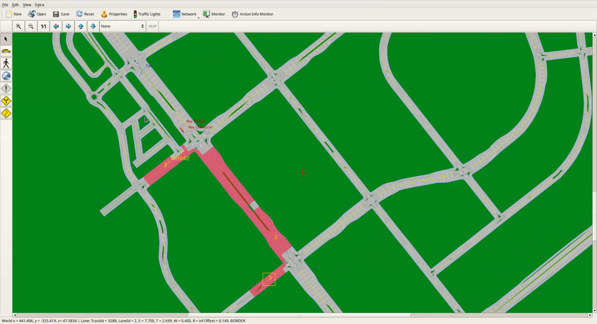

# VTD Scenario Editor·제어기 연동 교육 정리

## 1. 문서 범위와 판독 원칙

이 문서는 2026-08-13 오후 교육 영상 전체(02:09:11.75)를 기준으로, Scenario Editor 실습과 HLVTD 제어기 연동 절차를 다시 수행할 수 있도록 정리한 기록이다. 영상의 자동 전사본 3,309개 큐는 [`transcripts/session-2.md`](transcripts/session-2.md)에서 시간순으로 확인할 수 있다.

- 화면에 나온 시나리오 수치와 파일명은 교육 중 계속 수정된 예시다. 대회 배포본의 최종값으로 간주하지 않는다.
- Scenario Editor 제목의 `*` 또는 `(edited)` 표시는 저장하지 않은 수정이 있다는 뜻이다. 캡처만으로 저장·배포·제출 완료를 입증하지 않는다.
- 명령과 UI 이름은 화면에서 직접 읽힌 표기를 우선하고, 음성만으로 판독한 항목은 `확인 필요`로 표시했다.
- 참가자·팀명·이메일·전화번호·내부 URL·계정·비밀번호·원격 접속 정보는 기록하지 않았다.
- 아래 이미지는 모두 영상 프레임을 잘라 쓴 스크린샷이다. 별도로 생성한 시각자료는 없다.

## 2. 전체 타임라인

긴 휴식·화질 점검·질문 대기까지 포함해 영상의 처음부터 끝까지 빈 구간 없이 정리했다. 자동 전사의 긴 큐는 무음 구간까지 늘어나는 경우가 있어, 휴식과 대기는 화면·음성의 실제 전환을 함께 기준으로 구분했다.

| 영상 구간 | 내용 |
|---|---|
| 00:00:00–00:01:17 | XML·XODR·OSGB 세 파일 배치를 다시 확인하고 VTD 실행 및 대상 시나리오 노출 여부를 점검한다. |
| 00:01:17–00:02:22 | Scenario Editor를 열고, 제공된 신호 설정을 유지하며 원본에서 `File > Save As`로 V1 작업본을 만든다. |
| 00:02:22–00:06:29 | View 표시, Traffic Lights, 인터페이스 문서, Scenario Properties의 Layout File(XODR)·Visual Database(OSGB) 연결을 설명한다. |
| 00:06:29–00:09:28 | Player·Character·Object·Path·Path Shape 도구를 소개하고, 제어 차량을 `Ego`, 차량 모델, Animation `External`로 설정한다. |
| 00:09:28–00:13:57 | `New Player`, Position Type, Route/Path와 Path Shape의 차이, 차로 선택의 자유도와 정해진 궤적의 차이를 설명한다. |
| 00:13:57–00:17:48 | Object·Character 모델 선택, Path/Path Shape 연결, 시작 차로, 반복·정지·자유주행 등의 End Action을 설명한다. |
| 00:17:48–00:22:42 | Trigger와 Action, Absolute/Relative 위치, Pivot, 활성 반경, 뒤차축 기준 판정, Lane Change 방향·시간·지연을 설명한다. |
| 00:22:42–00:25:27 | 기존 요소를 지우고 Ego와 Path01을 다시 만들어 V1의 최소 직진 시나리오를 구성한다. `+`로 Path 생성을 확정해야 한다는 점을 강조한다. |
| 00:25:27–00:27:47 | VTD GUI에서 시나리오를 선택하고 Configure·Apply·Play로 실행한다. Viewer 해상도, 추종 시점, MainRS 창을 확인한다. |
| 00:27:47–00:31:24 | 앞차를 추가해 Ego가 영역에 들어오면 출발·가속·차로 변경하도록 Absolute Trigger 예시를 만든다. 재적용 순서를 설명한다. |
| 00:31:24–00:33:04 | V2에서 Ego 중심 Relative Trigger로 바꾸고, 상대 차량이 반경에 들어올 때 같은 Action을 실행하는 방식을 비교한다. |
| 00:33:04–00:37:18 | V3에서 주행 차량이 Ego 근처에서 급정지하는 예를 만들고, 내부 운전자 모델의 안전거리 반응 때문에 원하는 결과가 달라질 수 있음을 확인한다. |
| 00:37:18–00:42:29 | Character와 Path Shape를 연결해 보행자가 도로로 뛰어드는 예를 만든다. Motion·속도·Gesture·반복·경로 접근 방식을 조정한다. |
| 00:42:29–00:44:44 | Road Objects 표시와 정적 Object 배치, VTD 내부 제어기의 장애물 회피를 확인한다. |
| 00:44:44–00:48:17 | Relative Trigger를 다시 구성하고, 보행자·정차 차량·큰 차량의 가림을 결합한 복합 상황을 만든다. |
| 00:48:17–00:49:07 | 다음 교차로 예고, 시나리오 파트 중간 질의, 10분 휴식을 안내한다. |
| 00:49:07–01:00:20 | 휴식. 새 교육 내용은 없다. |
| 01:00:20–01:01:19 | 교육을 재개해 기존 상황을 유지하고 차량 모델을 바꾸며 추가 시나리오 작업을 시작한다. |
| 01:01:19–01:02:50 | Junction 자체 또는 Junction Track은 Path로 선택할 수 없다는 오류를 확인하고 접근·이탈 도로 구간을 선택하는 우회 방법을 설명한다. |
| 01:02:50–01:08:52 | Path Shape로 교차로 우회전 궤적을 만들고, 여러 Trigger에서 30→50→20 같은 예시 속도를 단계적으로 바꾸며 반복 튜닝한다. |
| 01:08:52–01:12:21 | Waypoint 추가·이동·삭제, Object 복사/붙여넣기, 연료통 형태 장애물과 회피·신호 정지 결과를 확인한다. |
| 01:12:21–01:14:13 | 어린이 보호구역 등 다른 도로 구간에서 신호 준수와 제어기 반응을 시험하는 확장 방향을 설명하고 질문을 받는다. |
| 01:14:13–01:16:15 | 시나리오 교육을 마무리한다. V8은 복사본이라고 밝히고 V1–V7 예시를 Redmine 지원 시스템에 올릴 예정이라고 말하지만, 실제 업로드 완료는 영상이 입증하지 않는다. |
| 01:16:15–01:17:31 | 제어기 연동 파트로 전환하고 다음 강사가 HLVTD 셋업 설치·대회 환경 질의를 다룰 것이라고 소개한다. |
| 01:17:31–01:19:00 | 화면 화질 문제를 확인하고 약 10분간 테스트하기로 한다. |
| 01:19:00–01:29:34 | 화질·접속 점검 대기. 새 기술 설명은 없다. |
| 01:29:34–01:30:24 | 교육을 재개하고 배포 셋업이 대회 VTD PC 환경과 맞춰진 빌드라고 설명한다. |
| 01:30:24–01:31:01 | 필수 Ubuntu 패키지, NVIDIA 드라이버와 NVENC 확인 명령을 설명한다. |
| 01:31:01–01:32:10 | `VTD_ROOT`를 실제 설치 위치에 맞추고 배포된 HLVTD 압축 파일을 지정 위치에 푸는 절차를 설명한다. 정확한 압축 해제 명령은 화면 자료가 없어 확인 필요다. |
| 01:32:10–01:33:17 | 첫 실행에서 HLVTD setup을 선택하고, 이후에는 기본 실행 명령만 쓰는 흐름을 설명한다. 실행 명령 철자는 음성 판독이어서 확인 필요다. |
| 01:33:17–01:35:00 | XML·XODR·OSGB를 각 디렉터리에 배치하고 Properties를 연결한 뒤 Ego 모델과 `External` 애니메이션을 설정한다. |
| 01:35:00–01:35:53 | `Relative Follower View`를 Project Configuration에 추가하고 PDF에 제시된 X/Y/Z/Heading/Pitch/Roll을 맞춘다. 영상에 나온 좌표는 최종 배포 PDF로 재확인해야 한다. |
| 01:35:53–01:37:43 | HLVTD JSON의 센서 활성화와 LiDAR 목적지 IP를 설정하고 Configure→Apply→Play 후 센서별 MainRS 창 3개를 확인한다. |
| 01:37:43–01:39:38 | 전방 카메라·LiDAR는 참가 제어에 쓰지만 방송 카메라는 참가자가 접근할 수 없다고 설명한다. 대회 LAN 직결, TCP·UDP·RTSP, 추후 고정 IP 공지를 다룬다. |
| 01:39:38–01:41:14 | 경로 이탈·중앙선 침범 시 정상 방향 차로로 Respawn, 교차로 이탈 시 교차로 이후로 Respawn, 감점, Object 배열 고정 30개를 설명한다. |
| 01:41:14–01:44:42 | 운영자가 평가 경로의 Waypoint 좌표를 제공하고 종점 반경 진입 시 종료하는 구상을 설명한다. 경로 이탈과 좌표 점프 대응을 강조한다. |
| 01:44:42–01:45:48 | LiDAR·카메라·Object 목록 제공, 로컬 PC 성능에 따른 센서 비활성화, 대회에서는 센서 데이터를 내보내는 방침을 설명한다. |
| 01:45:48–01:47:17 | 9월 3–4일 사전 테스트, 실제 경로와 다른 테스트 경로, 실시간 감점·점수 UI, 사전 연동 필요성을 안내한다. 날짜·정원은 당시 계획이라 확인 필요다. |
| 01:47:17–01:48:20 | VTD와 제어기를 한 PC에 같이 두기보다 두 PC로 나눠 시험할 것을 권장하고, 연동 문제는 지원 시스템에 남기도록 안내한다. |
| 01:48:20–01:50:34 | 센서 스펙·RTSP 접속·고정 센서 구성을 설명한다. 팀별로 카메라나 LiDAR 수를 바꿔 주지는 않으며 HLVTD setup으로 실행해야 한다. |
| 01:50:34–01:51:26 | HLVTD가 아니면 센서 창이 정상 생성되지 않을 수 있음을 재확인하고 질문을 받는다. |
| 01:51:26–01:56:10 | ROD/DefaultProject 누락 사례를 진단한다. 설치 구성·경로를 확인하고 필요하면 민감정보를 공개하지 않는 별도 원격 점검을 안내한다. |
| 01:56:10–01:57:12 | 지원 시스템 계정의 성(last name) 필드에 `HLFMA`를 넣어 운영자가 참가자를 식별·프로젝트에 추가할 수 있게 하라고 안내한다. |
| 01:57:12–01:58:53 | 점수표 공개 시점, 평가 항목 추가 가능성, 센서 노이즈 여부를 답변한다. 점수·항목은 당시 미확정이고 별도 노이즈는 넣지 않는다고 설명한다. |
| 01:58:53–02:00:56 | 포트 표와 API를 다시 보여준다. 장애물 종류는 미확정이며 Object payload에는 타입 구분 없이 ID·위치·방향·속도·크기만 준다고 정정한다. |
| 02:00:56–02:03:20 | 특정 설치/XODR 문제의 원격 점검을 조율한다. 접속 ID·비밀번호·연락처 등 민감한 대화는 이 문서에서 제외했다. |
| 02:03:20–02:04:16 | 마지막 질문을 요청하고 일정이 있는 참석자는 먼저 종료해도 된다고 안내한다. |
| 02:04:16–02:08:56 | 정적 질문 대기. 새 기술 설명은 없다. |
| 02:08:56–02:09:11.75 | 질문이 없음을 확인하고, 후속 질문은 지원 시스템에 남기도록 안내한 뒤 종료한다. 마지막 발화 뒤 약 4.8초는 무음이다. |

## 3. 프로젝트·도로·신호 데이터 준비

### 3.1 시작 점검

1. 제공된 XML·XODR·OSGB가 각각 VTD가 읽는 위치에 있는지 확인한다.
2. VTD GUI의 초록색 체크 표시로 setup/라이선스가 정상 상태인지 먼저 확인한다. 체크의 정확한 진단 범위는 설치 매뉴얼 확인 필요다.
3. VTD를 실행해 `HL_FMA_VTD_LivingLab` 계열 시나리오가 `File > Scenario`에 나타나는지 확인한다.
4. Scenario Editor는 영상에서 `Alt+S` 또는 Tools 메뉴의 Scenario Editor 항목으로 연다. 정확한 단축키는 설치 버전에서 확인 필요다.
5. 원본을 직접 덮어쓰지 말고 `File > Save As`로 V1을 만든다.
6. 제공된 신호 주기·도로 신호 설정은 대회용으로 준비됐다고 설명했으므로 임의로 바꾸지 않는다.


*그림 1 — 00:02–00:03 무렵 전체 도로망과 `File > Save As`가 있는 편집 화면을 보여준다. 이 프레임은 도로망이 로드됐다는 정적 상태만 보여 주며, V1이 실제로 저장됐는지·신호 로직이 실행되는지·배포본과 동일한지는 증명하지 않는다.*

### 3.2 파일 배치와 Properties

| 자료 | 영상에서 설명한 위치/연결 | 판독 상태 |
|---|---|---|
| Scenario XML | VTD 프로젝트의 `Scenarios` 폴더 | 프로젝트명은 설치마다 달라질 수 있어 실제 선택된 프로젝트 경로 확인 필요 |
| OpenDRIVE XODR | `./Runtime/Tools/ROD/DefaultProject/Odr/HL_FMA_VTD_LivingLab.xodr` | 화면 판독 고신뢰. 대소문자와 파일명은 배포본 확인 필요 |
| Visual Database OSGB | 위 `Odr`의 형제 `Database` 폴더에 있는 동명 계열 `.osgb` | 화면 일부가 가려져 전체 경로 확인 필요 |

Scenario Properties의 Scene 항목에서 다음을 연결한다.

- `Layout File`: XODR
- `Visual Database`: OSGB

도로가 보이지 않거나 로직이 정상 로드되지 않으면 먼저 파일이 정확한 디렉터리에 있는지 본다. 교육 화면에서는 `Runtime/Tools/ROD/DefaultProject` 쪽 바로가기/연결 구조 때문에 서로 다른 진입 경로가 같은 데이터 위치를 가리킬 수 있다고 설명했다. Properties의 파일 선택기로 직접 올바른 파일을 지정하는 방식도 가능하다.

Traffic Lights와 Road Objects는 View 표시를 켜야 편집기에서 보일 수 있다. 강사는 실전 TCP 인터페이스가 Ego 바로 앞의 현재 신호 상태를 실시간으로 전달한다고 설명했다. 다만 편집기의 Traffic Light controller/object ID가 그대로 전달된다고 가정하지 말고, 어느 신호가 “바로 앞”으로 선택되는지와 ID 매핑을 배포 API 계약으로 확인한다.

## 4. Scenario Editor 작성 모델

### 4.1 편집 요소

왼쪽 도구 모음의 핵심 요소는 다음과 같다.

| 요소 | 용도 | 주의 |
|---|---|---|
| Player | Ego 또는 주변 차량 | 외부 제어 차량과 내부 운전자 모델 차량을 구분한다. |
| Character | 성인·아동·동물 등의 보행 개체 | Action에서 Motion·Path Shape·Gesture를 따로 준다. |
| Object | 벽·통·장애물 같은 정적/일반 물체 | 모델 미리보기와 Bounding Box로 크기를 확인한다. |
| Path/Route | 도로 구간을 잇는 논리 경로 | 경로는 정하지만 특정 차로를 끝까지 강제하지 않을 수 있다. |
| Path Shape/Trajectory | Waypoint를 직접 찍은 궤적 | 정해진 궤적과 타이밍이 필요한 상황에 적합하다. UI의 정확한 용어 대응은 설치 버전에서 확인 필요다. |


*그림 2 — 00:14–00:16 무렵 `Ego`, `New Player`, `New Character`, `New Object`, `Path01`, `PathShape01`의 상대 배치를 보여준다. 정적 편집 화면이므로 각 요소의 Position Type, Trigger/Action 값, 저장 상태, 실제 충돌·인지 결과는 증명하지 않는다.*

### 4.2 Ego

제어 대상 Player의 최소 설정은 다음과 같다.

1. Player를 도로 위에 놓고 진행 방향에 맞게 회전한다.
2. 이름을 정확히 `Ego`로 둔다.
3. 제공된 Ego 차량 모델을 고른다. 영상은 검은색 IONIQ 6 예를 사용했지만 모델·색상은 최종 대회값으로 확정된 것이 아니다.
4. Animation을 `Internal`에서 `External`로 바꾼다.
5. 저장한다.

커서가 가리키는 월드 좌표는 Editor 왼쪽 아래에서 확인한다. 실습 중 첫 배치 예로 X≈445, Y≈-239가 언급됐지만 편집 시연용 좌표이며 평가 시작점이 아니다. 차로 반대편에 놓으면 진행 방향도 함께 뒤집어야 한다.

Ego는 참가 제어기가 움직이는 대상이므로, 실제 연동 시에는 주변 차량처럼 Scenario Action을 임의로 넣지 않는다. 교육 중 직진 확인을 위해 VTD 내부 제어로 움직인 장면은 편집 개념 시연이며 외부 제어 연동의 성공을 뜻하지 않는다.

### 4.3 New Player·Character·Object

- `New Player`는 주변 교통 차량이다. Route, 초기 속도, 내부 Autonomous, Trigger/Action으로 움직인다.
- Character 모델은 성인 남녀·아동·동물 범주에서 고를 수 있다. 실제 목록은 설치 자산에 따라 달라질 수 있다.
- Character의 경로는 차량 Position Type만 바꾸는 방식이 아니라 Action의 Path Shape에서 연결한다.
- Motion은 걷기/달리기와 속도를 정하고, Gesture는 전화·우산·음료 같은 동작을 추가한다. 영상의 구체 Gesture는 예시일 뿐 평가 조건이 아니다.
- Object는 도로에 놓기만 해도 정적 장애물이 된다. 복사/붙여넣기로 여러 개를 만들 수 있다.
- Object도 이동시키는 구성이 가능하다고 언급되지만 영상 실습은 Player와 Character 이동에 집중한다. 구체 Object 이동 Action은 확인 필요다.

### 4.4 Position Type

화면에서 확인된 선택지는 `Absolute`, `Path Shape`, `Relative`, `Route`, `Track`, `Trailer`다.

| Position Type | 교육에서의 의미/용도 |
|---|---|
| Absolute | 월드 좌표의 자유 위치. 배치와 고정 Trigger 영역에 사용한다. |
| Relative | Ego 같은 Pivot에 대한 상대 위치/반경으로 Trigger를 따라다니게 한다. |
| Route | 도로 구간을 연결한 Path를 따른다. 내부 제어기가 차로를 유동적으로 선택할 수 있다. |
| Path Shape | 직접 찍은 궤적을 그대로 따르게 할 때 사용한다. |
| Track | 선택 항목은 보였지만 이 교육에서 독립 실습하지 않았다. 세부 동작 확인 필요다. |
| Trailer | 트레일러 관계 설정. 이번 평가에는 관련 미션이 없다고 안내했다. 당시 기준이며 최종 규정 확인 필요다. |

## 5. Path·Waypoint·Trajectory

### 5.1 Route/Path

1. 도로를 시작 구간부터 다음 구간 순서로 클릭한다.
2. 선택 영역이 강조되는지 본다.
3. 반드시 `+`를 눌러 왼쪽 목록에 Path를 확정한다. 선만 그린 상태는 아직 생성 완료가 아니다.
4. Player의 Position Type을 `Route`로 바꾸고 생성한 Path를 고른다.
5. 시작 위치/Start Lane을 고른다. 교육은 우측통행 차로를 1, 2, 3…으로 설명했다.
6. End Action에서 반복, 종점 정지, 종점 이후 자유주행 중 목적에 맞는 동작을 선택한다.

Route는 연결 도로를 지정하지만, 내부 운전자 모델이 주변 교통·초기 위치·회전에 따라 차로를 바꿀 수 있다. 특정 차로와 타이밍을 강제해야 하면 Path Shape를 사용한다.

Start Lane 선택기는 보도나 경계 쪽도 선택할 수 있다고 설명했으므로, 시작 위치가 실제 주행 차로 위인지 지도와 렌더에서 함께 확인한다.

### 5.2 Path Shape와 Waypoint

Path Shape는 클릭한 점을 잇는 궤적이다. 선택 상태에서 `+`로 점을 추가하고, Waypoint를 이동하거나 `Delete Waypoint`로 지운다. 마지막 점이 선택된 상태에서 다음 점을 추가해야 순서가 의도대로 이어진다. 필요하면 전부 지우고 다시 찍는 편이 빠르다.

Character는 Action의 Path Shape 항목에서 해당 이름을 선택한다. 영상은 고도 추종, 반복, 시작점으로 즉시 이동할지 경로까지 걸어갈지 정하는 항목도 설명했으나 정확한 UI 라벨은 자동 전사만으로 확정하기 어려워 확인 필요다.

### 5.3 Junction Track 선택 제한

Junction 자체를 Path에 넣으려 하면 다음 모달이 표시됐다.

- 제목: `Selecting Junction`
- 본문: `Junction Tracks cannot be selected for paths.`

따라서 교차로 내부 Junction Track을 직접 클릭하지 않고, 교차로 진입 전 기본 도로와 이탈 후 기본 도로를 순서대로 선택한다. 내부 움직임을 정확히 강제해야 하는 예에서는 Path Shape로 우회전 궤적을 직접 만들었다.



*그림 3 — 01:05 무렵 `Path02`, Ego, 주변 Player·Character가 교차로에 배치된 편집 상태다. 강조 영역은 선택된 경로를 보여 주지만 Junction Track 선택 오류의 해결 여부, 차량이 실제로 교차로를 통과했는지, Trigger 타이밍이 맞는지는 증명하지 않는다.*

## 6. Trigger와 Action

### 6.1 Trigger 판정

화면에서 확인된 주요 필드는 Position/Trigger Type, `Release Type`, `Who`, `Activation Radius`, `Counter ID`, `Counter Value`다. 교육에서 실제로 다룬 판정은 다음과 같다.

- Absolute Position: 고정된 월드 위치의 영역에 `Who`가 들어오면 작동한다.
- Relative Position: Pivot(Ego 등)을 중심으로 영역이 이동하고 대상이 반경에 들어오면 작동한다.
- Pivot/Who를 혼동하지 않는다. Action을 가진 Actor와 Trigger 판정 대상은 다를 수 있다.
- 차량의 판정 기준점은 뒤차축 중심이라고 설명했다. 영역이 차체 일부에 닿는 것만으로는 작동하지 않을 수 있다.
- `On Enter`는 영역 진입 시, `On Exit`는 영역 이탈 시 작동한다.
- Delay Time은 판정 뒤 Action 시작을 늦춘다.
- TTC 관련 Trigger도 보였지만 상세 조건·단위는 실습에서 충분히 검증하지 않았다. 확인 필요다.
- Counter ID/Value는 화면에 보였지만 이 교육에서 동작 예를 만들지 않았다. 확인 필요다.

반경은 크게 하면 안정적으로 일찍 작동하고 작게 하면 돌발성이 커진다. 영상의 반경 30, 속도 20/30/50, 차로 변경 3초, 지연 1초 등은 튜닝 중 예시이므로 배포본 최종값으로 사용하지 않는다.

### 6.2 Action 분류

화면에서 확인된 분류는 `Autonomous`, `Lane Change`, `Speed Change`, `SCP`, `User`다.

| Action | 영상에서 확인된 동작 |
|---|---|
| Autonomous | 주변 Player의 VTD 내부 자율주행을 활성화한다. Trigger만 있고 Action이 비어 있으면 명령 대기 상태가 될 수 있다. |
| Lane Change | `+1`은 왼쪽, `-1`은 오른쪽 한 차로 변경으로 설명했다. Duration과 Delay를 함께 조절한다. |
| Speed Change | 시작/목표 속도와 가감속 관련 값을 바꾼다. 내부 안전거리 모델 때문에 명령값과 관찰 결과가 다를 수 있다. |
| SCP | 항목명만 화면에서 확인됐다. 메시지 형식·대상·실행 결과는 확인 필요다. |
| User | 항목명만 화면에서 확인됐다. 사용자 Action의 호출 계약은 확인 필요다. |

### 6.3 실습한 시나리오 패턴

1. Ego가 고정 Absolute 영역에 진입하면 앞차가 출발해 가속하고 왼쪽으로 끼어든다.
2. 같은 동작을 Ego 중심 Relative 영역으로 바꿔, 두 차량 거리에 따라 발생시킨다.
3. 앞차가 주행하다 Ego가 가까워지면 속도를 0으로 바꿔 급정지시킨다.
4. Ego가 영역에 들어오면 Character가 Path Shape를 따라 뛰어든다.
5. 정차 차량/버스로 시야를 가리고 그 뒤에서 보행자가 나오게 해 카메라·LiDAR 인지 난도를 높인다.
6. 교차로에서 주변 차량이 Path Shape를 따라 우회전하며 구간별 속도를 바꾸게 한다.
7. 여러 Object를 복사해 도로 위 장애물 군을 만들고 회피 반응을 본다.

## 7. 버전 관리와 반복 튜닝

교육은 원본에서 `Save As`로 분기해 다음 순서로 예시를 확장했다.

| 버전 | 영상에서의 역할 | 확정 수준 |
|---|---|---|
| V1 | Ego+Path01 최소 직진, 이어서 Absolute Trigger 끼어들기 | 명시적으로 확인 |
| V2 | Ego 중심 Relative Trigger 비교 | 명시적으로 확인 |
| V3 | 근접 시 앞차 급정지·속도/반경 튜닝 | 명시적으로 확인 |
| V4 | 보행자 Path Shape·Motion 예시로 이어지는 순서 | 화면 파일명을 전 구간에서 명확히 읽지 못해 확인 필요 |
| V5 | 정적 Object 예시 | “다섯 번째” 발화는 있으나 정확한 파일명 확인 필요 |
| V6 | 보행자·가림 차량을 결합한 복합 예시 | 진행 순서에 따른 대응으로, 정확한 파일명 확인 필요 |
| V7 | 휴식 뒤 교차로·Path02·속도 단계·장애물 예시 | 마지막에 V1–V7을 제공할 예정이라고 했지만 개별 파일명 확인 필요 |
| V8 | V7 계열 복사본이라고 설명 | 독립 완성본이 아니며 제공 대상이라고 확인되지 않음 |

강사는 V1–V7을 Redmine 지원 시스템에 올리겠다고 말했지만 영상에는 업로드 완료 확인 화면이 없다. 실제 파일 존재·최종 수정 시각·배포 상태는 확인 필요다.

V3 작업 중 기존 파일에 잘못 저장한 뒤 별도 사본을 다시 만들겠다고 정정한 장면도 있다. 버전 번호를 바꾸기 전에 현재 파일명을 확인하고, 원본/이전 버전을 덮어썼다면 즉시 새 이름으로 분기해 변경 이력을 점검한다.

튜닝은 계산 한 번으로 끝내기보다 실행 결과를 보고 Trigger 위치·반경·속도·가감속·Delay·Actor 시작 위치를 조금씩 바꾸는 방식이었다. 변경 후에는 저장과 재적용을 반복한다.

## 8. 실행·검증 절차와 한계

권장 순서는 다음과 같다.

1. Scenario Editor에서 저장한다.
2. VTD GUI에서 대상 시나리오를 선택한다.
3. `Configure`를 실행한다.
4. `Apply`를 실행한다.
5. `Play`를 누른다.
6. Editor/Monitor, Render 창, Action Info Monitor에서 Actor와 Trigger 상태를 확인한다.

교육에서는 FHD 해상도를 선택하고 Viewer의 Ego 항목으로 주행 차량을 추종했다. Editor 상단의 `HUP` 버튼도 선택 Actor 기준 시점으로 보는 데 사용했지만, 정확한 View 동작과 단축키는 설치 버전에서 확인 필요다.

정지한 뒤 편집하고 Play만 다시 눌러도 되는 경우가 있지만, Action이 이전 상태로 남거나 새 값이 적용되지 않는 현상이 가끔 발생한다고 설명했다. 이상하면 `Configure → Apply → Play`를 다시 순서대로 실행해 초기화한다.


*그림 4 — 00:27 무렵 왼쪽의 Ego/Path01과 오른쪽 Render의 IONIQ 주행 화면을 함께 보여 준다. 한 프레임은 렌더링이 시작됐다는 점만 뒷받침하며, 외부 제어기 연결·Path 완주·센서 스트림·Action 반복 재현성은 증명하지 않는다.*

내부 Driver Model은 속도 제한, 신호, 안전거리, 장애물 회피에 스스로 반응한다. 그래서 “Speed 0”이나 Lane Change를 줬어도 의도와 다른 타이밍/궤적이 나올 수 있다. 실제 참가 제어기의 성능과 내부 모델의 결과를 혼동하지 않는다.

## 9. HLVTD 설치 환경

영상에서 권장한 HLVTD/VTD 환경은 다음과 같다.

- Ubuntu 24.04 LTS
- x86-64
- VTD 2025.2
- NVIDIA GPU/드라이버
- FFmpeg NVENC 인코더
- VTD 설치와 라이선스 설정 완료

### 9.1 필수 패키지와 확인 명령

아래는 교육 PDF 화면에 나온 명령을 그대로 옮긴 것이다.

```bash
sudo apt update # update

sudo apt install -y python3 xterm ffmpeg tcpdump
sudo apt install -y libboost-program-options1.83.0
sudo apt install -y libboost-thread1.83.0
sudo apt install -y libboost-chrono1.83.0t64
sudo apt install -y libboost-filesystem1.83.0

nvidia-smi
ffmpeg -hide_banner -encoders | grep -i nvenc

export VTD_ROOT="$HOME/Hexagon/VTD.2025.2"
echo "$VTD_ROOT"
```


*그림 5 — 01:30–01:31 무렵 필수 패키지, NVIDIA/NVENC 확인, `VTD_ROOT` 예시를 보여 준다. 이 자료는 명령 철자의 근거지만 현재 PC에서 패키지가 실제 설치됐는지, GPU가 호환되는지, VTD가 반드시 해당 경로에 있는지는 증명하지 않는다.*

`nvidia-smi`가 GPU/드라이버를 보여야 하고, FFmpeg 목록에는 최소 `h264_nvenc`가 있어야 시뮬레이션의 카메라 송출 프로세스를 정상 실행할 수 있다고 안내했다. 교육자의 실제 설치는 `VIRES/VTD.2025.2` 계열 경로였고 참가자 기본 예시는 `Hexagon/VTD.2025.2`였으므로, `VTD_ROOT`는 실제 설치 위치에 맞춘다.

### 9.2 HLVTD setup 설치와 실행

배포된 HLVTD 압축 파일을 받아 VTD setup이 읽는 위치에 압축 해제한다. 영상에는 “제공된 명령”이 있다고 설명하지만 현재 스크린샷에는 정확한 압축 해제 명령과 대상 경로가 없어 확인 필요다.

첫 실행 흐름은 음성상 다음과 같이 들린다.

```bash
cd "$VTD_ROOT/bin"
./vtdStart.sh -select
# 목록에서 HLVTD에 해당하는 번호(교육 화면에서는 0)를 선택

# 첫 선택 이후
./vtdStart.sh
```

`vtdStart.sh -select`와 실행 파일의 상대경로 표기는 음성 전사를 토대로 복원한 것이며 배포 매뉴얼/실제 `bin` 디렉터리에서 확인 필요다. 교육 화면의 HLVTD 번호 `0`도 setup 목록 순서가 바뀌면 달라질 수 있다. Standard setup으로 실행하면 참가용 센서·인터페이스가 올라오지 않을 수 있다.

## 10. VTD 프로젝트와 View 설정

1. XML·XODR·OSGB를 앞 절의 경로에 배치한다.
2. Scenario Editor Properties에서 Layout File과 Visual Database를 연결한다.
3. Ego를 추가하고 모델을 선택한 뒤 Animation을 `Internal → External`로 바꾼다.
4. 저장한다.
5. View에서 Database 표시를 켜고 `Relative Follower View`를 더블클릭해 Project Configuration에 추가한다.
6. 배포 PDF의 X/Y/Z/Heading/Pitch/Roll 값을 그대로 입력한다.

교육 화면의 View 수치는 카메라 연출 예시이므로 이 문서에 전사하지 않았다. 최종 배포 PDF와 대회 환경의 설정을 기준으로 한다.

## 11. HLVTD JSON·센서·RDB

### 11.1 화면에서 확인된 설정

배포 setup의 `00_HL_VTD/Config/HLVTD/hl_vtd_config.json`에서 센서 활성화와 목적지 주소를 바꾼다. 화면에서 읽힌 경로·파일명이며 설치본에 따라 달라질 수 있다. 아래 값도 편집 중 값일 수 있어 최종 배포본 확인 필요다.

| 설정 | 화면 판독값 | 해석과 주의 |
|---|---:|---|
| `bindIp` | `0.0.0.0` | 모든 로컬 인터페이스 바인드로 보인다. 대회 격리 LAN과 방화벽 정책 확인 필요 |
| `participantDataPort` | `9910` | 참가 제어기 연결 포트로 보이며 API 포트 표와 일치 |
| `rdbPort` | `48190` | RDB 연결 설정으로 보이나 실제 프로토콜·상대 endpoint 확인 필요 |
| `lidarDestinationIp` | `127.0.0.1` | 로컬 기본 예시. 두 PC 연동에서는 LiDAR 수신 제어기 PC IP로 바꿔야 함 |
| `lidarDstPort` | `9912` | LiDAR/UDP 목적 포트로 보이며 포트 표와 일치 |

화면 우측 터미널의 `127.0.0.1:32512`는 setup 내부 연결로 보이며 참가자 API 포트가 아니다. `9910`, `8554`, `9912`와 혼용하지 않는다.

구체 로그 파일명·로그 디렉터리·RDB wire protocol은 영상 음성과 확보된 화면에 나오지 않았다. 이를 TCP/UDP/RTSP 인터페이스와 동일시하지 않는다. 로그 수집이 필요하면 배포 매뉴얼과 실제 setup 프로세스 인자를 확인해야 한다.

### 11.2 센서 활성화와 MainRS

JSON에서 전방 카메라, 방송 카메라, LiDAR를 각각 `true`/`false`로 켜거나 끈다. LiDAR Destination은 데이터를 받을 PC의 IP로 설정한다. 변경 후에는 반드시 VTD에서 `Configure → Apply → Play`를 다시 수행한다.

세 센서를 모두 켠 교육 예에서는 센서마다 하나씩 MainRS 창, 총 3개가 뜬다. 창 3개는 setup 프로세스가 올라왔다는 1차 점검일 뿐 실제 RTSP 프레임 수신, LiDAR 패킷 수신, 시간 동기화, 외부 제어 성공을 보장하지 않는다.

### 11.3 센서 제공 범위

- Ego에는 LiDAR 1식과 카메라 1식이 제공된다고 안내했다.
- LiDAR 모델은 Velodyne HDL-32E다.
- 카메라는 차량에 부착된 전방 카메라다.
- 방송 카메라는 중계용이며 참가자 제어 입력으로 접근할 수 없도록 할 예정이라고 했다.
- 카메라 2대나 LiDAR 2대처럼 팀별 센서 구성을 바꾸는 요청은 지원하지 않는다.
- 고정 구성을 쓰는 이유로 당시 신청 약 42개 팀을 팀별로 다시 빌드하기 어렵다는 운영 부담을 들었다. 42는 교육 당시 집계이며 최종 참가팀 수가 아니다.
- 로컬 PC 성능이 부족하면 연습 중 LiDAR 등을 끌 수 있지만, 대회 setup은 센서 데이터를 내보내는 것을 전제로 한다.
- 센서 정량 사양(해상도, FPS, FOV, LiDAR 주기·채널별 보정, 좌표 외부파라미터)은 이 화면에 없다. 확인 필요다.
- 별도 노이즈 모드는 없고 계측값을 그대로 보낸다고 답변했다. “무오차 ground truth”를 뜻한다고 확대 해석하지 않는다.


*그림 6 — 01:49–01:50 무렵 Ego에 Velodyne HDL-32E LiDAR 1식과 차량 부착 카메라 1식이 제공된다는 슬라이드다. 장착 수와 모델 표기만 뒷받침하며 해상도·FOV·주기·좌표계·지연·노이즈·RTSP URL은 증명하지 않는다.*

## 12. 제어기 인터페이스 API

### 12.1 VTD → 참가자

| Level 1 | 항목 | 필드명 | 단위 | 데이터 형식 | Size(bit) |
|---|---|---|---|---|---:|
| Ego | X 좌표 | `egoX` | m | `float`/float32 | 32 |
| Ego | Y 좌표 | `egoY` | m | `float`/float32 | 32 |
| Ego | Z 좌표 | `egoZ` | m | `float`/float32 | 32 |
| Ego | Heading | `egoHeading` | rad | `float`/float32 | 32 |
| Ego | Pitch | `egoPitch` | rad | `float`/float32 | 32 |
| Ego | Roll | `egoRoll` | rad | `float`/float32 | 32 |
| Object(Array=30) | ID | `objects[].id` | - | `uint32_t` | 32 |
| Object(Array=30) | X | `objects[].x` | m | `float`/float32 | 32 |
| Object(Array=30) | Y | `objects[].y` | m | `float`/float32 | 32 |
| Object(Array=30) | Z | `objects[].z` | m | `float`/float32 | 32 |
| Object(Array=30) | Heading | `objects[].heading` | rad | `float`/float32 | 32 |
| Object(Array=30) | Speed | `objects[].speed` | m/s | `float`/float32 | 32 |
| Object(Array=30) | Length | `objects[].length` | m | `float`/float32 | 32 |
| Object(Array=30) | Width | `objects[].width` | m | `float`/float32 | 32 |
| Object(Array=30) | Height | `objects[].height` | m | `float`/float32 | 32 |
| TrafficLight | 신호등 ID | `trafficLights[].id` | - | `int32` | 32 |
| TrafficLight | 신호등 상태 | `trafficLights[].state` | - | `uint8` | 8 |

Object 배열은 항상 30개 고정 크기로 전달한다고 안내했다. 빈 슬롯의 ID/값 규칙, byte order, padding, framing, 갱신 주기, timestamp는 화면 표에 없으므로 확인 필요다. Object payload는 사람/자동차/장애물 같은 타입 분류를 주지 않으며 ID·위치·Heading·Speed·Length·Width·Height만 제공한다고 말미에 정정했다.

Traffic Light 상태 코드는 다음과 같다.

| 코드 | 상태 |
|---:|---|
| 0 | 미할당 |
| 1 | 적색 |
| 2 | 황색 |
| 3 | 녹색 |
| 4 | 좌회전 |
| 5 | 녹색+좌회전 |
| 6 | 점멸 |

점멸의 색상/상세 의미, 복수 신호와 Ego 전방 신호의 매핑, ID 안정성은 확인 필요다.

### 12.2 참가자 → VTD

| 항목 | 필드명 | 단위 | 데이터 형식 | Size(bit) | 값 |
|---|---|---|---|---:|---|
| 조향각 | `steering` | rad | `float`/float32 | 32 | 허용 범위 확인 필요 |
| 종방향 가속도 | `targetAccel` | m/s² | `float`/float32 | 32 | 허용 범위·포화 규칙 확인 필요 |
| 방향지시등 | `turnSignal` | - | `uint8` | 8 | 0=끔, 1=좌회전, 2=우회전 |

별도 throttle/brake 필드는 표에 없다. `targetAccel`의 양·음 부호, 제동 한계, 단위 변환을 임의로 정하지 말고 배포 API 구현과 확인한다.

### 12.3 포트 표

화면 표의 문구를 그대로 보존하면 다음과 같다.

| 포트 | 프로토콜 | 화면의 비고 |
|---:|---|---|
| 9910 | TCP | 학생 PC ↔ Host 접속 |
| 8554 | RTSP | 학생 PC → Host 접속 |
| 9912 | UDP | Host → 학생 PC 접속 |

화살표는 연결을 시작하거나 접속하는 관점일 수 있으므로 곧바로 payload 데이터 방향으로 재해석하지 않는다. 데이터 의미는 위의 `VTD → 참가자`, `참가자 → VTD` 표와 배포 매뉴얼/코드로 검증한다. 특히 RTSP는 참가자 PC가 Host에 접속해 영상을 받는 구조여도 화면 표에는 `학생 PC → Host 접속`으로 적힐 수 있다.

화면에서 판독된 저지연 확인 예시는 다음과 같다. 원본 PDF가 아닌 영상 화면 판독이므로 path까지 최종 확인 필요다.

```bash
ffplay -fflags nobuffer -flags low_delay -framedrop -rtsp_transport tcp \
  "rtsp://<VTD_PC_IP>:8554/front"
```


*그림 7 — 02:00–02:01 무렵 Ego/Object/TrafficLight, Control 필드와 9910·8554·9912 포트를 보여 준다. 표는 필드명·단위·형식·연결 표기의 근거지만 byte order, packet framing, 전송률, timeout, IP, payload 화살표 방향, 실제 소켓 연결 성공을 증명하지 않는다.*

## 13. 대회 운영·평가 연동

### 13.1 PC와 네트워크

- 운영 측은 VTD 워크스테이션 2대를 준비하고 두 팀씩 병렬 평가할 계획이라고 설명했다.
- 참가팀은 제어기가 든 노트북/PC를 가져와 VTD PC와 LAN으로 직결한다.
- 로컬 연습도 VTD와 제어기를 한 PC에 같이 두기보다 두 PC로 나눠 대회 구조를 미리 검증하는 것을 권장했다.
- 대회용 고정 IP는 당시 정해지지 않았고 지원 시스템으로 추후 공지한다고 했다. 문서에 임의 IP를 고정하지 않는다.
- 참가 PC는 TCP/UDP/RTSP 포트, 방화벽, NIC 주소, 동일 서브넷, 케이블 연결을 사전 테스트한다.

### 13.2 Waypoint·종점·Respawn

운영 측이 실제 평가 경로의 시작점·경유지·종점 X/Y 좌표를 제공할 계획이라고 설명했다. 교육 중 읽은 좌표들은 지도 클릭 예시이며 최종 평가 좌표가 아니다.

- 각 Waypoint를 순서대로 통과해야 한다.
- 종점 좌표 반경 10–20m 진입 시 자동 종료하는 예를 설명했지만 최종 반경은 확인 필요다.
- 경로를 건너뛰거나 다른 도로로 이탈하면 감점하고 정상 경로로 Respawn한다.
- 중앙선을 침범하거나 보도 밖으로 나가면 가장 가까운 정상 방향 차선으로 Respawn한다.
- 교차로에서 이탈하면 교차로 이후 정상 차선으로 이동시킨다고 설명했다.
- Respawn 순간 Ego 좌표가 크게 점프하므로 localization/path follower가 불연속 좌표를 처리해야 한다.
- Respawn 구간과 감점 규칙의 정확한 수치는 최종 규정 확인 필요다.

차량 좌표 기준점은 뒤차축 중심의 바닥면이라고 설명했다. 이 기준을 Ego pose, Waypoint 거리, Object 상대 위치 계산에 일관되게 사용하되 축 방향과 좌표계 원점은 API/맵 문서에서 재확인한다.

### 13.3 사전 테스트와 평가 UI

당시 안내는 9월 3–4일 사전 테스트, 하루 최대 21개 팀 접수였다. 실제 대회 경로는 쓰지 않지만 운영 시나리오와 평가 UI로 감점 및 최종 점수를 실시간 표시할 계획이라고 했다.

- 사전 테스트 참가 신청도 Redmine 지원 시스템에서 진행한다고 안내했다.
- 점수 결과를 별도 출력물로 제공하지 않고 현장 UI로 확인하게 할 예정이라고 했다.
- 사전 테스트 전에 배포 setup과 제어기를 로컬에서 연동해 와야 여러 차례 평가를 돌릴 수 있다.
- 현장 연결에 오래 걸리면 대기 중인 다음 팀으로 넘어갈 수 있다고 안내했다.
- 점수표는 사전 제공하지 않고 대회 당일 안내할 예정이라고 답변했다.
- 평가 항목은 설명회 당시 약 10개에서 약 5개 추가될 가능성이 있었고 공개 여부도 협의 중이었다. 모두 당시 미확정 정보다.
- 장애물 종류·구성은 당일 달라질 수 있다고 답변했다. Object payload에는 타입이 없으므로 치수·위치·속도와 센서 인지를 함께 고려한다.

### 13.4 Redmine 지원 채널

- 연동·설치 문제는 Redmine 지원 시스템의 해당 일감에 증상, 로그, 재현 절차를 남긴다. 내부 URL은 이 문서에 기록하지 않는다.
- Redmine 계정의 성(last name) 필드에 `HLFMA`를 넣어 운영자가 참가자를 식별하고 프로젝트에 추가할 수 있게 한다.
- V1–V7 예시는 지원 시스템에 제공할 예정이라고 했지만 실제 첨부 여부는 직접 확인한다.
- 교육에서는 설치 누락 PC의 원격 점검 도구로 RustDesk를 예로 들었다. 원격 점검은 승인된 도구로 별도 진행하고, 공개 일감·문서에 접속 ID·비밀번호·전화번호를 남기지 않는다.

## 14. 문제 해결

| 증상 | 우선 확인 |
|---|---|
| 시나리오/도로가 안 보임 | XML·XODR·OSGB 위치, Scenario Properties의 Layout/Visual Database, 프로젝트 선택, 파일 대소문자 |
| ROD/DefaultProject가 없음 | 설치 옵션과 설치 경로 확인. 전사상 `Full Stack`/`Simulate`/`Create`로 들린 구성 중 `Create`도 같은 VTD 경로에 설치했는지 확인. 설치 프로그램의 정확한 옵션명은 확인 필요 |
| Path에서 교차로를 클릭하면 오류 | Junction/Junction Track 대신 진입 전·이탈 후 기본 도로를 선택하거나 Path Shape 사용 |
| Trigger가 작동하지 않음 | Who/Pivot, Absolute/Relative, 뒤차축 기준, Activation Radius, On Enter/Exit, Delay, Action 유무 확인 |
| 수정한 Action이 반영되지 않음 | 저장 후 `Configure → Apply → Play` 전체 순서를 다시 실행 |
| 주변 차량이 예상대로 급정지/차로 변경하지 않음 | 내부 Driver Model의 신호·안전거리·회피 개입, Trigger 영역, 속도·가감속, 시작 위치를 반복 조정 |
| HLVTD가 setup 목록에 없음 | 압축 해제 위치와 setup 설치 성공 여부 확인. 정확한 설치 명령/경로는 배포 매뉴얼 확인 |
| 센서 창이 없거나 개수가 다름 | Standard가 아닌 HLVTD setup인지, JSON sensor boolean, Configure/Apply, NVIDIA/NVENC 프로세스 확인 |
| LiDAR가 수신 PC로 안 옴 | `lidarDestinationIp`, 9912/UDP, 수신 PC 방화벽·NIC·서브넷, 실제 배포 JSON 확인 |
| RTSP 영상이 안 옴 | 8554/RTSP, Host IP, `/front` path, FFmpeg/NVENC, 방송 카메라와 전방 카메라 혼동 여부 확인 |
| TCP 제어가 안 됨 | 9910/TCP, Host/participant 역할, packet framing·byte order·timeout을 배포 API와 대조 |
| Respawn 뒤 제어기가 불안정 | pose 좌표 점프 감지, planner/localizer 상태 초기화, 다음 Waypoint 재선택 로직 확인 |

## 15. 구현 전 최종 확인 목록

- [ ] VTD 2025.2와 HLVTD setup의 실제 설치 경로를 확정했다.
- [ ] XML·XODR·OSGB의 배포 파일명과 대소문자를 확인했다.
- [ ] Ego 이름, 차량 모델, Animation `External`을 확인했다.
- [ ] Relative Follower View의 6DoF 값을 최신 PDF와 맞췄다.
- [ ] JSON의 센서 boolean, 목적지 IP, 9910/9912, RDB 48190 값을 실제 배포본과 대조했다.
- [ ] 8554 RTSP URL path와 codec/FPS/해상도를 실수신으로 확인했다.
- [ ] TCP/UDP packet framing, byte order, 주기, timeout, timestamp, 빈 Object 슬롯 규칙을 확인했다.
- [ ] `steering`·`targetAccel` 허용 범위와 부호를 확인했다.
- [ ] Traffic Light ID 매핑과 점멸 상태의 의미를 확인했다.
- [ ] Waypoint·종점 반경·Respawn·감점·평가 항목의 최종 공지를 확인했다.
- [ ] VTD PC와 제어기 PC를 분리해 LAN 직결 사전 테스트를 했다.
- [ ] 변경마다 저장 후 Configure→Apply→Play를 반복해 Scenario Action을 검증했다.
- [ ] 지원 요청에는 민감정보를 넣지 않고 재현 절차와 비식별 로그만 첨부했다.

## 16. 확인 필요 항목 모음

1. Scenario Editor 정확한 단축키와 메뉴 라벨.
2. OSGB 전체 절대/상대 경로와 XML의 정확한 프로젝트 경로.
3. HLVTD 압축 해제 명령·대상 setup 디렉터리.
4. `./vtdStart.sh -select` 철자, 옵션, 최초 선택 번호.
5. Relative Follower View의 최종 X/Y/Z/Heading/Pitch/Roll.
6. V4–V7의 정확한 파일명·내용·실제 지원 시스템 첨부 여부.
7. Track, TTC, Counter, SCP, User Action의 상세 계약.
8. JSON의 `bindIp`, `participantDataPort`, `rdbPort`, `lidarDestinationIp`, `lidarDstPort` 최종값.
9. RDB protocol과 로그 파일명·경로·보존 정책.
10. TCP/UDP packet framing, byte order, 갱신 주기, timeout, timestamp, 빈 Object 처리.
11. RTSP 최종 URL path, codec, 해상도, FPS, 지연 허용치.
12. 카메라 FOV/내·외부 파라미터, LiDAR 주기·좌표계·외부파라미터.
13. Ego/Object 좌표계 축 방향과 뒤차축 기준 변환.
14. 최종 Waypoint 좌표, 종점 반경, Respawn·감점·평가 규칙.
15. 대회 고정 IP, 사전 테스트 일정·정원, 점수표·평가 항목 공개 범위.

## 17. 전사 자료 사용 시 주의

자동 전사는 VTD·ROD·XODR·OSGB·MainRS·RTSP·NVENC·Relative 같은 용어를 한국어 일반 단어로 잘못 바꾼 부분이 있다. 이 문서는 화면 판독과 문맥으로 명백한 항목만 교정했고, 확정할 수 없는 명령·수치·경로는 원문을 그럴듯하게 보정하지 않고 `확인 필요`로 남겼다. 정확한 발화와 타임스탬프가 필요하면 전체 전사본을 함께 확인한다.
