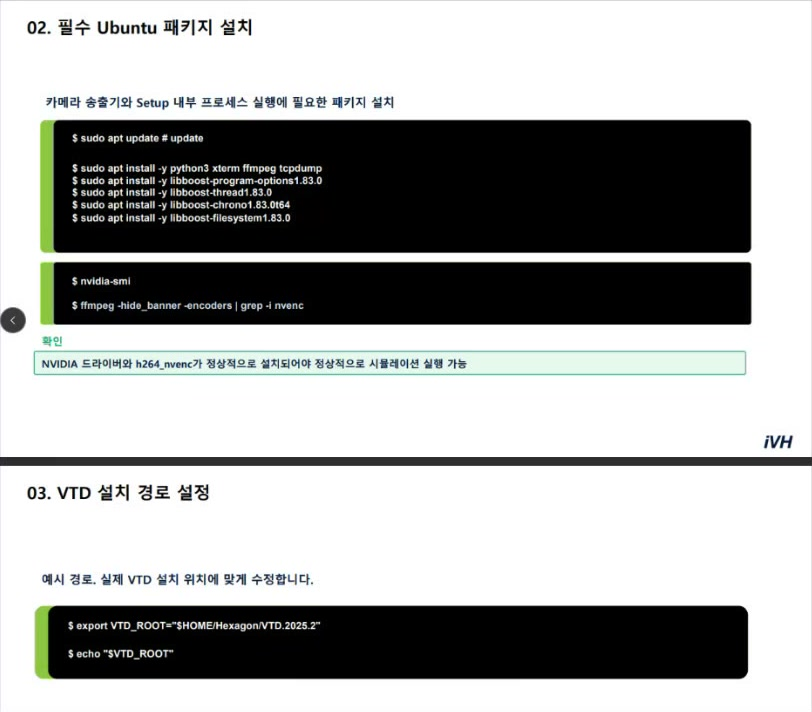
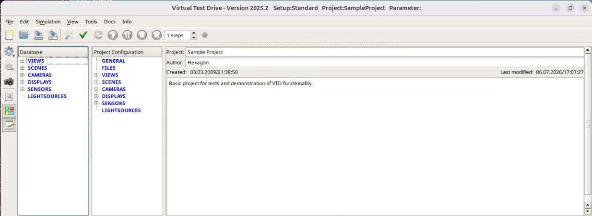
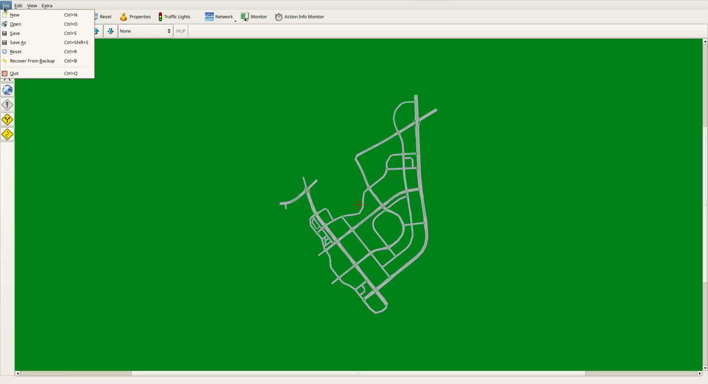
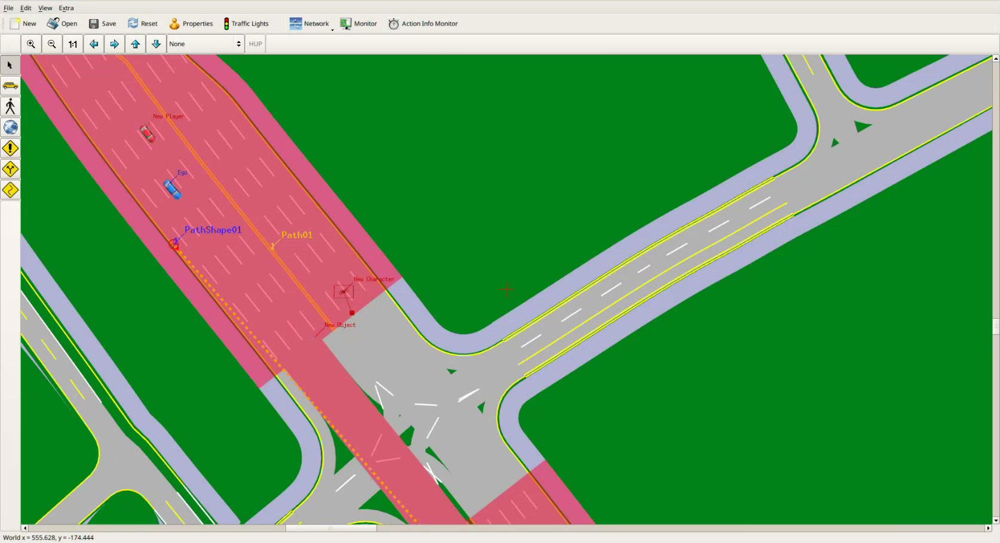
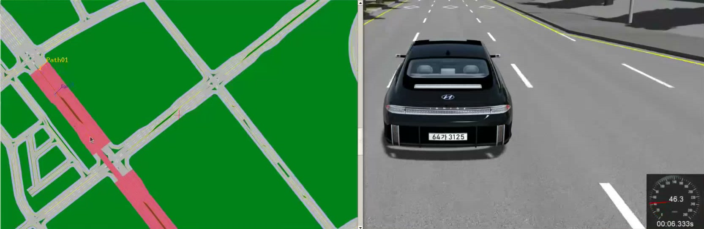
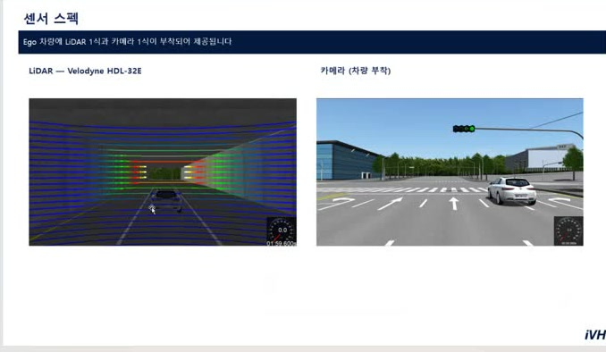
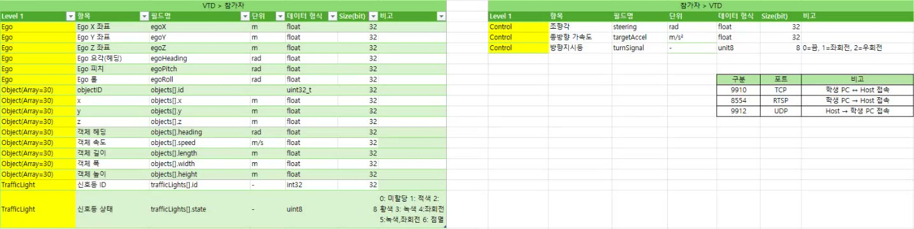

# VTD 시뮬레이터 설치·실행·사용 가이드

이 문서는 교육 영상에서 확인된 VTD 2025.2와 HLVTD setup의 설치 준비, 최초 실행, 시나리오 실행, 센서·제어기 연결 절차를 한 흐름으로 정리한 가이드다.

> 교육 영상은 VTD 본체 설치 프로그램의 전체 과정을 보여 주지 않는다. 아래 설치 부분은 **VTD 2025.2와 라이선스 파일을 받은 뒤** 필요한 Ubuntu 패키지, 라이선스 활성화, HLVTD setup 배치부터 시작한다. 화면이나 음성으로 확정되지 않은 명령·경로는 **확인 필요**로 표시했다.

관련 상세 문서:

- [ROD Road Designer 교육 정리](01-vtd-road-designer.md)
- [Scenario Editor·제어기 연동 교육 정리](02-vtd-scenario-editor-integration.md)

## 1. 설치 전 준비

교육 화면에 나온 기준 환경은 다음과 같다.

| 항목 | 교육 영상 기준 |
|---|---|
| 운영체제 | Ubuntu 24.04 LTS |
| 아키텍처 | x86-64 |
| VTD | 2025.2 |
| 그래픽 | NVIDIA GPU와 정상 설치된 NVIDIA 드라이버 |
| 영상 인코더 | FFmpeg의 `h264_nvenc` |
| 선행 상태 | VTD 설치와 라이선스 설정 파일 준비 |

준비할 배포 자료는 다음과 같다.

- HLVTD setup 압축 파일
- Scenario XML
- OpenDRIVE XODR
- Visual Database OSGB
- 차량 리소스가 포함된 별도 `Data` 묶음
- VTD/Scenario Editor/제어기 연동 매뉴얼

## 2. Ubuntu 패키지 설치

교육 PDF 화면에 나온 명령은 다음과 같다.

```bash
sudo apt update # update

sudo apt install -y python3 xterm ffmpeg tcpdump
sudo apt install -y libboost-program-options1.83.0
sudo apt install -y libboost-thread1.83.0
sudo apt install -y libboost-chrono1.83.0t64
sudo apt install -y libboost-filesystem1.83.0
```

GPU와 NVENC를 확인한다.

```bash
nvidia-smi
ffmpeg -hide_banner -encoders | grep -i nvenc
```

`nvidia-smi`에서 GPU와 드라이버가 보여야 한다. FFmpeg encoder 목록에는 최소 `h264_nvenc`가 있어야 카메라 송출 프로세스를 정상 실행할 수 있다고 안내했다.



*그림 1. 교육 PDF에 나온 필수 Ubuntu 패키지, NVIDIA/NVENC 확인, `VTD_ROOT` 설정 예시.*

## 3. VTD 설치 경로 설정

교육 자료의 기본 예시는 다음과 같다.

```bash
export VTD_ROOT="$HOME/Hexagon/VTD.2025.2"
echo "$VTD_ROOT"
```

교육자의 실제 설치 화면에는 `VIRES/VTD.2025.2` 계열 경로가 보였다. 위 경로를 그대로 복사하지 말고 실제 설치 디렉터리를 `VTD_ROOT`로 지정한다.

설정 뒤 실제 설치 루트 아래에 `bin` 디렉터리가 있는지 확인한다. `bin`이 없다면 `VTD_ROOT`가 잘못됐거나 VTD 구성 요소가 다른 위치에 설치된 것이다.

## 4. 라이선스 활성화

교육 PC에서 사용한 라이선스 서버 작업 디렉터리와 명령은 다음과 같다.

```bash
cd /msc/MSC.Software/MSC.Licensing/Beryllium
sudo ./lmgrd -c license.dat
```

이 절대경로와 `license.dat`는 교육 PC 기준이다. 실제 라이선스 설치 경로와 파일명은 배포 매뉴얼에서 확인한다.

VTD 실행 뒤 툴바에 **초록색 체크 표시**가 있는지 확인한다. 체크가 없을 때 교육에서 안내한 대응 순서는 다음과 같다.

1. 라이선스를 다시 활성화한다.
2. 계속 실패하면 PC를 재부팅한다.
3. 그래도 복구되지 않으면 지원 채널에 문의한다.

## 5. HLVTD setup과 배포 데이터 배치

### 5.1 HLVTD setup

배포된 HLVTD 압축 파일을 VTD가 setup으로 읽는 위치에 푼다. 영상에서는 제공 명령을 사용한다고 설명했지만, 현재 캡처에는 **정확한 압축 해제 명령과 대상 setup 디렉터리 전체가 나오지 않는다**. 이 두 값은 배포 매뉴얼에서 확인해야 한다.

### 5.2 XML·XODR·OSGB

교육 PC에서 사용한 배치 위치는 다음과 같다.

| 파일 | 역할 | 교육 PC 기준 경로 |
|---|---|---|
| `*.xml` | VTD Scenario | `<VTD_ROOT>/Data/Projects/SampleProject/Scenarios/` |
| `*.xodr` | OpenDRIVE 도로 로직 | `<VTD_ROOT>/Runtime/Tools/ROD/DefaultProject/Odr/` |
| `*.osgb` | VTD 3D 그래픽 DB | `<VTD_ROOT>/Runtime/Tools/ROD/DefaultProject/Database/` |

Linux는 대소문자를 구분한다. HLVTD에서 사용하는 Project가 `SampleProject`가 아니라면 VTD 창 제목과 Scenario Properties에서 실제 Project 경로를 확인한다.

### 5.3 차량 `Data` 리소스

IONIQ 차량이 보이지 않거나 Scenario Editor가 차량 리소스 오류를 내면 별도 `Data` 묶음을 적용한다.

1. 배포 압축에서 `Data` 폴더를 꺼낸다.
2. `<VTD_ROOT>/Data`와 병합한다.
3. 배포본이 지정한 충돌 파일을 적용한다.
4. Scenario Editor를 다시 열어 차량 모델이 나타나는지 확인한다.

## 6. VTD 최초 실행

교육 음성을 기준으로 복원한 최초 실행 흐름은 다음과 같다.

```bash
cd "$VTD_ROOT/bin"
./vtdStart.sh -select
```

목록에서 HLVTD setup을 선택한다. 교육 화면에서는 HLVTD가 `0`번이었지만 목록 순서가 다르면 번호도 달라진다.

첫 선택 이후에는 다음 명령으로 실행한다고 설명했다.

```bash
cd "$VTD_ROOT/bin"
./vtdStart.sh
```

`./vtdStart.sh -select`의 정확한 옵션 철자와 상대경로는 음성 판독을 토대로 복원한 것이므로 실제 `bin` 디렉터리와 배포 매뉴얼에서 확인한다.

> 센서와 참가자 인터페이스를 사용할 때는 `Standard`가 아니라 **HLVTD setup**으로 실행한다. 교육 초반의 일반 GUI·Scenario Editor 실습은 `Standard` setup으로 진행했지만, HLVTD가 아니면 참가용 센서 프로세스가 올라오지 않을 수 있다.

### 실행 직후 확인

1. 초록색 라이선스 체크가 보이는지 확인한다.
2. 창 제목의 Setup과 Project를 확인한다.
3. 왼쪽 Database 창이 없으면 `View > Show Database`를 켠다.
4. `File > Scenario`에서 배포 XML이 보이는지 확인한다.
5. 시나리오가 안 보이면 트리를 접었다 펼치고 XML 경로·확장자·Project를 다시 확인한다.



*그림 2. VTD 메인 GUI에서 Setup, Project, Database 구성을 확인하는 화면.*

## 7. 시나리오 열기와 기본 설정

### 7.1 Scenario Editor 열기

교육에서는 다음 두 방법을 안내했다.

- Tools 메뉴에서 Scenario Editor 선택
- `Alt+S` 사용 — 정확한 단축키는 설치본에서 확인 필요

원본 시나리오를 직접 덮어쓰지 말고 먼저 `File > Save As`로 작업 사본을 만든다. 제목에 `*` 또는 `(edited)`가 있으면 아직 저장되지 않은 수정이 있다는 뜻이다.



*그림 3. 전체 도로망을 불러온 Scenario Editor와 `File > Save As` 메뉴.*

### 7.2 Layout와 Visual Database 연결

Scenario Properties의 Scene에서 다음 두 항목을 확인한다.

- `Layout File`: XODR
- `Visual Database`: OSGB

도로가 없거나 그래픽이 나오지 않으면 Properties의 파일 선택기로 올바른 XODR와 OSGB를 다시 지정한다.

### 7.3 Ego 설정

외부 제어기와 연결할 Ego의 최소 설정은 다음과 같다.

1. Player를 실제 주행 차로 위에 놓는다.
2. 이름을 `Ego`로 지정한다.
3. 배포된 차량 모델을 고른다.
4. Animation을 `Internal`에서 `External`로 바꾼다.
5. 저장한다.

Ego는 참가 제어기가 움직이는 차량이므로 주변 차량용 Scenario Action을 임의로 추가하지 않는다.

### 7.4 추종 View

교육에서는 `Relative Follower View`를 Project Configuration에 추가한 뒤 배포 PDF의 X/Y/Z/Heading/Pitch/Roll 값을 입력했다. 정확한 6DoF 값은 영상에 확정값으로 남아 있지 않으므로 최신 배포 PDF를 따른다.

## 8. Scenario Editor 기본 사용

| 요소 | 용도 |
|---|---|
| Player | Ego와 주변 차량 배치 |
| Character | 보행자·아동·동물 배치 |
| Object | 벽·통·장애물 배치 |
| Path/Route | 도로 구간을 연결한 논리 경로 |
| Path Shape | Waypoint를 직접 찍은 고정 궤적 |



*그림 4. `Ego`, `New Player`, `New Character`, `New Object`, `Path01`, `PathShape01`을 배치한 예시.*

### 8.1 Route/Path 만들기

1. 이동할 도로 구간을 시작부터 순서대로 클릭한다.
2. 선택 구간이 강조되는지 확인한다.
3. 반드시 `+`를 눌러 Path 목록에 생성한다.
4. Player의 Position Type을 `Route`로 바꾼다.
5. 생성한 Path와 시작 차로를 선택한다.
6. End Action에서 반복, 종점 정지, 종점 이후 자유주행 중 하나를 고른다.

Junction Track 자체는 Path로 선택할 수 없다. `Junction Tracks cannot be selected for paths.`가 나오면 교차로 진입 전·이탈 후의 일반 도로를 선택한다. 교차로 내부 궤적을 정확히 강제하려면 Path Shape를 사용한다.

### 8.2 Trigger와 Action

교육에서 사용한 주요 Trigger는 다음과 같다.

- Absolute Position: 고정된 월드 위치의 영역
- Relative Position: Ego 같은 Pivot을 따라 움직이는 영역
- `On Enter`/`On Exit`: 영역 진입 또는 이탈 때 실행
- Activation Radius: Trigger 반경
- Delay: 판정 뒤 실행 지연

주요 Action은 다음과 같다.

- `Autonomous`: 주변 Player의 VTD 내부 주행
- `Lane Change`: `+1`은 왼쪽, `-1`은 오른쪽 한 차로 변경
- `Speed Change`: 목표 속도와 가감속 변경

교육의 반경·속도·지연 값은 시연 중 계속 수정한 예시다. 최종 대회 설정값으로 사용하지 않는다.

## 9. 시나리오 실행

시나리오를 새로 열거나 Action·Trigger·센서 설정을 바꾼 뒤에는 다음 순서를 사용한다.

1. Scenario Editor에서 저장한다.
2. VTD GUI에서 대상 Scenario를 선택한다.
3. `Configure`를 실행한다.
4. `Apply`를 실행한다.
5. `Play`를 누른다.
6. Scenario Editor, Action Info Monitor, Render 창에서 동작을 확인한다.

Stop 후 편집하고 Play만 눌러도 되는 경우가 있지만, 이전 Action 상태가 남거나 새 값이 적용되지 않을 수 있다고 설명했다. 결과가 이상하면 항상 `Configure → Apply → Play`를 다시 수행한다.



*그림 5. Scenario Editor의 Ego/Path와 MainRS Render 주행 화면이 함께 실행된 상태.*

## 10. HLVTD 센서 설정

### 10.1 JSON 파일

교육 화면에서 확인된 설정 파일은 다음과 같다.

```text
00_HL_VTD/Config/HLVTD/hl_vtd_config.json
```

화면에서 판독된 주요 키는 다음과 같다. 최종 배포본의 값과 다시 대조한다.

| 키 | 교육 화면 값 | 사용법 |
|---|---:|---|
| `bindIp` | `0.0.0.0` | 화면 판독값. 실제 바인드 설정은 배포본 확인 필요 |
| `participantDataPort` | `9910` | 참가 제어기 TCP 연결 포트 |
| `rdbPort` | `48190` | RDB 연결 설정. 상대 endpoint와 protocol은 확인 필요 |
| `lidarDestinationIp` | `127.0.0.1` | LiDAR를 받을 PC의 IP로 변경 |
| `lidarDstPort` | `9912` | LiDAR UDP 목적 포트 |

전방 카메라, 방송 카메라, LiDAR 항목은 각각 `true`/`false`로 켜거나 끈다. 영상 화면에서 보인 센서 이름은 `CameraFront`, `CameraBroadcast`, `LiDAR`다.

설정을 바꾼 뒤 VTD에서 다시 `Configure → Apply → Play`를 실행한다. 세 센서를 모두 켠 교육 예에서는 센서마다 MainRS 창이 하나씩, 총 3개가 나타났다.

- 참가 제어용 센서: 전방 카메라, LiDAR
- 참가자가 사용할 수 없는 센서: 방송 송출용 카메라



*그림 6. Ego에 Velodyne HDL-32E LiDAR 1식과 차량 부착 카메라 1식이 제공된다는 교육 화면.*

## 11. 제어기 통신과 포트

| 포트 | 프로토콜 | 교육 화면 표기 |
|---:|---|---|
| 9910 | TCP | 학생 PC ↔ Host 접속 |
| 8554 | RTSP | 학생 PC → Host 접속 |
| 9912 | UDP | Host → 학생 PC 접속 |

표의 화살표는 접속 관점일 수 있으므로 payload의 실제 데이터 방향은 배포 API와 구현으로 확인한다.

카메라 RTSP 확인 예시는 영상 화면에서 다음과 같이 판독됐다.

```bash
ffplay -fflags nobuffer -flags low_delay -framedrop -rtsp_transport tcp \
  "rtsp://<VTD_PC_IP>:8554/front"
```



*그림 7. VTD↔참가자 필드와 9910/TCP, 8554/RTSP, 9912/UDP 포트 표.*

핵심 제어 필드는 다음과 같다.

| 방향 | 필드 |
|---|---|
| VTD → 참가자 | Ego pose 6종, Object 배열 30개, Traffic Light ID/state |
| 참가자 → VTD | `steering`, `targetAccel`, `turnSignal` |

필드별 단위·형식·신호 상태 코드는 [Scenario Editor·제어기 연동 교육 정리](02-vtd-scenario-editor-integration.md#12-제어기-인터페이스-api)를 참고한다.

## 12. 저장과 종료

1. Simulation 메뉴나 툴바의 `Stop`으로 실행 중인 시뮬레이션을 멈춘다.
2. Scenario Editor의 수정본을 저장한다.
3. 원본 XML을 덮어쓰지 않았는지 확인한다.

영상에는 `vtdStop.sh` 파일이 보이지만 정확한 종료 명령 사용 절차는 설명하지 않았다. VTD 전체 프로세스 종료 순서는 배포 매뉴얼에서 확인한다.

## 13. 문제 해결

| 증상 | 확인 순서 |
|---|---|
| 초록 체크가 없음 | 라이선스 재활성화 → VTD 재실행 → PC 재부팅 → 지원 문의 |
| Scenario XML이 안 보임 | Project와 `Scenarios` 경로 → 확장자/대소문자 → 트리 접기/펼치기 |
| 도로·그래픽이 안 보임 | XODR/OSGB 경로 → Scenario Properties의 Layout/Visual Database |
| IONIQ 차량이 없음 | 별도 `Data` 묶음 병합 여부 → Scenario Editor 재실행 |
| ROD/DefaultProject가 없음 | VTD 설치 경로와 설치 구성 확인. 전사상 `Create` 구성도 같은 경로에 설치해야 함. 정확한 옵션명은 확인 필요 |
| 수정한 Action이 적용되지 않음 | 저장 → `Configure → Apply → Play` 전체 재실행 |
| HLVTD가 setup 목록에 없음 | setup 압축 해제 위치와 설치 성공 여부 확인 |
| 센서 창이 뜨지 않음 | HLVTD setup → JSON sensor boolean → Configure/Apply → NVIDIA/NVENC |
| LiDAR가 수신되지 않음 | `lidarDestinationIp` → 9912/UDP → 수신 PC 네트워크 설정 |
| RTSP 영상이 나오지 않음 | VTD PC IP → 8554/RTSP → `/front` path → FFmpeg/NVENC |

## 14. 빠른 실행 체크리스트

- [ ] Ubuntu 필수 패키지 설치
- [ ] `nvidia-smi`와 `h264_nvenc` 확인
- [ ] `VTD_ROOT`가 실제 VTD 2025.2 설치 경로인지 확인
- [ ] 라이선스 활성화와 초록 체크 확인
- [ ] HLVTD setup 설치
- [ ] XML/XODR/OSGB 배치
- [ ] 별도 차량 `Data` 리소스 적용
- [ ] `vtdStart.sh -select`로 HLVTD 선택
- [ ] Scenario Properties의 XODR/OSGB 연결 확인
- [ ] Ego 이름·차량 모델·Animation `External` 확인
- [ ] `hl_vtd_config.json`의 센서와 목적지 IP 확인
- [ ] 저장 후 `Configure → Apply → Play`
- [ ] MainRS 센서 창과 TCP/UDP/RTSP 연결 확인

## 15. 교육 영상만으로 확정되지 않은 항목

- VTD 본체 설치 프로그램의 전체 절차와 라이선스 파일 발급 과정
- HLVTD 압축 해제 명령과 정확한 setup 설치 디렉터리
- `vtdStart.sh -select`의 정확한 옵션 철자와 최초 선택 번호
- Project별 Scenario XML의 최종 경로와 배포 파일명
- Relative Follower View의 최종 6DoF 값
- JSON 각 키의 최종 배포값과 RDB protocol
- TCP/UDP packet framing, byte order, 주기, timeout
- RTSP 최종 URL path, codec, 해상도, FPS
- 카메라·LiDAR의 정량 사양과 좌표 외부파라미터
- VTD 전체 프로세스의 공식 종료 명령
