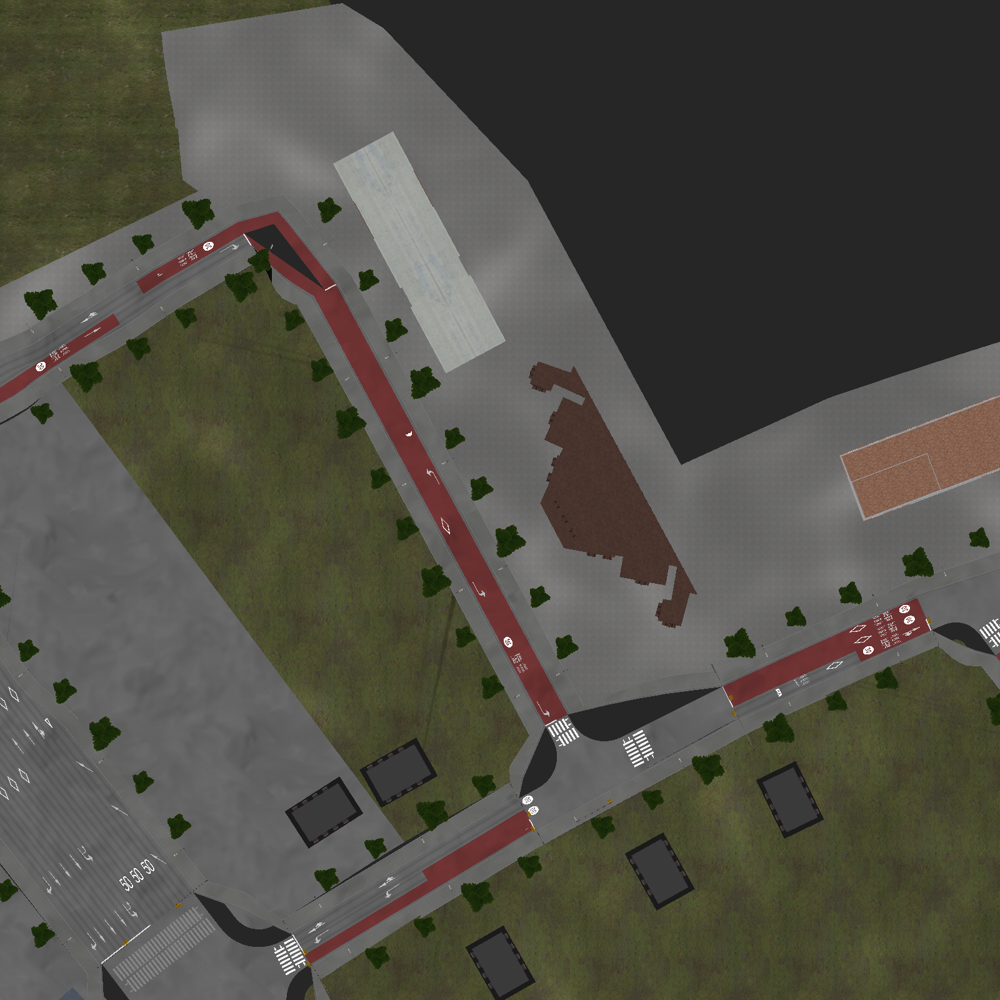
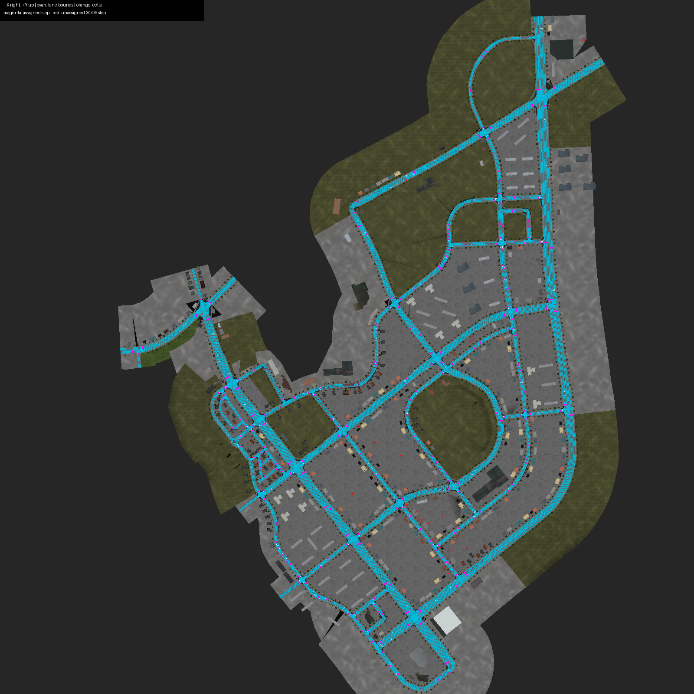
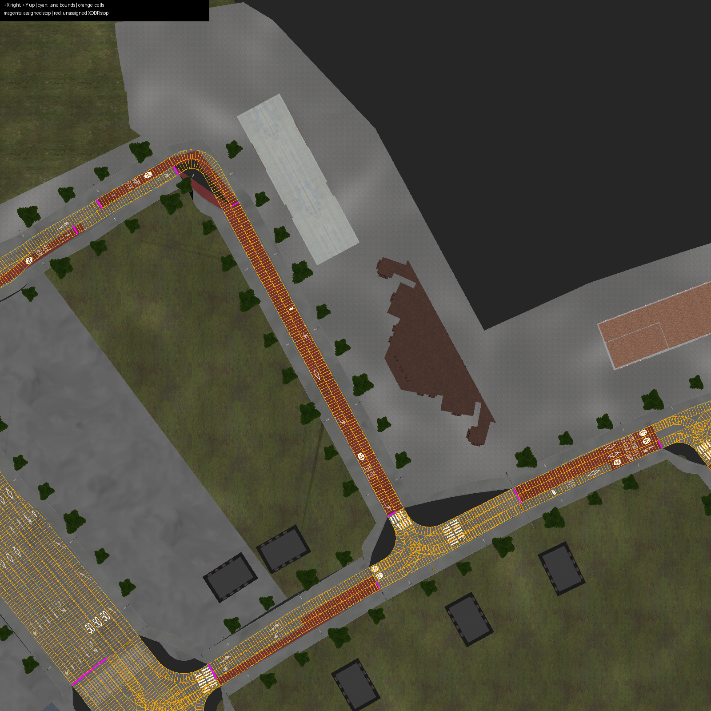

# LivingLab 정적 지도 제작 기록

## 산출물과 상태

루트 `map/`은 생성된 지도와 제작 자료, `map/tools/`는 지도 재생성·에셋 추출·오프라인 검사 도구다. ROS 주행 노드에서 실행하지 않으며 지도 변경 시 재사용한다. 런타임 지도 라이브러리 `src/hdmap/`와 구분한다.

`map/hdmap.bin`은 실제 Lanelet2 바이너리다. Lanelet map, 분할 Cell polygon, 정지선, 물리 신호, TrafficLight 규제 요소를 함께 저장한다. `hdmap_init`이 파일을 읽고 각 프로세스의 Cell 저장소·R-tree·previous 연결·정지선 역색인·신호 레지스트리를 구성한다. R-tree 내부 노드까지 직렬화한 별도 파일은 없다.

- `map/build_report.json`: 입력/바이너리 SHA-256, XODR 원본 도로·차선과 생성 Lanelet/Cell 대응, 보정 내역, 누락 목록.
- `map/native_check.json`: 실제 C++ 로더·RoutingGraph·example checkpoint 검사 결과. 실행 환경에 따라 시간은 달라진다.
- `map/stopline_mesh.json`: 원본 OSGB의 흰색 도색 삼각형에서 추출한 사각형 후보. **모든 후보를 정지선으로 채택한 것이 아니다.**
- `config/map.yaml`: 오프라인 분할·표본 간격, 보수적 제한속도, 확인한 수동 보강 항목. 변경 후에는 지도를 다시 생성한다.

**개발용 정적 지도이며 대회 주행 승인본은 아니다.** `config/runtime.yaml`의 `allow_motion: false`를 유지했다. VTD 내부 운전자 차량의 전역 표본 주행과 후속 단독 재검증을 수행했다. 프로젝트 planner/controller 폐루프와 제동 보정 완료를 뜻하지 않는다. 전수 진단·보강 및 남은 입력 모순은 [HDMapAudit.md](HDMapAudit.md), 실측 범위는 [HDMapDrivingAudit.md](HDMapDrivingAudit.md)에 있다.

| 항목 | 이번 생성본 |
|---|---:|
| Lanelet | 2,845 |
| Cell | 94,154 (`cell_id=0..94153`) |
| 물리 신호 / controller | 646 / 214 |
| 정지선 geometry | 원본 ID 710 + 에셋 보강 41 = 751 (원본 위치 보정 5개 포함) |
| 차선에 연결된 정지선 geometry | 725 |
| 형상 거부 / 명시적 링크 연결 오차 / 잘못된 Cell | 0 / 0 / 0 |

```cpp
#include "hdmap/hdmap.hpp"

auto static_map = hdmap::hdmap_init("map/hdmap.bin");
const auto& lanelets = static_map->laneletMap();
const auto& cells = static_map->cells();
const auto& tree = static_map->cellTree();
const auto& registry = static_map->signalRegistry();
const auto candidates = tree.search(cells.front().boundingBox3d());
```

```python
from hdmap import hdmap_init

static_map = hdmap_init("map/hdmap.bin")
cells = static_map.cells()
candidates = static_map.cellTree().search(cells[0].boundingBox3d())
registry = static_map.signalRegistry()
```

예시의 상대 경로는 프로젝트 루트 기준이다. 다른 작업 디렉터리에서 실행하는 노드는 프로젝트 루트를 기준으로 절대 경로를 만들어 전달한다. 반환 객체는 노드 수명 동안 보관한다.

## 파서와 좌표

[Autoware ODD 지도 변환 논의](https://github.com/orgs/autowarefoundation/discussions/6019)에서 연결한 [OpenDRIVE–Lanelet 변환 프로젝트](https://github.com/TranHuuNhatHuy/opendrive-lanelet-conversion)의 CommonRoad 기반 접근을 사용했다. 참고 저장소 commit은 `1c60155157f786a75fa8556a9ef517c25b474554`, 실제 OpenDRIVE 파서는 `commonroad-scenario-designer==0.8.5`다. **Autoware 공식 변환기를 수정 없이 돌렸다는 뜻은 아니다.** 이 프로젝트용 Lanelet 생성·Cell 분할·에셋 보강은 `map/tools/build_map.py`에 있다.

소스는 `HL_FMA_VTD_LivingLab.xodr`의 651개 road다. 제공본과 VTD 설치본 XODR의 SHA-256은 같았다. 원본에 geoReference가 없으므로 참고 변환기의 기본 Tokyo 투영을 사용하지 않았다. VTD의 지도 고정 XYZ[m]를 그대로 보존한다. `.bin` 기록에 전달하는 `Origin(0, 0)`은 바이너리 writer의 인수일 뿐, 원본을 위경도로 재투영하지 않는다.

- line/arc/spiral은 CommonRoad 파서의 plan-view 평가를 사용한다.
- CommonRoad 0.8.5의 poly3 구현은 거리 s를 매개변수 u처럼 사용하고 접선 기울기를 각도에 직접 더한다. 이 데이터에서는 그대로 쓰지 않고 `s(u)=∫sqrt(1+(dv/du)²)du`를 0.01m 이하 간격으로 적분·역보간하고 heading에는 `atan(dv/du)`를 사용한다.
- elevation, laneOffset, lane width, lane height를 반영한다. 현재 원본에 없는 superelevation/crossfall이 들어오면 조용히 평면 처리하지 않고 제작을 중단한다.
- laneSection과 차선 도색 속성 변경점에서 Lanelet을 분리한다. 양수 lane은 XODR s 감소 방향, 음수 lane은 증가 방향으로 정렬한다. 흰색 점선/가상선은 변경 가능, 실선·황색선은 변경 금지로 보존한다.
- 경계 표본 간격은 최대 0.25m다. 모든 정점이 무한정 정확한 연속 곡선이라는 뜻은 아니다. 원래 sample point와 Cell 절단점으로 polygon을 만든다.
- 부모 중심선의 XY 누적 길이로 최대 1m씩 자른다. 정지선 위치도 절단점에 넣으므로 일부 Cell은 더 짧다. 퇴화한 1µm 미만 끝 조각은 제외하고 목록을 기록한다.

원본 파일·설정이 같으면 도로/차선 순회 순서에 따라 Cell ID가 결정된다. 지도/설정을 바꾼 뒤에도 이전 ID가 유지된다는 보장은 없다. 런타임에 ID를 재생성하지 않으며 모든 소비자는 **같은 생성본**을 사용해야 한다.

## 직접 보강한 항목

### 연결과 형상

도로·laneSection·junction의 명시적인 lane link로 경계 끝점을 묶고, 완성된 지도에서 실제 소비자와 동일한 Lanelet2 native routing graph를 구성한다. cell.previous와 movement 추론도 이 그래프를 사용한다. 명시 목록 밖에서 native가 인식한 5개 연속 끝점 연결은 보고서에 기록한다. 원본 연결 없이 폭 0 끝점이 접촉해 생긴 `1196/−2 → 1218/−2`의 허위 U턴은 공유되지 않은 내측 끝점 ID만 분리하여 막고, 좌표와 합법 차로 변경을 보존한다. 공간상 가까운 도로를 거리만으로 임의 연결하지 않는다. 연결된 양 끝 Point3d는 기본 최대 0.15m 범위에서 동일 ID로 묶는다. 평균내어 매끈하게 만들지 않고 더 작은 원본 point ID 쪽 좌표를 사용하며, 바뀐 거리와 연결을 `endpoint_snaps`에 남긴다.

원본 프로파일에는 같은 s가 부동소수점 오차로 중복·역순 기록된 곳이 있다. 시작점 차이 1e-7m 이내에서는 뒤에 기록된 다항식을 선택한다. 이전 laneSection의 끝에서는 laneOffset을 왼쪽 극한으로 평가한다. 음수 차선 폭은 0으로 제한하고 실제 음수 값을 보고서에 기록한다. 가장 큰 음수 폭은 약 -0.0127m다.

다음 기존 보강과 전역 감사에서 확인한 중앙 도색 잔여물 두 건(`2810:5:+1`, `2816:2:+1`) 제외·5개 정지선 좌표 보정은 `config/map.yaml`에 명시했다. 원본 연결과 차로 변경을 가진 좁은 taper는 보존하며, 일반 허용오차를 키워 숨기지 않는다.

| 위치 | 보강 | 근거 |
|---|---|---|
| road 1927, section index 3, lane +4 | 첫 width의 sOffset 13.2m → 0m | 앞 section의 3.3m 폭, 명시적 연결, OSGB에서 이어지는 차로를 확인. 원본 그대로면 처음 13.2m가 폭 0으로 해석됨 |
| road 2190/-2 → 2172/+2 | 이 연결만 최대 0.17m 허용 | 명시적 lane link 양 끝에 약 0.165m 폭 불일치 |

합류점에서 `previous` 하나로 상류 여러 개를 표현할 수 없으므로 임의로 고르지 않고 비워 둔다. Tracker가 모든 상류 차선까지 역전파하려면 해당 지점에서는 Lanelet routing의 predecessor들을 사용해야 한다.

### 어린이 보호구역과 제한속도

OSGB에 포함된 텍스처 106개를 추출하고 원본 장면을 정지 상태로 렌더링했다. 노면 문구는 텍스처만이 아니라 메시로 되어 있어 학교 건물 모델 이름만으로 판정하지 않았다. 아래 화면에서 붉은 노면·30 표기·어린이 보호구역 문구를 확인했다.



road `174, 190, 420, 465` 전체에 **보수적으로 확장한 범위**로 `school_zone=yes`, `speed_limit=8.0 m/s`를 기록했다. 실제 표시는 30km/h지만 운용 cap은 요청한 8m/s다. 이것이 법정 보호구역 시작·종료 좌표를 정확하게 복원했다는 뜻은 아니다.

다른 도로도 미확인 법정 속도를 추측하지 않고 기본 운용 cap 8m/s를 쓴다. `speed_source=conservative_config_not_verified_legal_limit`로 구분한다. 30/50 노면 모델 142개는 발견 지점의 증거로 별도 기록하며, 그 숫자가 도로 전체에 적용된다고 자동 확대하지 않는다. 보호구역 cap과 미확인 기본 cap은 각각 config에서 변경할 수 있다. 현재 Native Lanelet2 traffic rules에서도 실제 8m/s로 읽힌다. Germany/Vehicle 규칙은 그래프 구성용 구현이며 한국 교통법규를 완전 구현했다는 의미가 아니다.

### 정지선과 신호

API가 선택하는 값은 물리 signal ID가 아니라 controller ID다. 제공 plugin 바이너리의 정적 135개 선택 표와 XODR `<controller><control signalId=...>`를 연결했다. 바이너리 SHA-256이 바뀌면 고정 offset으로 계속 읽지 않고 중단한다. 설치본의 코드나 데이터는 수정하지 않았다.

- XODR의 물리 신호 646개와 controller 214개를 보존한다. 물리 위치는 `positionRoad`가 있으면 그 값을 사용한다.
- XODR 정지선 모델 710개의 ID 대응을 보존한다. OSGB로 입증한 5개 위치 오류는 설정으로 보정하며 `xodr_t`, `effective_t`, `correction_evidence`에 원본과 근거를 남긴다. 적용 차선이 확인되지 않은 선은 `cell_assignment=unresolved`로 표시하고 임의 Cell에 붙이지 않는다.
- 기존 road `2077, 2115, 2116, 2195, 2819`의 12개 에셋 복원에 전역 영상 검사 결과 29개 신규 geometry를 추가했다. 추가로 확인한 30개 접근 도색 중 mesh 125 한 개는 원본 object 5153을 실제 OSGB geometry로 보정하여 중복 생성을 피했다. config에 지정한 접근 도로, 차선 끝 0.6m 이내, 진행방향과 수직인 도색을 사용한다. 중간 정지선이 있다고 끝 정지선 복원을 건너뛰지 않는다.
- 에셋 정지선은 차로 끝에서 주로 약 0.15m, 일부는 약 0.287m 바깥에 있을 수 있다. 도색 geometry를 옮기지 않고 해당 접근 차로 끝에 투영하여 마지막 Cell에 연결한다. 이 보수적 Cell 연결은 `cell_assignment=projected_to_approach_end`로 공개한다.
- 에셋 후보 추출은 직각 삼각형에서 사각형을 복원하고, 중심을 1cm 단위로 묶어 같은 도색의 두 삼각형·LOD 중복을 합친다. 마지막 후보의 실제 좌표를 보존하며 1cm 격자에 geometry를 스냅하는 것은 아니다. 이 중복 제거가 들어간 후보 자료를 원본 삼각형 스트림과 동일하다고 부르지 않는다.
- 신호 규칙은 원본 signal validity와 terminal approach 범위를 검사한다. 미선언 validity는 미검증으로 기록한다. 각 TrafficLight에 `controller_id`, `api_selected_controller_id`, `api_observation`, `lane_validity_source`, `movement`, `permitted_states`, `movement_source`를 담는다. 좌/우/직진/유턴 노면 화살표를 우선하고 없으면 후속 연결의 회전각으로 추정한다. 추정은 `routing_geometry`라고 표시하며 원본 정답으로 포장하지 않는다.
- 복합 차로에서 서로 다른 허용 상태는 교집합을 사용한다. 예를 들어 직진+좌회전은 상태 5만 허용하는 보수적 설정이다. 실제 경로에 따라 더 적극적으로 허용하는 기능이나 Tracker 상태 머신은 구현하지 않았다.

plugin의 raw GO는 정적 테이블의 API 3 또는 5로 축약되며 API 4는 발생하지 않는다. 5가 개별 좌회전·직진 램프 동시 점등 측정값이라는 뜻은 아니다. 자세한 근거와 통과가 막힐 수 있는 규칙은 [HDMapSignalAudit.md](HDMapSignalAudit.md)를 참조한다.

**아직 미확정인 항목**:

1. API controller `80, 82, 84, 86`은 이 XODR에 없다. 같은 설치본 XODR도 동일했다. 비슷한 위치의 다른 controller에 연결하지 않았다. 실제 실행의 신호 정의 또는 주최측 계약 확인이 필요하다.
2. 존재하는 API controller `89, 213, 215, 221`은 대응 물리 신호는 로드하지만 적용 정지선은 확정하지 못했다. `stopLine()`이 없는 규제 요소가 들어가며 통과 허용을 뜻하지 않는다. API 선택 표 밖의 controller 222도 정지선 미연결이다.
3. 원본 정지선 26개는 여전히 Cell 미연결이다. 모든 에셋 보강과 원본 오류 객체 ID의 일대일 동일성까지 증명한 것은 아니므로 임의로 원본 객체를 삭제하거나 ID를 바꿔치기하지 않았다. 미연결 전체와 OSGB 불일치 집합은 같지 않다.
4. controller가 레지스트리에 있다는 것과 모든 접근 차로·movement가 완전히 검증됐다는 것은 다르다. 법정 제한속도 적용 범위, 신호 규칙, 전체 시나리오의 통과 가능성은 별도 확인 대상이다.

미확정 신호를 녹색으로 취급하거나 원본 객체 누락을 자유 공간으로 해석하면 안 된다. 이 제약 때문에 `release_ready=false`로 기록한다.

## 오프라인 화면의 의미





청록색은 생성된 lanelet 경계, 주황색은 Cell polygon, 자홍색은 Cell에 연결한 정지선, 빨간색은 미연결 원본 정지선이다. 선을 평균내거나 누락된 구간을 곡선으로 연결하지 않는다. 표시된 원본 OSGB와 생성 지도는 같은 VTD XYZ를 사용한다. 도색의 실선/점선 속성은 지도에 있지만 이 오프라인 검사 overlay에서는 모두 가는 실선으로 그린다. 실제 RViz Visualizer 구현이 아니며 움직이는 차량·dynamic status도 없다.

이 검사 화면은 **오른쪽 +X, 위쪽 +Y**다. README에서 정한 RViz의 위 +X/왼쪽 +Y와 카메라 방향이 다르며 지도 좌표를 회전시킨 것은 아니다.

## 재생성

프로젝트 루트에서 실행한다. Python 3.12, Native Lanelet2 C++/Python 1.2.2, Boost 1.83, C++17 및 VTD 2025.2 설치본의 OpenSceneGraph가 필요하다. Lanelet2 공식 Python 모듈은 `import lanelet2.core, lanelet2.io`가 되는 환경이어야 한다. Python 바인딩과 C++ consumer가 동일한 Lanelet2/Boost ABI를 사용해야 하며, `.bin`을 이기종 버전 호환 포맷으로 간주하지 않는다.

```bash
source /opt/ros/jazzy/setup.bash
python3 -m venv --system-site-packages /tmp/hdmap-build-env
/tmp/hdmap-build-env/bin/pip install -r map/tools/requirements.txt

export VTD=/home/stier/VIRES/VTD.2025.2
export SOURCE='/home/stier/vtd 자료'
g++ -std=c++17 -D_GLIBCXX_USE_CXX11_ABI=0 map/tools/render_map.cpp \
    -I "$VTD/Develop/IG64/3rdParty/OpenSceneGraph/include" \
    -L "$VTD/Runtime/Core/IG64/lib" -Wl,-rpath,"$VTD/Runtime/Core/IG64/lib" \
    -losgViewer -losgDB -losg -lOpenThreads -o /tmp/hdmap-render

LD_LIBRARY_PATH="$VTD/Runtime/Core/IG64/lib" /tmp/hdmap-render \
    "$SOURCE/HL_FMA_VTD_LivingLab.osgb" --white-mesh /tmp/hdmap-white-triangles.txt
/tmp/hdmap-build-env/bin/python map/tools/extract_assets.py \
    /tmp/hdmap-white-triangles.txt map/stopline_mesh.json --white-mesh

/tmp/hdmap-build-env/bin/python map/tools/build_map.py \
    --xodr "$SOURCE/HL_FMA_VTD_LivingLab.xodr" \
    --osgb "$SOURCE/HL_FMA_VTD_LivingLab.osgb" \
    --plugin "$VTD/Data/Setups/00_HL_VTD/Plugins/ModuleManager/libHLVTD.so.1.0.0" \
    --stopline-mesh map/stopline_mesh.json \
    --config config/map.yaml --output map
```

OpenSceneGraph 추출 도구만 설치본의 구 ABI를 사용한다. Lanelet2 소비자에 이 ABI 옵션을 복사하지 않는다. OSGB 메시 추출에는 VTD 시뮬레이션 실행이나 GUI가 필요 없다. 항공 렌더 카메라는 `LODScale=0.001`로 정밀 도로 모델을 선택한다. 기본 거리 LOD에서는 거친 포장면이 정지선·횡단보도 도색을 덮는 사례가 재현됐다. 이 설정은 `--white-mesh`의 전체 geometry 추출에는 영향을 주지 않는다. 아래 렌더링에는 유효한 DISPLAY/XAUTHORITY가 필요하며 pbuffer로 원본 장면만 읽는다.

```bash
LD_LIBRARY_PATH="$VTD/Runtime/Core/IG64/lib" /tmp/hdmap-render \
    "$SOURCE/HL_FMA_VTD_LivingLab.osgb" /tmp/map_source.png -500 -1200 2000 1300
/tmp/hdmap-build-env/bin/python map/tools/preview_map.py \
    map/hdmap.bin /tmp/map_source.png map/map_overlay.png \
    --bounds -500 -1200 2000 1300

LD_LIBRARY_PATH="$VTD/Runtime/Core/IG64/lib" /tmp/hdmap-render \
    "$SOURCE/HL_FMA_VTD_LivingLab.osgb" map/aerial_source.png -500 -1200 2000 1300 8192

LD_LIBRARY_PATH="$VTD/Runtime/Core/IG64/lib" /tmp/hdmap-render \
    "$SOURCE/HL_FMA_VTD_LivingLab.osgb" map/school_source.png 380 -210 630 40
/tmp/hdmap-build-env/bin/python map/tools/preview_map.py \
    map/hdmap.bin map/school_source.png map/school_cells.png \
    --bounds 380 -210 630 40 --cells
```

## 검사

Lanelet2 개발 패키지가 CMake에서 검색되는 환경에서 실행한다. 기본 코어 소비자는 검사 도구를 빌드하지 않는다.

```bash
cmake -S src/hdmap -B /tmp/hdmap-audit/native-check \
    -DCMAKE_BUILD_TYPE=Release -DHDMAP_BUILD_MAP_TOOLS=ON -DHDMAP_BUILD_PYTHON=OFF
cmake --build /tmp/hdmap-audit/native-check
/tmp/hdmap-audit/native-check/hdmap_check map/hdmap.bin "$SOURCE/route_example.csv" \
    > map/native_check.json
python3 src/hdmap/python/check_api.py
```

마지막 명령은 빌드한 `hdmap` Python 확장을 PYTHONPATH에서 찾을 수 있어야 한다. 검사 실행 파일은 실제 map 로드, Cell 자기 ID의 R-tree 조회, previous 소유권 및 native predecessor 일치, RoutingGraph 오류, 8개 example checkpoint 경유 경로를 확인한다. `route_example.csv`는 제공된 예제이며 확정 대회 checkpoint라고 간주하지 않았다.

이번 환경에서 `shortestPathVia`의 예제 경로 100회 평균은 약 0.03ms, 지도+Cell+R-tree 로드는 약 2.3초였다. 경로 계산 결과는 28개 Lanelet이다. 이 측정은 **현재 맵의 해당 예제 경로**에 한정하며, 전체 planner 10Hz·모든 경로·시공간 충돌 회피 성능을 보장하지 않는다.

추가로 Python 로드 약 4.8초, 모든 부모 polygon의 유효성, 부모별 Cell 합집합을 검사했다. 부모와 Cell 합집합의 대칭차 면적 최대값은 `1.54e-7 m²`였다. 수정 전과 최종 보강 지도 모두 동일 원본·설정 재생성에서 byte 단위 일치를 확인했다. [재현성 기록](../map/audit/reproducibility.json)에 최종 재생성의 두 SHA를 보존했다. 현재 보강 바이너리 SHA-256은 `e7a426f900813748747a39233f3678237fd7f849c335bae3bc3014b31ae678b0`이며 최신 검사 수치는 `map/native_check.json`과 `map/audit/`에 있다. 이러한 오프라인 검사는 미확정 신호·속도 규칙을 검증된 것으로 바꾸지 않는다.
