# Data Pipeline — 원시 데이터부터 RViz까지

현재 정한 데이터 경로와 그 사이에 개입하는 연산만 표시한다. 사각형은 데이터·토픽·마커, 원은 연산, 원통은 파일·정적 맵이다. Bridge·TF·HDMap Dynamic Tracker 1차 버전·Visualizer·Python query marker adapter는 구현했다. Planner·Annotator·Control과 Tracker의 전체 신호 접근 상태기는 아직 구현할 계약이다. 실행과 현재 표시 제약은 README Bringup 및 [Tracker README](../src/hdmap_dynamic_tracker/README.md)를 따른다.

RViz Fixed Frame은 `map`이다. 메시지의 좌표 frame과 RViz Fixed Frame은 다르다. Planner는 `map`에서 경로·탐색 트리를 계산한 뒤 발행 직전에 입력 snapshot 시각의 TF로 `base_link`에 변환하고 RViz가 해당 시각의 TF로 `map`에 표시한다. 탐색 트리와 Ego 차체 박스도 `base_link` 기준이며 TF로 표시한다. 나머지 공간 관측과 지도 마커는 `map` 기준이다. `/objects`는 **XY 박스 중심 + 객체별 min Z**, Ego는 **후륜축 기준점**이다. 마커 출력은 `visualization_msgs/msg/MarkerArray`다.

## 1. VTD 패킷 → Bridge 토픽

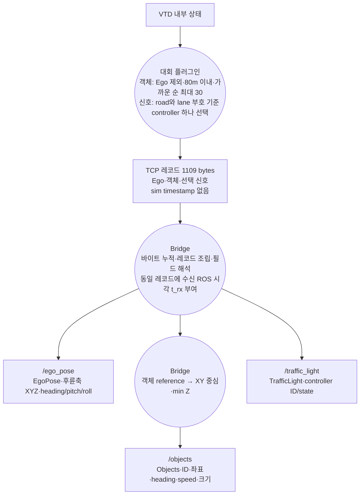

세 토픽의 Header는 같은 레코드의 `t_rx`를 공유한다. 이는 시뮬 관측 시각이 아니라 Bridge 수신 시각이다. 주행 토픽의 QoS는 BEST_EFFORT / VOLATILE / KEEP_LAST(1)이다.

## 2. 객체 → footprint·box·자세 마커

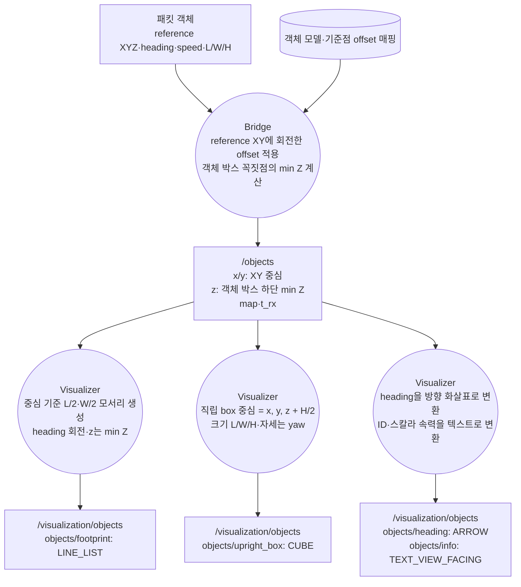

```text
center_x = ref_x + cos(heading) * offX - sin(heading) * offY
center_y = ref_y + sin(heading) * offX + cos(heading) * offY
z        = min(world_box_corner[i].z)
marker_center_z = z + size_z / 2
```

Bridge는 기준점을 바꾸고 Visualizer는 하단 Z를 마커 중심 Z로 바꾼다. 같은 offset을 두 번 적용하지 않는다. 객체 box는 pitch/roll 없는 직립 근사이며 heading은 속도 방향이 아니다. 전체 NPC offset 매핑은 아직 미완성이다. 보정 전 reference는 `/objects`에 없으므로 별도 원시 기준점 마커 경로를 그리지 않는다.

## 3. Ego → 기준점·차체·추정 속도 마커

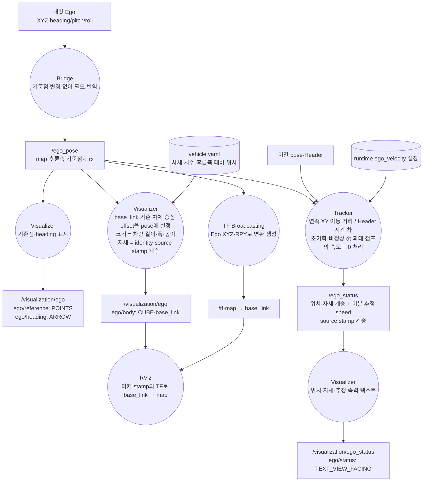

차체 CUBE의 pose에는 차량 제원의 후륜축 대비 중심 offset만 넣는다. Ego의 map 위치·RPY는 TF에서 한 번만 적용한다. `header.frame_id=base_link`, stamp는 `/ego_pose`에서 계승하고 `frame_locked=false`로 해당 관측 시각에 표시한다.

speed는 시뮬레이터가 직접 준 Ego 속도가 아니라 위치 차분의 결과다. `/ego_status`에는 0 처리 이유가 없으므로 그 이유를 표시하는 경로는 없다.

## 4. Ego → TF → RViz view

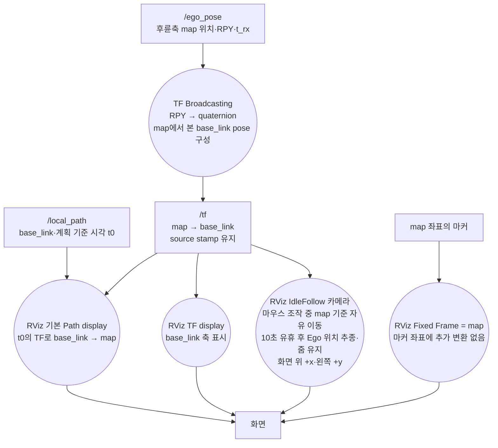

`odom → map` 변환이나 지도 정합은 없다. 카메라 추종은 view 변경이지 데이터 좌표 보정이 아니다. `/clock` 없이 `use_sim_time=false`를 사용한다.

## 5. 정적 지도 → Lanelet·Cell 마커

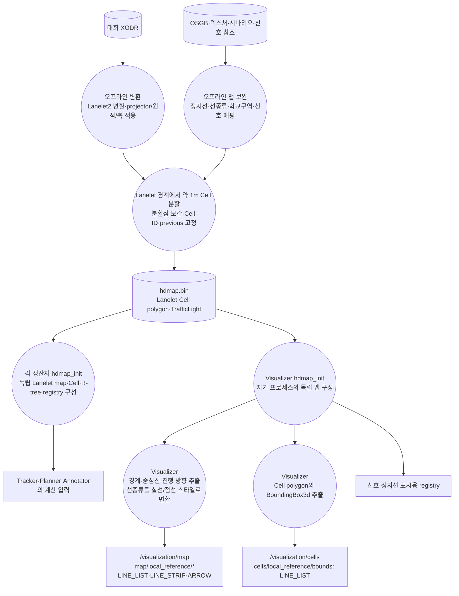

파일 제작은 오프라인 작업이다. `.bin` 로드에서는 재투영·Cell 재분할·ID 재생성을 하지 않는다. R-tree는 Cell AABB로 bulk-load한다. Visualizer의 맵 마커는 다른 노드 메모리의 복사본이 아니라 **자기 맵을 그린 것**이다. 자동 생성 중심선과 점선 스타일도 원본 경계에서 파생한 표시다.

## 6. 신호 → controller 관측·물리 신호·정지선 마커

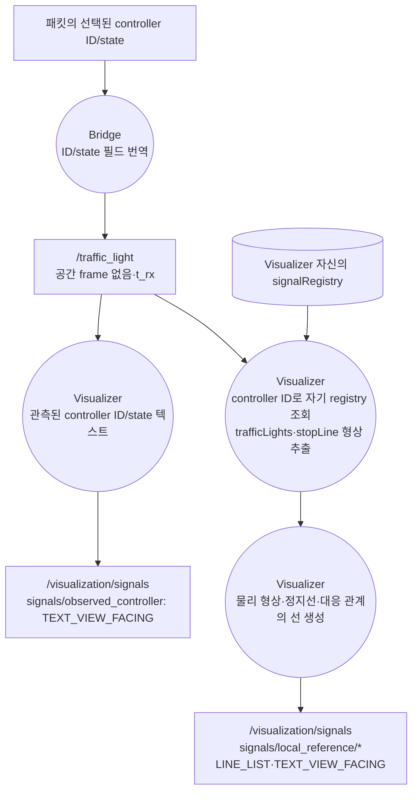

API는 controller 관측 하나를 준다. 위치는 registry에서 붙인 것이며, controller에 연결된 모든 lamp의 실제 색을 각각 관측한 것은 아니다.

## 7. 객체 → 현재·미래 Cell 점유 → 점유 마커

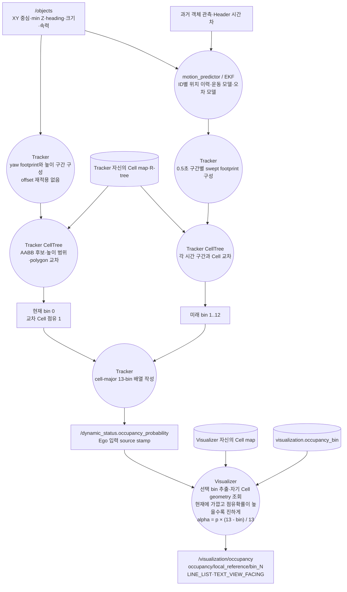

bin 0은 현재, bin 1..12는 `((bin-1)*0.5, bin*0.5]`초다. Visualizer는 예측을 다시 계산하지 않는다. 점유값은 Tracker 출력이고 표시 기하는 Visualizer 맵에서 복원한다. 객체별 예측 footprint는 주행 토픽에 없으므로 별도 예측 궤적 마커를 만들지 않는다.

선택한 bin의 Cell 선 마커에 `color.a = p * (13 - bin) / 13`을 적용한다. 같은 bin에서는 확률이 높을수록, 같은 확률에서는 현재에 가까울수록 불투명하다. `p=0`은 투명하며 unknown 값 `-1`은 이 식에 넣지 않고 별도 회색으로 표시한다. 텍스트에는 원본 확률과 bin을 그대로 표시한다. alpha는 표시 변환일 뿐 점유확률 자체를 변경하지 않는다.

## 8. 신호·정적 제한 → Cell cap → speed limit 마커

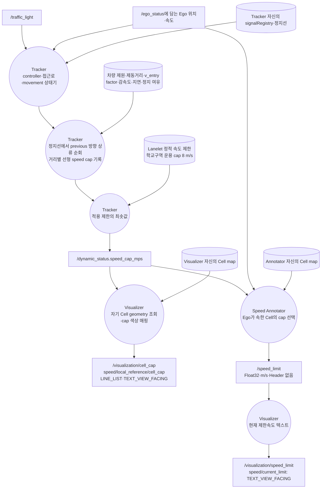

Annotator는 Path를 읽지 않는다. cap은 적용 제한의 최솟값이며 원인별 기여는 메시지에 없다. `/speed_limit`에는 source stamp와 Cell ID가 없다.

## 9. checkpoint → 글로벌 경로 강조·로컬 Path 표시

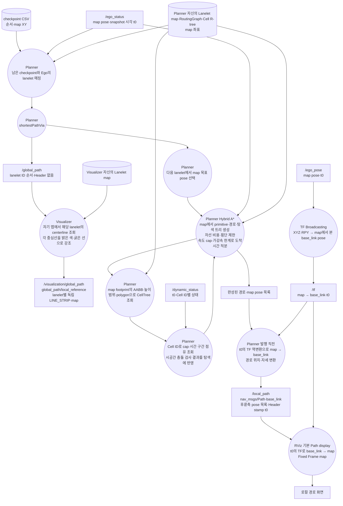

글로벌 경로는 ID 리스트에 든 lanelet 각각의 중심선만 강조한다. lanelet 사이 연결선을 추가하거나 중심선을 평활화하지 않는다. geometry는 Visualizer 자신의 맵에서 가져온 것이며 Planner의 실제 메모리 기하를 대신 나타내지 않는다.

Planner는 **경로 생성·탐색·비용 계산·충돌 검사 모두 map에서 수행**한다. 목표·차선 기하·primitive footprint·Cell R-tree를 같은 map 좌표로 사용하며 탐색 중 로컬 변환은 하지 않는다. 완성된 경로와 발행할 탐색 트리만 마지막에 `t0`의 TF 역변환으로 `base_link`에 옮긴다. `t0`는 입력 snapshot 시각이며 계산 완료 시각이 아니다. TF는 전담 노드가 Ego XYZ·RPY로 발행한 `map → base_link`를 사용한다. Path는 위치와 자세 모두 변환하고 탐색 트리의 배열 순서·부모 인덱스·최종 노드 인덱스는 유지한다.

Path Header와 모든 PoseStamped Header는 `frame_id=base_link`, `stamp=t0`로 통일한다. 도착 예정 시각이나 발행 시각으로 stamp를 바꾸지 않는다. RViz 기본 Path display가 Path Header의 시각으로 TF를 적용하며 Visualizer의 별도 `/visualization/local_path` 마커는 만들지 않는다. Buffer Length=1, Offset=(0,0,0)으로 원본 pose 순서를 그대로 표시한다. TF가 없으면 최신 TF로 대체하지 않는다. 빈 Path는 경로 표시를 비운다. primitive 도착시간은 Path에 없으므로 표시하지 않는다. 탐색 과정은 별도의 `/search_tree`로 표시한다.

### 탐색 트리 → 부모 연결선·선택 분기

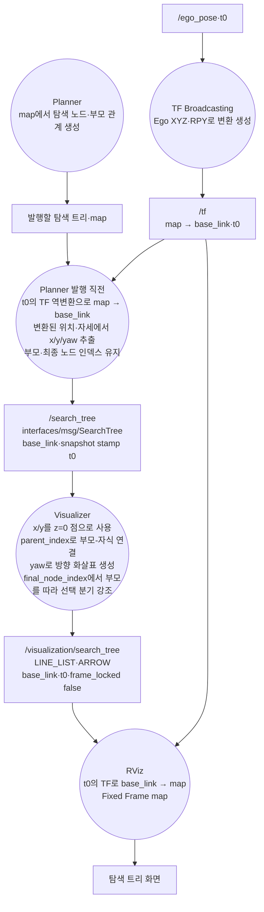

`x/y/yaw/parent_index`는 길이가 같은 배열이며 인덱스 하나가 탐색 노드 하나다. 좌표는 m, yaw는 rad다. 부모 없는 루트의 `parent_index=-1`, 나머지는 같은 메시지의 부모 노드 인덱스다. `final_node_index=-1`은 선택된 최종 노드 없음이고, 그 외에는 같은 배열의 인덱스다. 부모 연결은 순환하지 않는다. Header는 해당 탐색의 `/local_path`와 같은 `base_link`, `t0`를 사용한다.

연결선은 샘플 노드 사이의 직선이지 실제 primitive 곡선이 아니다. SearchTree는 변환 후 x/y/yaw만 저장하므로 z·pitch·roll은 전달하지 않는다. 표시의 z=0은 이 메시지의 2D 근사이며 경사면에서는 원래 map 탐색 기하와 일치하지 않을 수 있다. 지면에 snap해 이를 숨기지 않는다. 원본 노드와 부모 관계를 그대로 표시하고 새로운 연결을 만들지 않는다. 새 메시지로 이전 트리를 교체하며 사라진 마커는 DELETE한다. 빈 배열과 `final_node_index=-1`이면 트리 표시를 비운다. TF는 최신 값이 아니라 t0의 값을 사용한다.

## 10. Control → 명령 마커·VTD 입력

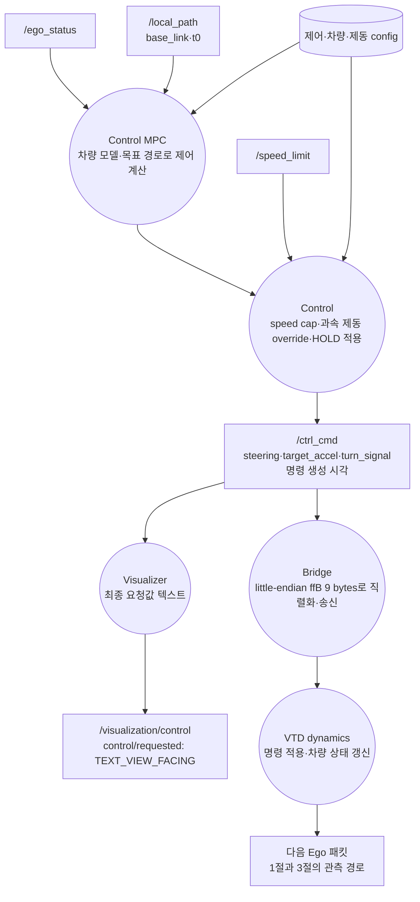

Control은 `/ego_status`, `/local_path`, `/speed_limit`만 구독한다. 발행된 로컬 경로를 입력으로 사용하며 TF 구독·변환은 하지 않는다.

마커는 요청한 바퀴각·가속도이지 실제 차량 응답이 아니다. MPC 원안·override 이유·송신 완료 여부는 `/ctrl_cmd`에 없다.

## 11. CellTree 조회 → 생산자 Cell 마커

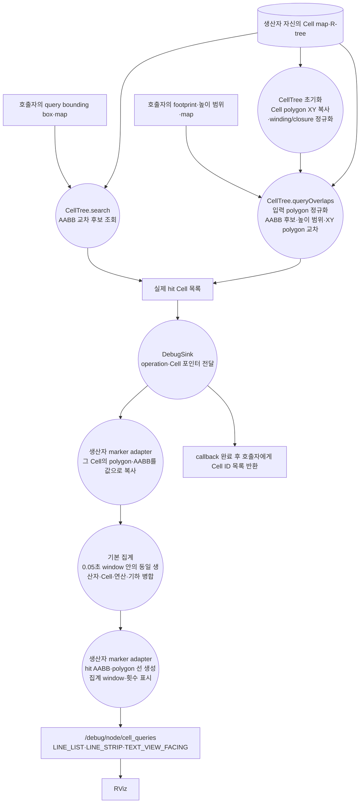

마커는 Visualizer가 ID로 재조회한 기하가 아니라 **조회한 프로세스의 실제 Cell**을 사용한다. 기본 집계는 호출 순서·개별 시각을 합치므로 raw trace와 다르다. 현재 sink에 query 입력·source stamp는 없으며, 반환 Cell AABB를 query box라고 표시하지 않는다. Python adapter는 `visualization.query_debug.QueryDebugSink`로 구현했다. C++ ROS adapter는 미구현이다.

## 12. 공통 마커 처리 → 화면

이 처리는 MarkerArray 경로에만 적용한다. `/local_path`는 9절의 RViz 기본 Path display로 직접 표시한다.

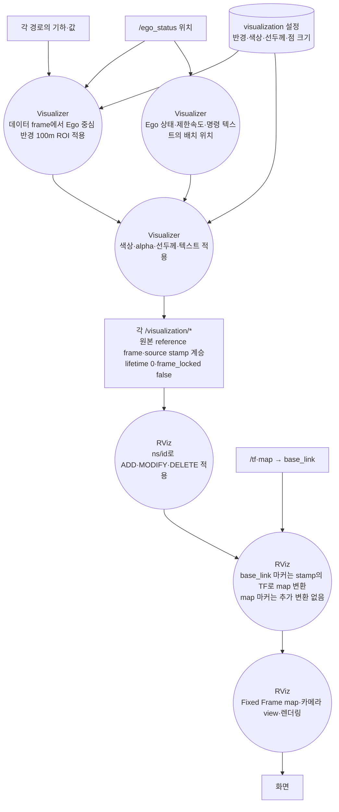

ROI 거리 비교도 같은 frame에서 수행한다. base_link 데이터는 해당 시각의 원점 기준이며 map의 Ego 좌표와 직접 빼지 않는다. map 좌표의 points에는 identity pose를 사용한다. CUBE처럼 pose에 중심·회전을 담는 마커는 로컬 형상을 사용한다. 같은 변환을 pose와 points에 중복 적용하지 않는다. 텍스트 배치 위치는 표시용이지 값의 관측 위치가 아니다.

Header 없는 `/global_path`·`/speed_limit`의 표시 시각은 source 시각이 아니다. `lifetime=0`이므로 목록에서 빠진 객체·경로 마커는 발행자가 DELETE로 제거한다. 좌표를 띄우거나 box를 부풀려 겹침을 숨기지 않는다.

## 13. Frame 전수 점검

RViz Fixed Frame은 항상 `map`이며 아래 frame은 **데이터 좌표의 기준**이다.

| 데이터 | reference frame | 화면까지 개입하는 변환 |
|---|---|---|
| `/ego_pose`, `/ego_status` | `map` | 후륜축 위치 그대로 사용; 차체 CUBE는 아래 별도 frame 계약 적용 |
| `/objects` | `map` | Bridge에서 reference → XY 중심·min Z; box 마커는 z에 H/2 추가. 좌표 frame 변경은 아님 |
| Lanelet·Cell·R-tree | `map` | 파일 제작 때 투영; 로드·표시 때 재투영 없음 |
| `/dynamic_status` | `map`의 Cell ID 참조 | Visualizer 자신의 Cell geometry로 위치 복원 |
| `/global_path` | `map`의 lanelet ID 참조; Header 없음 | Visualizer 자신의 lanelet 중심선을 강조 |
| `/local_path` | `base_link(t0)` | RViz가 t0의 TF로 map에 변환; Visualizer 미경유 |
| `/traffic_light` | 없음 | 관측은 ID/state; 물리 위치는 map registry에서 조회 |
| `/speed_limit` | 없음 | 스칼라 값을 map의 표시용 텍스트 위치에 배치 |
| `/ctrl_cmd` | 차량 기준 `base_link` | 제어 스칼라이지 변환할 공간 점이 아님; map 위치에 텍스트 배치 |
| `/debug/node/cell_queries` | `map` | 생산자가 실제 조회한 Cell 기하 그대로 표시 |
| `/visualization/ego`의 `ego/body` | `base_link` | 중심 offset·치수만 적용한 CUBE를 source stamp의 TF로 map에 표시 |
| `/search_tree`, `/visualization/search_tree` | `base_link(t0)` | 노드·부모 연결·yaw 표시 후 t0의 TF로 map에 표시 |
| 나머지 `/visualization/*` 마커 | `map` | 추가 TF 변환 없음; 색상·선두께·ROI는 표시 단계 |
| `/tf` | parent `map`, child `base_link` | Ego pose에서 생성; Path에는 원본 stamp의 변환 적용 |

자료형과 메시지 계약: [README](../README.md), [객체 기준점 조사](05-object-reference-resolution.md), [ROS Marker](https://raw.githubusercontent.com/ros2/common_interfaces/jazzy/visualization_msgs/msg/Marker.msg), [ROS Path](https://raw.githubusercontent.com/ros2/common_interfaces/jazzy/nav_msgs/msg/Path.msg).

## 화면 고정 텍스트 출력

기존 절의 TEXT_VIEW_FACING 생성 경로는 이제 위치 없는 HUD 텍스트로 출력한다. Visualizer가 생성한 텍스트 전체가 대상이며 생산자의 query debug 마커는 별도다. 3D 기하 마커는 기존 frame·stamp 계약을 유지한다.

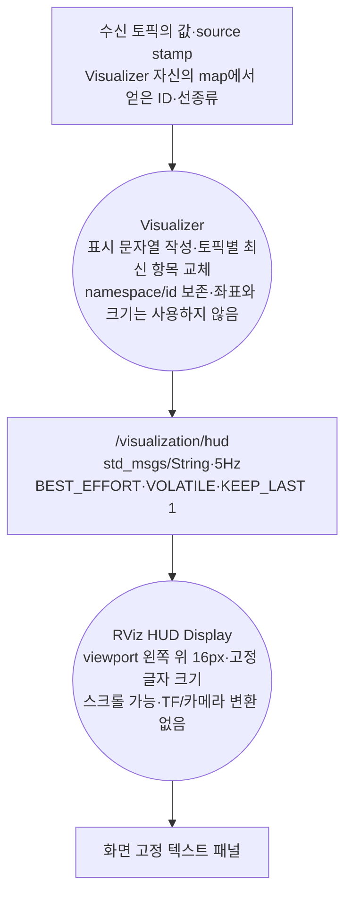
