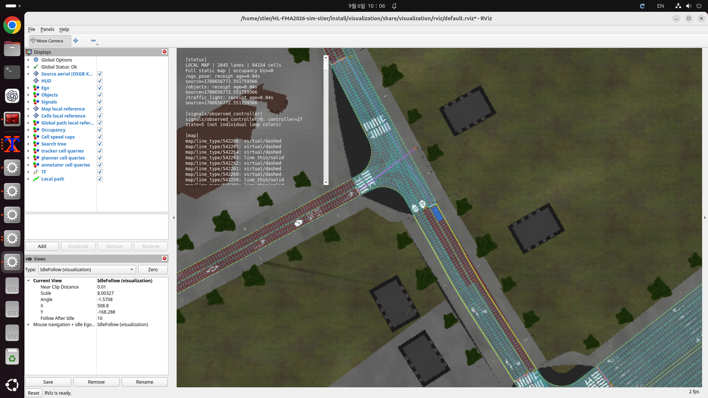
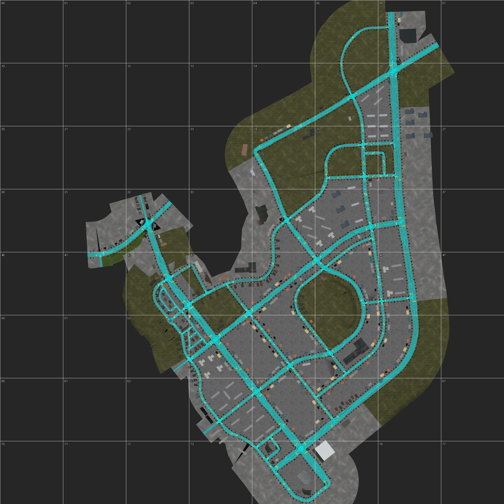
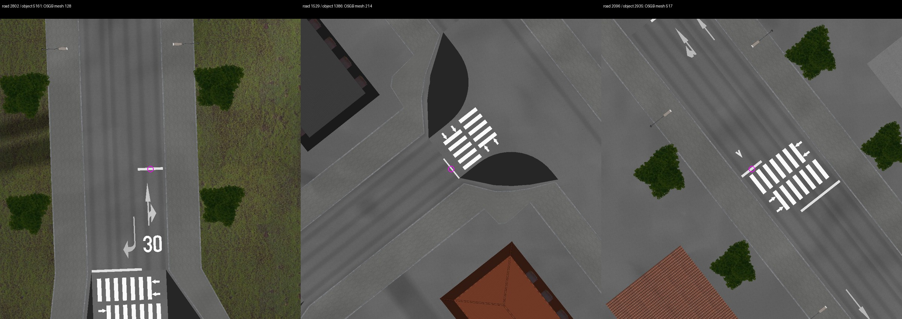
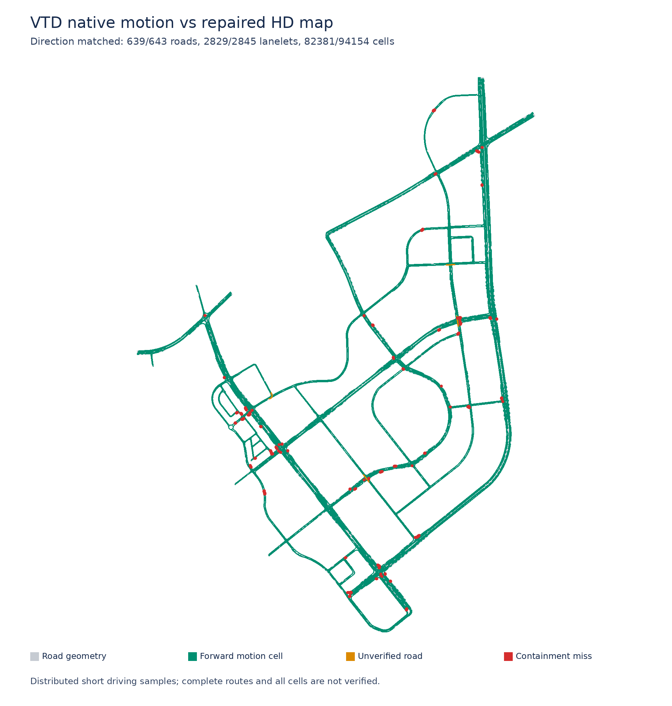

# LivingLab HDMap 전역 진단·보강 기록

2026-09-05–06에 원본 XODR·OSGB, 생성 Lanelet2 바이너리, RViz 출력, 실제 VTD 내부 차량의 RDB를 교차 조사했다. **생성기 오류와 시각화 오류를 모두 확인해 수정했지만, 원본 신호·도색의 모순과 실주행 미검증 범위가 남아 있다. 현재 산출물은 보강된 개발 지도이며 무결점 주행 승인본이 아니다.** `release_ready=false`와 `allow_motion=false`를 유지한다.

최종 바이너리 SHA-256은 `e7a426f900813748747a39233f3678237fd7f849c335bae3bc3014b31ae678b0`이다.

최신 기계 판독 결과는 [제작 보고서](../map/build_report.json), [native 검사](../map/native_check.json), [보정 검사](../map/audit/repaired-stopline-check.json), [신호 검사](../map/audit/repaired-signal-check.json)에 있다. 수정 전 기준 바이너리 SHA-256은 `7759de6a84ba9ef6fd7807792c642d5e479a981c37cbc38f570fc4912420bc78`이다. 원본 XODR·OSGB·plugin 파일은 보존하고, 입증한 지역 보정은 [설정](../config/map.yaml)에 원본 좌표·증거와 함께 기록했다.

## 확인한 원인과 수정

| 구분 | 수정 전 원인 | 적용한 수정·확인 |
|---|---|---|
| 멀리 뻗는 신호–정지선 연결 | plugin의 road/lane-sign 선택 범위를 물리 신호의 차로 적용 범위처럼 사용하고, 같은 도로의 중간 정지선까지 연결 | 원본 signal validity를 존중하고 접근부 끝의 정지선에 적용. explicit validity 위반 117→0, 중간 lanelet 적용 82→0 |
| 실제 도색은 있는데 정지선 누락 | 여러 원본 객체가 같은 차로에 중복되고 옆 접근 차로는 누락 | 27개 접근의 OSGB 도색 30개를 검증. 최종 29개 신규 geometry와 원본 object 5153 한 개 보정으로 확보 |
| 반대 차로/보도 쪽 정지선 | 일부 원본 객체의 t 좌표 부호/offset 오류 | 5개 원본 객체를 도색·차로 중심과 대조하여 보정. 5153/5238은 횡방향과 0.15m 도색 offset을 함께 반영한 원본 OSGB geometry 사용. 원본 t와 유효 t 보존 |
| 중간 정지선 보정 후 끝 정지선 재누락 | 에셋 보강이 lanelet에 정지선 하나라도 있으면 접근부 복원을 건너뜀 | 끝 0.6m 안에 정지선이 있을 때만 건너뜀. road 2802의 중간·끝 정지 이벤트가 서로 다른 cell에 존재하는지 검사 |
| 잘못된 공간 fallback | 선이 차로 가장자리에 닿기만 해도 차로에 배정 | 차로 중심선도 정지선 buffer와 교차해야 배정. 기존 잘못된 road 1529/object 1386 한 건만 영향을 받는지 전수 측정 |
| cell 이전 연결 누락 | 생성기의 명시 연결 목록과 실제 Lanelet2 native 그래프에 7개 차이 | cell.previous와 movement 추론에 실제 소비자와 동일한 native 그래프 사용. C++ 이전 연결 불일치 7→0 |
| 차로처럼 보이는 극소폭 잔여물 | 2810/section 5/+1은 길이 1.7m·최대 폭 0.01914m, 2816/section 2/+1은 길이 0.7m·원본 최대 폭 0.001139m의 독립 중앙 도색 영역 | 두 키만 border로 보정. source 연결과 차로 변경이 있는 2810/section 2/+2의 좁은 taper는 보존 |
| 원본에 없는 순간 U턴 | 1196/−2의 끝과 1218/−2의 시작이 폭 0인 같은 점 ID를 공유해 176.46° 역방향 경로가 자동 생성 | 원본에 없는 점 접촉을 검출하고 공유되지 않는 내측 경계 끝점 ID를 분리. 좌표와 모든 합법 차로 변경 연결은 그대로 보존 |
| 항공 배경에서 횡단보도·정지 도색 누락 | 고공 카메라가 거친 OSGB 도로 LOD를 골라 실제 도색을 덮음 | 정밀 LOD 선택 후 같은 8192×8192 배경 재생성. road 146 / object 403 ROI 흰색 픽셀 0→155. [국소 배치·LOD 재검토](HDMapSignalAudit.md#2026-09-06-우상단-정지선-배경-lod-누락과-미확정-배치) |
| 황색 경계가 회색으로 표시 | RViz가 원본 boundary color를 무시하고 batching도 색을 묶어버림 | 황색 표시 및 RGBA별 batching. segment 보존·색·marker ID 중복 회귀 검사 통과 |

RViz의 자홍색 연결은 수정 전 바이너리의 2,327개 실제 lamp–stopline 쌍과 좌표 오차 1e−10m 이하로 일치했다. 선을 잘못 이어 그리는 문제가 아니었다. 반면 황색 경계 1,854개를 회색으로 그리는 오류는 시각화 쪽에서 확인됐다. 최종 지도를 다시 로드한 실제 RViz 화면에서도 황색 경계와 수정된 신호 연결을 확인했다.



Cell polygon과 AABB를 함께 표시하여 생기는 사각 격자·교차선은 별개의 표시 요소다. AABB를 보고 주행 면적으로 해석하지 않는다.

현재 검증 수치는 다음과 같다. 정지선 위치 복원과 원본 ID 보정을 중복 집계하지 않는다.

| 지표 | 수정 전 | 최종 |
|---|---:|---:|
| lanelet / cell | 2,847 / 94,157 | 2,845 / 94,154 |
| 정지선 geometry / 배정 | 722 / 696 | 751 / 725 |
| 원본 정지선 위치 보정 | 0 | 5 |
| OSGB와 0.5m 내 호환하는 정지선 | 663 | 697 |
| 명시적 signal validity 위반 | 117 | 0 |
| 비접근부 lanelet 신호 연결 | 82 | 0 |
| native 그래프와 cell.previous 불일치 | 7 | 0 |
| 폭 0 점 접촉의 허위 U턴 | 1 | 0 |
| 100m 초과 lamp–stopline 관계 | 155 | 16 (원본 검토 대상 포함) |

최종 바이너리는 [독립 재생성](../map/audit/reproducibility.json)에서 byte 단위로 동일했다. [RViz 전수 검사](../map/audit/visualizer-after.json)는 차로 중심 2,845개, cell polygon과 AABB 각 94,154개, 정지선 751개, 황색 경계 1,853개의 표시와 배치 전후 선분 보존·marker ID 중복 없음을 확인했다. [마지막 연결 보정의 독립 비교](../map/audit/topology-repair-independent.json)에서 남겨진 모든 차로 경계의 XYZ는 완전히 같고, 모든 합법 차로 변경 연결도 같았다. 제거한 극소 차로의 edge와 허위 U턴 이외의 주행 연결 변화는 없었다.

지역 보정에 사용한 mesh 후보 번호는 이번 `stopline_mesh.json`의 순서에 종속된다. 입력 파일의 해시는 제작 보고서에 보존돼 있다. OSGB 메시를 재추출하거나 후보를 재정렬하면 기존 번호를 그대로 재사용하지 말고 도색 좌표와 설정을 다시 대조해야 한다. 보정 검사는 실제 바이너리와 보고서의 해시 일치를 확인하지만, 원본 도색 의미의 재검토를 대신하지 않는다.

## 전역 영상 대조

2026-09-06 후속: 수정된 정밀 LOD로 **651개 도로의 306개 구역 전체**와 도로 밖 정지선 보충 1개 구역을 직접 영상 비교했다. [새 전수 감사 보고서](HDMapVisionAudit.md)와 [전체 영상·구역별 판정](assets/hdmap-audit/full-vision/index.html)을 사용한다. 애매한 객체는 사용자 기준에 따라 XODR 존재·유형·좌표를 유지한다.

후속 road 146 검토에서 기존 고공 배경의 LOD 선택으로 횡단보도와 정지 도색이 가려지는 오류를 확인했다. 배경 생성기를 수정하고 운영 배경을 다시 생성했다. 아래의 과거 검사 영상은 당시 증거로 보존하며, 그 영상에서 도색이 보이지 않는다는 관찰만으로 시설 부재를 확정할 수 없다. [동일 원본의 전후 비교](assets/hdmap-audit/stop146-lod-comparison.png)와 [정지선 배치 미확정 범위](HDMapSignalAudit.md#2026-09-06-우상단-정지선-배경-lod-누락과-미확정-배치)를 함께 확인한다.

원본 OSGB 전체 2,500×2,500m를 8×8 타일로 나누고, 원본/차로 경계 overlay를 비교했다. 원본 배경은 8,192×8,192px, 약 0.305m/px다. 전체 개요에서 도로가 없는 바깥 타일을 확인하고, 도로가 있는 영역은 별도 타일로 확대했다. 이것은 모든 픽셀의 의미가 자동 검증됐다는 뜻이 아니다.



별도 확대 타일은 05, 06, 15, 16, 24, 25, 26, 31, 32, 34, 35, 36, 41, 42, 43, 44, 45, 46, 52, 53, 54, 55, 56, 63, 64, 65, 66, 74, 75이고, 경계 타일 14, 17, 23, 33, 51, 62, 73도 확인했다. 남부 독립 검토 기록은 [JSON](../map/audit/visualizer_south_review.json)에 있다.

복원 접근은 다시 50–70m 범위를 1,000–1,200px로 OSGB에서 직접 렌더링했다. [1](assets/hdmap-audit/contact0.jpg), [2](assets/hdmap-audit/contact1.jpg), [3](assets/hdmap-audit/extra_contact0.jpg), [4](assets/hdmap-audit/extra_contact1.jpg), [5](assets/hdmap-audit/extra_contact2.jpg), [6](assets/hdmap-audit/extra_contact3.jpg), [7](assets/hdmap-audit/extra_contact4.jpg)에 모든 27개 접근의 도색을 보존했다. 689개 흰색 사각형 후보 중 106–115는 횡단보도 줄무늬라 정지선으로 추가하지 않았다.



수정 전 OSGB 후보와 맞지 않는 59개 원본 정지선 중 **34개는 이미 차로에 배정돼 있었고 25개는 미배정**이었다. 미배정 전체 26개가 모두 영상 불일치 집합과 같은 것은 아니다. 배정된 34개는 각각 30m/750px 원본 장면으로 다시 확인했다. [전수 위치·영상 색인](../map/audit/mapped_stopline_vision_review.json)에 road/object ID를 남겼다. 원본 위치에서 도색이 보이지 않는다는 관측만으로 원본 정지 의무를 삭제하지 않았다. 실제 도색이 없는 입력 오류와 추출/렌더링 한계, 논리적인 정지 위치를 구분해야 하기 때문이다.

## 데이터 전수 검사와 의도된 제외

[독립 기하 감사](HDMapGeometryAudit.md)에는 원본 651개 road, nonzero driving laneSection 2,480개, 모든 lanelet/cell의 면적·순서·합집합·방향·연결 검사가 있다. 최신 결과는 [기하 JSON](../map/audit/repaired-geometry.json), [정지선 대조 JSON](../map/audit/repaired-stoplines.json)이다.

- 생성 도로 643개. 나머지 8개는 원본에 driving 차로가 없다. sidewalk, border, 객체 배치용 reference road, parking을 일반 차로로 자동 승격하지 않았다.
- 원본 ID 정지선 710개와 에셋 정지선 41개, 총 751개를 보존한다. 725개가 차로에 배정된다. OSGB와 0.5m 이내 호환 도색 대응은 663→697개이며 미대응 후보 15개는 횡단보도 10개와 기존 도색 중첩 5개다. 원본 도색 불일치 54개를 별도 기록한다.
- 생성 lanelet 2,845개, cell 94,154개. 잘못된 polygon, cell 없는 lanelet, 부모와 cell 합집합 면적 오류, 이전 cell의 공간 단절, native graph 오류는 0이다.
- 원본 driving 구간과의 차이는 중앙 도색 잔여물 `2810:5:+1`의 1.7m와 `2816:2:+1`의 0.7m 제외 두 건이다. [극소폭 전수 조사](../map/audit/tiny-driving-lanelets.json)와 [2816 원본 렌더](assets/hdmap-audit/tiny2816_source.png)에 근거를 남겼다. 원본 대비 차이를 0으로 숨기지 않고 정확한 키와 s 범위를 보고한다.
- 에셋 정지선은 실제 도색 좌표를 유지하고 접근 끝 cell에 투영한다. 도색과 마지막 cell 사이 최대 약 0.287m의 간격이 있는 사례도 `projected_to_approach_end`로 공개한다. 지도 전체 좌표를 이동시킨 것이 아니다.
- checkpoint 예제의 native 경로는 28 lanelet로 여전히 존재한다. 이는 모든 시작·종료 조합의 차량 통과 가능성을 보증하지 않는다.

원본 교차로 참조도 별도로 전수 확인했다. 94개 junction, 499개 connection, 1,202개 laneLink에서 접촉 laneSection을 road의 junction 참조와 connector의 contactPoint로 독립 판정했다. 없는 from/to 차로, 접촉 모순, 차로 유형 불일치는 모두 0이었다. driving→driving 680개, border→border 266개, sidewalk→sidewalk 256개다. [원본 참조 전수 JSON](../map/audit/source-junction-lanelink-audit.json)에 XML 키를 보존한다. road 1926의 −6/−7은 border/sidewalk로 존재하며 정상 연결이다. 차량 차로 −1/−2/−3의 후속 부재는 별도 의미 검토 대상이고, 인접 연결의 번호만 바꿀 수 있는 기하적 근거는 없었다. [junction 40 독립 끝점 대조](../map/audit/junction40-endpoints-independent.json)에서 기존 네 연결의 중심·경계 XYZ 오차는 최대 3.16e−11m였다.

## 실제 VTD 주행

VTD 2025.2를 실행하고 SCP로 내부 운전자 차량을 생성·배치·가속한 뒤 실제 RDB object state와 road position을 읽었다. 정지 상태 화면 관찰이나 순간이동을 주행으로 세지 않았다. 최초 전역 검사는 수정 전 지도 해시를 명시한 상태에서 2,847개 lanelet 시작 지점을 모두 시도했다.

1차 다차량 합산 실제 이동거리는 **74.792km**, 수신 샘플은 473,977개였다. RDB road/lane과 map cell의 원본 부모가 일치할 때만 실제 이동 커버리지에 넣었고, 591/643 road, 2,760/2,847 lanelet, 45,788/94,157 cell에서 이동을 확인했다. 2,667개 타깃은 해당 차로 이동, 166개는 다른 차로로만 이동, 14개는 polygon/cell 이탈이었다. 무수신·완전정지는 0이었다.

정지선 보강 후 마지막 연결 보정 전 지도(`758f2990…`, 2,846 lanelet)에서는 원본 차로 중심의 횡방향 `t`까지 명시해 **2,846개 타깃을 모두 다시 시험**했다. 모든 타깃에서 RDB 수신과 실제 이동이 있었고, 다차량 합산 이동거리는 **74.743km**였다. 엄격하게 일치한 이동 범위는 586/643 road, 2,744/2,846 lanelet, 45,562/94,155 cell이다. 2,636개 타깃은 해당 차로 이동, 193개는 다른 차로로만 이동, 17개는 polygon/cell 이탈로 분류됐다. 2,658/2,846건은 수신 road/lane·polygon·원본 차로 중심 t가 일치했다. 이 수치는 요청 s와의 정확한 정지 위치 일치를 뜻하지 않는다. 이 전역 재시험 중 Traffic 종료나 RDB stream 정체는 없었다.

**모든 출발 지점 시도와 전 구간 완주를 구분한다.** 교차로에서는 명시적 `t`로 배치해도 VTD가 겹친 sibling road로 차량을 옮기는 경우가 있었고, 일부 차량은 border/sidewalk로 이탈했다. 미커버 도로의 중앙 재배치와 한 대씩 주행, 이탈 사례의 단독 재현, 수정된 지도에 raw 좌표 재쿼리도 수행했다. 서로 다른 시험의 집계와 최종 상세 수치·실행 방법·미검증 범위는 [주행 감사](HDMapDrivingAudit.md)에 기록한다.

추가 미커버 구간 주행과 마지막 37개 단독 시험까지 마친 후, **저장된 drive 표본 1,124,807개의 XYZ를 최종 지도에 다시 대조**했다. 과거 cell ID를 그대로 합산하지 않았다. 위치·RDB 원본 차로·차체 헤딩·실제 이동 방향을 모두 만족한 범위는 **639/643 road, 2,829/2,845 lanelet, 82,381/94,154 cell(87.496%)**이다. 미검증 11,773개 cell과 도로 2752·2898·3382·6024를 명시한다. 거리 **251.196km**는 여러 차량·반복 구간의 저장 좌표 합계이며 지도 고유 길이나 연속 완주 거리가 아니다. [최종 합집합 JSON](assets/hdmap-audit/driving/drive-final-combined-replay/summary.json)에 분모와 모든 ID를 보존했다.



이 검사는 VTD 내부 운전자에 대한 검사다. 프로젝트의 planner/controller 폐루프 주행, 실제 차량 mesh·타이어의 접촉과 충돌·제동거리, 모든 신호 주기의 정지/재출발, 모든 기상·경로 조합을 인증한 것이 아니다. 마지막 시험 후 임시 NPC 0개, Ego 원위치·자세·속도 오차 0을 마지막 3개 RDB 표본으로 확인하고 VTD를 Stop했다. RViz에는 최종 2,845 lanelet / 94,154 cell 지도를 로드한 상태로 남겼다.

추가로 저장 표본 1,124,807개 전부에 차량의 **실측 검증된 RDB bounding box**를 재구성했다. 길이·폭·높이 약 3.519×1.652×1.543m, 로컬 중심 offset `(1.2845, 0, 0)`을 사용하고 heading·pitch·roll을 모두 반영했다. 회전식은 설치된 VTD 공식 변환 함수와 독립 대조했으며, 마지막 단독 주행의 실제 offset 수신값도 기존 측정과 일치했다.

실제 이동하면서 기준점 검사에는 통과한 1,097,745개 표본 중 **16,743개에서 bbox의 driving 영역 밖 면적이 0.05m²를 초과**했다. 반복 표본이므로 지도 오류 16,743개라는 뜻은 아니다. yaw만 반영한 비교에서도 16,405개였다. 같은 높이의 모든 driving cell 합집합을 사용하므로 반대 차로 침범까지 검사한 값은 아니며, 0.05m²도 법적 허용오차가 아닌 조사 문턱값이다. 큰 이탈 대표 50개 중 원본 sidewalk와 0.05m² 넘게 겹친 사례 29개, border와 겹친 사례 31개를 확인했다(두 집합 중복). [차체 경계 감사](HDMapFootprintAudit.md)와 [전량 JSON](../map/audit/vehicle_footprint_audit.json)에 치수·높이 조건·한계와 원본 도로 유형 대조를 보존했다. bbox는 실제 외형 mesh나 타이어 접촉 측정이 아니므로 이탈 후보와 충돌 확정을 구분한다.

후속 명시적 횡방향 배치에서는 road 6024의 실제 차로 중심에 정확히 놓아도 VTD가 road 207로 재선택한 뒤 다시 종료됐다. 6024 단독 두 번과 후속 분산 배치 세 번, **총 5번의 종료가 주소 0의 같은 native 명령 `0x27994c`에서 발생**했다. 설치 바이너리의 심볼은 `DT_OdrPath::getNeighbourIfToNarrow(...)`이며 null 차로 정보 참조를 읽는 명령이다. [커널 로그](../map/audit/vtd-traffic-kernel-segfault.txt)와 [실행 파일 해시·함수 진단](../map/audit/vtd-traffic-fault.json)을 보존했다. 후속 후보 845→688, 2789→2783은 실제 위치에서 겹친 도로를 재선택하고 차량 방향과 크게 어긋난 관측이 있으나, actor별 전체 호출 stack은 없어 종료의 직접 원인까지 확정하지 않았다. 원본 폭이 차량보다 좁은 출발점은 TrackPos 전에 보류하고 분모에 남겼다. 마지막 1,595개 분산 타깃과 37개 단독 타깃 실행에서는 추가 종료가 없었다. 지도 영역 확장이나 임의 vendor 바이너리 패치로 기존 실패를 숨기지 않았다.

## 남은 입력 모순과 승인 차단 사유

[신호 감사](HDMapSignalAudit.md)에 controller별 상세 근거가 있다.

실제 Ego를 135개 접근 차로에 정지 배치하고 API를 읽은 2,700개 표본에서 road/lane과 controller ID가 모두 일치했다. 순간 배치는 주행 거리로 집계하지 않았다. 원위치 복원은 마지막 3개 표본의 XYZ/HPR/속도 오차 0으로 확인했다. 하지만 80/82/84/86은 번호만 전송되고 관측 상태는 모두 0이었다. controller 108은 해당 차로에서 API 3을 보냈지만 지도 규칙은 `[5]`여서 상태 의미 불일치를 실제로 확인했다. 물리 화살표 점등을 알 수 없는 상태에서 허용값을 임의로 넓히지 않았다. [실측 증거](../map/audit/signal_api_observations.json)에 ID 선택의 일치와 사용 가능한 상태의 검증을 구분해 기록한다.

- API가 요구하는 controller 80, 82, 84, 86은 원본 XODR에 없다. 번호가 비슷한 다른 controller를 대신 연결하지 않았다.
- API controller 89, 213, 215, 221은 적용 정지선을 확정하지 못했다. API가 관측하지 않는 별도 물리 controller도 존재한다.
- 원본 signal validity 미선언 규칙과 한 정지선의 복수 controller 적용은 아직 물리 차로별로 완전히 입증되지 않았다. 같은 phase처럼 보인다는 이유로 sibling controller 상태를 복제하지 않는다.
- controller 1은 같은 controller의 red/yellow와 green이 수백 m 떨어진 서로 다른 물리 모듈에 대응한다. `positionRoad`를 무시하면 다른 controller와 중복되므로 임의 좌표 수정으로 해결하지 않았다. 100m 초과 16개 연결 중 큰 교차로 반대편 신호처럼 정상일 수 있는 사례도 있어 거리만으로 일괄 삭제하지 않았다.
- plugin은 raw GO 상태를 정적 표에 따라 API 3 또는 5로 바꾸며 API 4를 내보내지 않는다. `5`를 실제 개별 직진·좌회전 램프의 동시 점등 증거로 읽으면 안 된다. 일부 좌회전 허용 상태는 이 축약 API만으로 검증할 수 없다.
- 원본 미배정 정지선 26개 및 일부 원본 도색/정지 객체 모순은 근거를 보존한 채 남아 있다. 복원된 실제 도색과 원본의 오류 객체 ID가 항상 일대일이라는 증거는 없다.
- 원본에는 법정 제한속도 적용 범위가 없다. 기본 8m/s는 운용 cap이며 법정 제한속도 검증값이 아니다.

미배정 중 road 2814/object 5568은 실제 흰 도색과 맞지만 **보도 위 도색**이었다. source sidewalk −4 안에 있고 driving 영역과 최소 0.274m 떨어져 있으며 높이 0.158m는 보도 0.15m와 도색 0.008m의 합과 일치한다. 인접 실제 두 차로의 5566/5567 정지선은 이미 배정돼 있다. 나머지 25개 원본 객체의 도로들은 접근 도색 보강 범위에 모두 속하지만 원본 좌표와 보강 도색은 일치하지 않아 같은 객체로 합치지 않았다. [독립 진단](../map/audit/object5568-and-unassigned25.json), [원본 확대](assets/hdmap-audit/object5568_source.png)에 그 구분을 남겼다.

정지선이 보이지 않는다는 이유로 빨간 신호에서 자유 통과로 해석하지 않는다. 정지 위치는 정지선·횡단보도·교차로 관계를 함께 판단해야 한다. [도로교통법 시행규칙 별표 2](https://law.go.kr/flDownload.do?flSeq=137368467)의 신호 의미를 검토 기준으로 삼았으며, 이 지도가 한국 도로교통법 전체를 구현했다는 주장은 하지 않는다. OpenDRIVE의 signal 적용 범위와 물리 위치 역시 [ASAM 공식 규격](https://www.asam.net/fileadmin/Standards/OpenDRIVE/ASAM_OpenDRIVE_BS_V1-7-0.html)에 따라 분리해서 검토했다.

## road 6024의 VTD Traffic 종료 조사

`drive-midpoint`에서 road 6024/lane −1의 s=15.988404m 배치 요청 직후 Traffic이 종료했다. 실제 좌표 `(524.331301, -154.853851, 42)`는 원본 reference line의 **t=0과 정확히 일치**하며, 폭 2.9351m인 해당 차로 중심 `(525.758214, -155.196813, 42)`과는 1.46755m 떨어져 있다. 따라서 이 실행은 **s 구간 중앙 배치 요청**이며 실제 차로 중앙 배치 성공으로 세지 않는다. 해당 좌표는 같은 교차로의 road 207/lane −2 영역과도 겹치며, 배치 직후 RDB는 207/−2를 보고하고 Traffic 로그 마지막에도 road 207이 나타난다.

원본 6024는 길이 31.976808m의 `line → spiral → arc → spiral → line`이며 poly3가 없다. 폭은 2.7533–3.1169m이고, 내부 reference 연결 위치 오차는 최대 8.4×10⁻¹¹m다. 원본 `465/−1 → 6024/−1 → 190/−1`은 모두 driving이며, 양 끝 차로 중심 오차는 각각 5.9×10⁻⁶m와 0m다. 생성 polygon은 유효하고 native 앞뒤 연결도 존재한다. 실행 중 VTD 원본과 감사 원본의 SHA-256도 일치한다. 초기 `GeoPoly` 경고의 길이에 대응하는 원본 후보들은 다른 도로에 있으므로 이 경고를 6024의 충돌 원인으로 연결하지 않는다.

같은 실행에서 요청 road/lane와 RDB가 일치한 23개 배치는 모두 RDB 반환 s에서 원본 차로 중심 t 오차가 0.05m 이내였다. SCP `TrackPos`에는 lane을 지정하고 t를 생략했으며, 배치 방식의 전반적 오사용 근거는 없다. 6024에서 관측한 기준선 배치·겹친 road 재선택과 native 종료의 인과관계는 내부 stack/core 없이 확정하지 않았다. 이 현상을 lanelet/cell 누락으로 간주해 교차로 기하를 임의 확장하지 않는다. 전체 수치, 로그 끝부분, 정상 배치 대조와 입력 hash는 [6024 충돌 원본 진단 JSON](../map/audit/road6024-crash-source.json)에 있다.

## 재검사

[기존 제작 문서](06-static-map.md)의 환경에서 실행한다. 지도 재생성 후 모든 소비자는 같은 바이너리를 다시 로드해야 한다. 원본 자료/설정 변경 시 이전 cell ID가 유지된다고 가정하지 않는다.

```bash
source /opt/ros/jazzy/setup.bash
/tmp/hdmap-build-env/bin/python map/tools/check_repairs.py map
/tmp/hdmap-build-env/bin/python map/tools/check_signals.py map
/tmp/hdmap-build-env/bin/python map/tools/audit_geometry.py \
  --map-dir map --xodr '/home/stier/vtd 자료/HL_FMA_VTD_LivingLab.xodr' \
  --output /tmp/geometry-current.json
/tmp/hdmap-build-env/bin/python map/tools/audit_stoplines.py \
  --map-dir map --mesh map/stopline_mesh.json --output /tmp/stoplines-current.json
/tmp/hdmap-audit/native-check/hdmap_check map/hdmap.bin '/home/stier/vtd 자료/route_example.csv'
source install/setup.bash
python3 -m visualization.test_markers
python3 map/tools/drive_map_audit.py --self-check
/tmp/hdmap-build-env/bin/python map/tools/audit_signal_api.py --self-check
```

기하·도색 audit는 관측을 저장하는 도구이며 결과 파일 생성 자체가 모든 의미 검사의 PASS는 아니다. `check_signals`는 명시한 validity/접근부 계약을 검사한다. `check_repairs`는 검토된 보정의 회귀를 검사한다. 실주행을 다시 수행하면 VTD 차량과 실행 상태가 바뀌므로 [주행 감사](HDMapDrivingAudit.md)의 조건과 cleanup 기록을 함께 확인한다.
