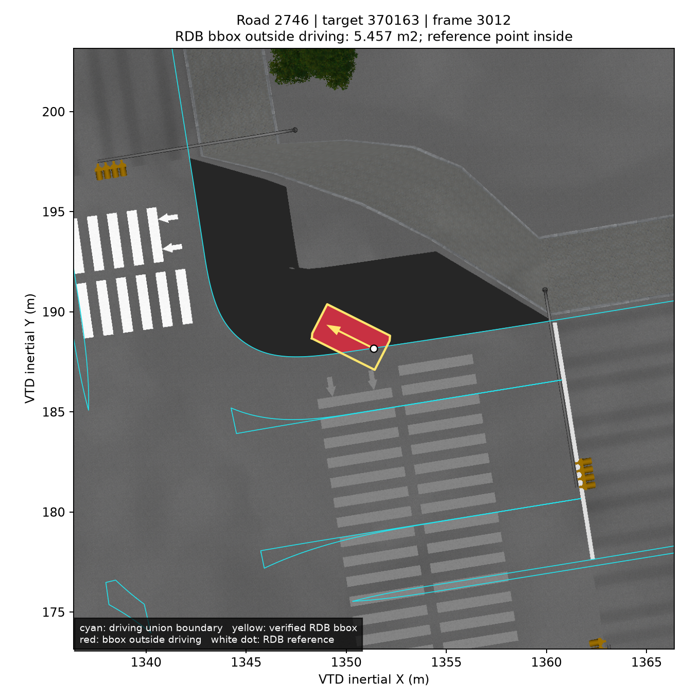
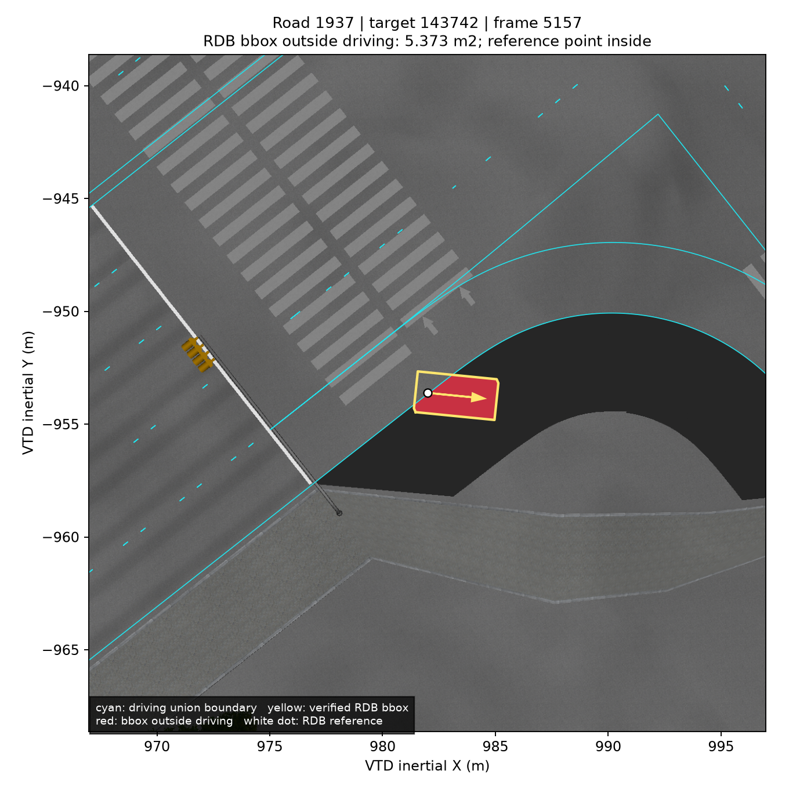
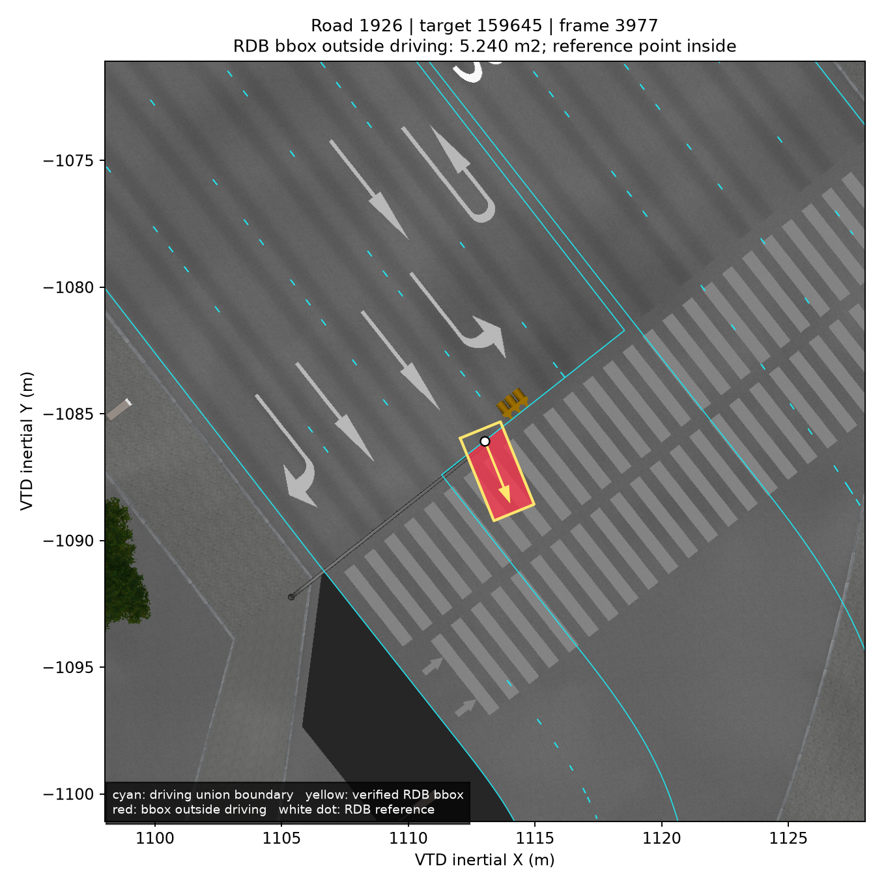

# RDB 차체 박스 전량 주행 감사

2026-09-06 분석. 최종 지도 SHA-256은 `e7a426f900813748747a39233f3678237fd7f849c335bae3bc3014b31ae678b0`다. 기준점 검사를 통과해도 차체가 도로 밖으로 나갈 수 있어, 저장된 모든 `phase=drive` RDB 자세를 실측 검증된 차량 bounding box와 대조했다. 시뮬레이터를 추가 조작하거나 지도 영역을 넓히지 않았다.

## 전량 결과

기존 11개 run과 마지막 37대 단독 run을 합쳐 **1,124,807개 drive 표본**, 그중 **1,100,181개 이동 표본**을 검사했다. 이동 여부는 기존 replay와 동일하게 연속 관측의 시간 차가 0보다 크고 0.5초 이하이며, 이동 거리가 0.001m보다 크고 `max(0.5m, 20m/s × dt)` 이하인 경우다. 배치 표본은 포함하지 않았다.

이동 표본 중 기준점이 높이가 맞는 driving 영역 안이거나 경계에서 2cm 이내인 표본은 **1,097,745개**다. 그중 차체 박스만 추가로 벗어난 결과는 다음과 같다. 같은 차량의 연속 프레임이 포함되므로 독립 사고 건수로 읽으면 안 된다.

| driving 밖 박스 면적 | Full HPR 박스 | yaw-only 박스 |
|---|---:|---:|
| > 0.05㎡ | **16,743** | 16,405 |
| > 0.1㎡ | 15,400 | 15,083 |
| > 0.5㎡ | **10,383** | 10,143 |
| > 1㎡ | 6,728 | 6,514 |
| > 3㎡ | 553 | 450 |

0.05㎡는 검토 대상을 추리는 임계값이며 법적 허용오차가 아니다. 0.05㎡를 넘는 추가 검출은 run·target·보고 road/lane 조합으로 1,051개 그룹이다. 모든 표본의 집계는 [vehicle_footprint_audit.json](../map/audit/vehicle_footprint_audit.json), Full HPR 또는 yaw-only 면적이 0.01㎡를 넘는 22,689개 상세 행은 [vehicle_footprint_violations.jsonl.gz](../map/audit/vehicle_footprint_violations.jsonl.gz)에 보존했다.

원래 1,119,856개 표본 계산은 낮춘 프로세스 우선순위와 4개 worker로 271.87초가 걸렸다. 마지막 run의 4,951개 drive 표본도 같은 계산으로 별도 검사해 합산했다. 임계값 이하 표본도 전체 집계에는 포함된다.

## 박스와 좌표의 근거

모든 감사 NPC는 `SmartForTwo_14_WhiteBlack`으로 생성됐다. 설치된 `SmartForTwo_14.xml` SHA-256 `7ae36b6495f7806f0e23cc848894571ca7470f01a47bb52f767218756025b7fb`는 [기존 RDB offset 실측](object-offset-measurement.json)의 모델 해시와 같다.

- 원본 모델: 앞 3.044m, 뒤 0.475m, 좌·우 각 0.826m, 높이 1.543m.
- 실제 RDB dimensions: `[3.5190000534057617, 1.6519999504089355, 1.5429999828338623]`.
- 실제 로컬 중심 offset: `[1.284500002861023, 0, 0]`.
- 256,232개 drive 표본은 dimensions도 직접 보존되어 모두 일치했다.
- 마지막 37대 run은 offset까지 보존한다. 배치를 포함한 5,596개 관측 전체에서 위 치수와 offset이 각각 한 값으로 동일했다. 따라서 이전 정지 측정의 offset은 이번 주행에서도 직접 확인됐다.

RDB SDK는 dimensions를 객체 로컬 크기, offset을 reference point에서 geometry center까지의 로컬 변위로 정의한다. 로컬 8개 꼭짓점에 offset을 더하고 `Rz(heading) Ry(pitch) Rx(roll)`을 적용한 뒤 XY convex hull을 계산했다. 공식 `TC_VtdFramework::CoordTrans::local2inertial`로 세 기저벡터를 별도 변환한 결과와 최대 `3.33e-16m` 이내로 같았다. 이 숫자 대조와 라이브러리 해시는 전량 JSON에 포함한다.

## 높이와 수치 처리

최종 지도의 94,154개 driving cell을 공간 인덱스에 넣었다. bbox와 겹치는 cell 중 중심의 원본 표면 Z가 차량 reference의 로컬 z=0 평면과 0.5m 이내인 것을 합친다. cell 표면의 평면 근사 최대 잔차는 0.007379m였다. 큰 검출에는 높이 허용치 0.2m·1m 결과도 함께 저장했다.

GEOS 차집합은 **10μm 고정 정밀도**로 계산한다. 원시 부동소수점 경계가 거의 일치할 때 박스 전체가 바깥으로 잘못 계산되던 pilot 한 건은 이 처리로 사라졌다. 2cm 확장한 driving 영역에 대해서도 바깥 면적을 상세 행에 기록하여 경계 민감도를 확인할 수 있다.

## 큰 사례의 원본 대조

보고 road/lane 조합별 큰 사례 50개를 골라, 원본 XODR의 line·spiral·arc 적분과 poly3 호장 역산으로 독립 대조했다. 원본 laneOffset 및 width에서 비주행 차로를 0.1m 간격으로 구성하고, bbox의 바깥 부분과 겹치는 면적을 계산했다. **29개 대표 표본에서 sidewalk가 0.05㎡ 이상, 31개에서 border가 0.05㎡ 이상** 겹쳤다. 두 분류는 중복될 수 있다. 다른 사례에는 none 영역, 원본 도로 끝, 원본 lateral driving 범위 밖이 포함됐다.

이 분류는 보고 도로의 원본 lane type에 대한 XY 대조다. 교차로에서 겹치는 다른 도로를 배타적으로 분류한 결과가 아니며, 보도 높이·타이어 접촉까지 검증한 결과도 아니다. [선택 표본](../map/audit/vehicle_footprint_source_cases.json)과 [독립 원본 대조](../map/audit/vehicle_footprint_source_types.json)에 좌표·프레임·원본 투영값·면적을 보존했다.

| 보고 도로 / target / frame | 기준점 XY(m) | bbox 바깥 면적 | 독립 원본 근거 |
|---|---|---:|---|
| 2746 / 370163 / 3012 | 1351.383700, 188.165607 | 5.457㎡ | border 0.876㎡ + sidewalk 4.581㎡ |
| 1937 / 143742 / 5157 | 981.984116, −953.612758 | 5.373㎡ | border 0.646㎡ + sidewalk 4.728㎡ |
| 1926 / 159645 / 3977 | 1113.023819, −1086.077387 | 5.240㎡ | 바깥 부분 중심 s=171.384m, 원본 도로 끝 s=169.912m |

원본 OSGB를 오프라인으로 렌더링하고 실제 RDB 자세와 최종 driving 경계를 겹쳤다. 흰 점은 reference, 노란색은 검증된 RDB bbox, 빨간색은 driving 밖 부분, 청록색은 주변 driving 경계다. 영상의 주변 경계는 설명용으로 가까운 높이의 cell을 표시하며, 수치 판정은 앞 절의 0.5m 정책을 따른다.







2746·1937은 기준점 뒤쪽 판정이 통과한 순간에도 앞쪽 bbox가 원본 비주행 영역으로 향한 사례다. 이 결과를 숨기기 위해 보도를 driving으로 확장할 근거는 없다.

1926은 별도 의미 확인이 필요하다. 원본 junction40의 `1926 −4/−5/−6/−7 → 1976 −1/−2/−3/−4`는 driving/driving/border/sidewalk 유형을 보존하며, 중심·양 경계 XYZ도 최대 `3.16e-11m` 이내로 맞는다. −6/−7은 없는 번호가 아니라 비주행 차로다. 전수 junction 검사에서도 1,202개 laneLink의 endpoint 번호·유형은 모두 유효했다. 1926 driving −1/−2/−3에는 해당 후속이 없지만, 기존 연결의 번호를 바꿔 복원할 기하 근거는 없다. 원본 OSGB에는 직진·좌회전 도색도 보이므로, 도색이 가리키는 후속 도로와 허용 경로를 원본이 충분히 기술했는지는 미확정이다. 기존 네 연결의 정확성과 교차로 전체 의미의 완전성은 구분한다. [junction40 독립 근거](../map/audit/junction40-endpoints-independent.json), [전수 laneLink 검사](../map/audit/source-junction-lanelink-audit.json)를 참조한다.

## 재현과 검증

저장소 루트에서 기존 ROS·지도 분석 환경을 사용한다. 전량 JSON의 run 목록을 manifest로 사용할 수 있다. 원래 세션 경로가 없으면 CLI는 자신의 디렉터리 아래에 보존된 동일 run basename을 찾는다. 표본이 있었거나 명시적으로 요청한 run의 로그가 없으면 실패하며, 표본 0으로 기록된 누락 run만 결과에 명시한다.

```bash
source /opt/ros/jazzy/setup.bash
/tmp/hdmap-build-env/bin/python docs/assets/hdmap-audit/driving/audit_vehicle_footprints.py \
  --map map/hdmap.bin \
  --replay-summary map/audit/vehicle_footprint_audit.json \
  --output /tmp/reproduced-footprints --workers 4

/tmp/hdmap-build-env/bin/python docs/assets/hdmap-audit/driving/project_footprint_sources.py \
  --cases map/audit/vehicle_footprint_source_cases.json \
  --xodr '/home/stier/vtd 자료/HL_FMA_VTD_LivingLab.xodr' \
  --output /tmp/reproduced-footprint-source-types.json
```

보존 CLI는 모델 해시·manifest 지도 해시·실제 수신 dimensions/center_offset을 확인한다. NaN·무한대·다른 치수/offset·지도 해시 불일치·비어 있지 않은 run의 로그 누락을 거부하는 검사를 통과했다. 입력 검증을 보강한 보존 CLI의 첫 3,000개 표본은 기존 계산과 모든 임계값별 수치가 같았고, 원본 대표 50개 면적도 재현됐다. 계산 당시 스크립트와 보존 스크립트 해시를 구분해 기록했다.

## 해석 범위

이 검사는 **실측 검증된 RDB bbox의 이산 시각별 투영**이다. 실제 그래픽 mesh, 바퀴 접지면, 연속 궤적 사이의 swept volume, 타이어·연석 접촉 충돌을 보증하지 않는다. 높이가 맞는 모든 driving cell의 합집합을 사용하므로, 반대 차로 또는 다른 회전 경로 침범이 없다는 보증도 아니다. 큰 검출의 상당수가 yaw-only에서도 유지되지만, 이 결과만으로 원본 도로의 법적 허용 회전이나 미확인 통행 영역을 새로 만들 수는 없다.
