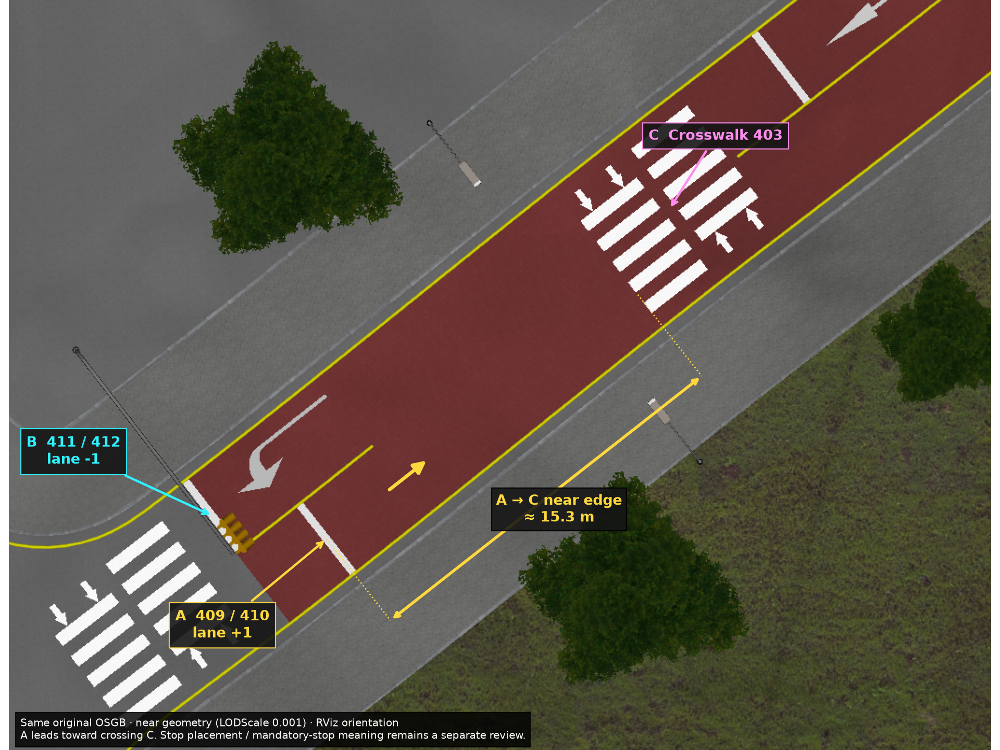

# HDMap 신호 제어기–정지선 감사

2026-09-05~06 원본 XODR의 모든 신호·제어기, 생성된 모든 신호 규제와 정지선 연결, VTD 플러그인의 선택 테이블·상태 직렬화, 원본 시나리오의 신호 주기를 조사했다. **변환기의 차로 유효 범위 무시와 도로 중간 정지선의 과잉 연결을 확인하고 수정했다.** RViz의 긴 보라색 선은 실제 지도 관계를 표시한 것이었다. 일부 긴 연결은 원본 신호 좌표·구성에 남아 있으므로 표시만 숨겨 해결했다고 보지 않는다.

현재 운영 `map/hdmap.bin`은 SHA-256 `e7a426f900813748747a39233f3678237fd7f849c335bae3bc3014b31ae678b0`이다. 실제 API 135개 접근부 측정 당시 지도는 `758f2990e28374036725bc88be2938e5857e1f9a6035e3017a83692d78e6c718`이며 측정 파일의 해시는 그대로 보존했다. 후속 도로 연결 수정 후 source ID와 native geometry로 신호 의미가 완전히 동일함을 별도로 검사했다. 이전의 신호 코드만 적용한 임시 지도 585개 규칙과 구분한다. 최신 통합 지도에는 정지선 보강까지 반영된 **603개 신호 규칙**이 있다. 이 문서는 전체 시뮬레이터 주행·제동 검증의 완료 증명서가 아니다. 빌드 보고서도 `release_ready=false`다.

## 근거 자료와 재현 기준

| 자료 | SHA-256 |
|---|---|
| `HL_FMA_VTD_LivingLab.xodr` | `5a369c7b0609fc98b0034680473465db4273dd396ffb37980996cea70ec6ca2f` |
| `HL_FMA_VTD_LivingLab.osgb` | `2d8f83fdc26cb7f8373e71cf850c70f7d90981362789fb474eb31b0d5b253296` |
| `libHLVTD.so.1.0.0` | `6059d5466def4821a243835c52c116b86f613db83729f113fb8e766aab6eca4e` |
| 수정 전 `hdmap.bin` | `7759de6a84ba9ef6fd7807792c642d5e479a981c37cbc38f570fc4912420bc78` |

원본 지도 디렉터리는 `/home/stier/vtd 자료`, 플러그인은 `/home/stier/VIRES/VTD.2025.2/Data/Setups/00_HL_VTD/Plugins/ModuleManager`에 있다. 원본 시나리오는 같은 지도 디렉터리의 `HL_FMA_VTD_LivingLab.xml`이다. XODR은 rev1.8이며 일부 구형 `positionRoad` 요소를 사용한다.

실제 생성·검증 코드는 [build_map.py](../map/tools/build_map.py), [check_signals.py](../map/tools/check_signals.py), 증거와 모든 거절 ID는 [build_report.json](../map/build_report.json)의 다음 필드에 남긴다.

- `plugin_selection_table`, `signal_mapping_contract`
- `signal_regulations`, `signal_mapping_rejections`
- `source_controller_lamp_spans`, `signal_mapping_audit`
- `api_controllers_without_stopline`, `xodr_controllers_without_stopline`

기하·차로 커버리지에 관한 독립 감사는 [HDMapGeometryAudit.md](HDMapGeometryAudit.md), 렌더링 동작은 [VisualizerAudit.md](VisualizerAudit.md)를 함께 참조한다. 생성 ID는 최종 바이너리 기준이며, 수정 전·실측 당시 ID를 사용할 때는 이를 따로 표시한다. 재생성 시 ID가 바뀔 수 있다. 원본 road/object/signal/controller ID를 함께 사용해야 한다.

## 최종 도로 연결 수정과 API 증거 대응

API 측정 뒤 도로 연결만 보강한 최종 지도는 lanelet 2,845개, cell 94,154개다. road 1196 lane -2 끝과 road 1218 lane -2 시작의 같은 좌표 point ID 공유가 만들던 176.46도 허위 U턴 연결을 분리했고, road 2816 section 2 lane +1의 약 1.139mm 폭 중앙선 잔여물을 제외했다. 신호·정지선 geometry는 수정하지 않았다. 독립 도로 연결 검사는 [topology-repair-independent.json](../map/audit/topology-repair-independent.json)에 있다.

생성 primitive ID는 신호 규칙 603개 모두 달라졌다. 따라서 과거 API 증거의 lanelet/stopline 숫자를 최종 바이너리에 그대로 대입하지 않았다. 규칙을 **controller + 원본 road/section/lane + s 구간 + 정지선의 원본 road/object ID 또는 OSGB mesh 후보 번호**로 대응시켰다. 이 기준으로 native lanelet에 실제 부착된 규칙과 빌드 보고서를 각각 대조했고, 각 규칙의 양쪽 차로 경계 XYZ, 모든 정지선·등화 XYZ와 속성, 허용 상태, API 관측 메타데이터도 검사했다. XYZ 순서를 유지한 해시에서 생성 point/line ID만 제외했다.

| 최종 의미 동일성 검사 | 결과 |
|---|---:|
| native / 보고서 신호 규칙 | 603 / 603 동일 |
| 정지선 geometry·속성·원본 차로 연결 | 751개 동일 |
| 물리 등화 geometry·속성 | 646개 동일 |
| 원본 제어기별 등화 구성원 | 214개 동일 |
| 정지선 미해결 native 제어기 | 6개 동일 |
| API 선택 테이블 | 135개 동일 |
| 원본 입력 해시·신호 적용/관측 계약 | 동일 |

두 지도의 신호 의미 SHA-256은 모두 `56c706aea51a24338839a629217e3afcccc91bbd2a0a3dbd50f8706f0b281a32`다. [전체 source-key 대응과 비교 결과](../map/audit/signal_semantics_comparison.json), [측정 당시 신호 의미 snapshot](../map/audit/signal-semantics-measured.json.gz)을 보존했다. 대표적으로 controller 108의 stop ID는 543465→543462, controller 55는 544389→544386, controller 74는 544395→544392로 바뀌었지만 원본 의미와 geometry는 동일하다.

최종 지도에서도 `check_signals.py map`이 규칙 603개, 명시적 validity/terminal 위반 0, 등화–정지선 관계 1,817개로 통과했다. **최종 바이너리에서 API 실측을 다시 했다는 주장이 아니다.** 측정 당시 신호 의미가 최종 지도에서도 보존됨을 입증하여 기존 API 증거를 source 키로 대응시킨 것이다. 도로 연결 수정의 효과·주행 증거는 별도의 도로 연결/주행 감사로 검증한다.

## 전수 조사와 수정 결과

### 2026-09-06 사용자 화면의 controller 136 연결 재확인

RViz 중심 `(618.708, -114.522)`, scale `24.857` 화면에서 아래 정지선의 긴 연결을 다시 특정했다. 정지선은 **542472**, 원본은 **road 174 / object 590 / lane +1**, 제어기는 **136**이다. 이 접근부의 양의 driving 차로는 +1 하나이며 plugin도 `(174, +1) → 136`을 선택한다.

정지선 중심은 `(612.114526, -116.186207)`이고 등화 431/432/433은 `(657.530692, -100.054236)`, `(657.437982, -99.665128)`, `(657.345273, -99.276020)`에 있다. 연결 길이는 **48.196–48.288m**다. 세 신호는 논리적으로 road 174의 s=0에 적용되며, 원본 `positionRoad`가 물리 배치를 **road 173의 s=0.1, t=0/0.4/0.8**로 명시한다. 같은 제어기의 세 등화를 원본 그대로 묶은 관계다.

독립 추출한 원본 OSGB의 실제 신호 모듈 bbox 222/221/220 안에 해당 등화 XYZ가 각각 포함됨을 확인했다(3D bbox까지 거리 모두 0). 기존 실제 Ego API 검사에서도 road 174 / lane +1의 20개 표본 모두 controller 136, state 1을 수신했다. 따라서 **이 약 48m 연결은 교차로 반대편의 실제 신호 위치를 반영하며, 긴 선 자체를 잘못된 매핑으로 볼 근거가 없다.** 자홍색 선은 차량 경로가 아니라 등화–정지선 관계의 직선 표시다.

이 국소 확인은 신호의 원본 적용 도로, 실제 물리 위치와 API 제어기 선택에 관한 것이다. 모든 신호 주기의 개별 등화 점등과 실제 정지·재출발 검증까지 완료했다는 뜻은 아니다. 원본에 차로 validity가 미선언된 메타데이터도 그대로 유지한다.

### 2026-09-06 우상단 정지선: 배경 LOD 누락과 미확정 배치

같은 사용자 화면의 우상단은 앞서 확인한 controller 136의 아래쪽 정지선과 별개다. 다음 A/B를 원본 객체와 최종 native 지도에서 각각 특정했다.

| 표시 | 원본 / 최종 정지선 | 진행 방향과 현재 매핑 |
|---|---|---|
| A: 교차로 바깥쪽 선 | road 146 objects 409/410 → stops 542418/542421 | lane +1, s 감소 방향으로 교차로에서 나감. lanelet 26112 / cell 4842, 신호 규칙 없음 |
| B: 신호등 옆 선 | road 146 objects 411/412 → stops 542424/542427 | lane −1, 교차로 진입. lanelet 25662 / cell 4730, controllers 137/138. 차로 validity 미선언은 여전히 미확정 |

A는 원본 XODR의 `Rm_StopLine_300cm_JPN_01.flt` 객체이고 OSGB 도색과의 XY 중심 차이는 각각 약 0.9/0.3mm다. 3m 모델 두 개의 중심을 횡방향 0.4m 간격으로 겹쳐 약 3.4m 폭을 채운다. 해당 차로 폭은 3.4358m이므로 단순 중복 오류로 제거할 근거가 없다. 화면에 보이는 교차로 횡단보도(road 4477 / object 6343)의 가까운 변은 A의 진행 방향 뒤쪽 약 4.565m에 있다.

**앞쪽에 별도 횡단보도가 없다는 영상 판단은 잘못될 수 있었다.** 원본 road 146 / object 403(`RM_532_6_6.flt`)이 s=124.825에 있고 A에서 그 가까운 변까지 진행 앞쪽 약 15.3m다. 이 횡단보도와 반대 방향의 정지선 objects 399/400은 기존 고공 렌더에서 가려졌다.

원인은 배경 생성기의 OpenSceneGraph LOD 선택이었다. 카메라는 `(0,0,1000)`이고 이 도로의 LOD 중심까지 약 1165.393m라 거친 포장면을 선택했다. 그 면은 objects 399/400 도색보다 약 0.191m 높았다. 동일 원본·같은 카메라에서 `camera->setLODScale(0.001f)`만 적용하면 횡단보도, 정지선, 중앙선·화살표가 함께 나타났다. 이는 원본 정지선을 새로 추가한 결과가 아니다.



[기존/정밀 배경 비교](assets/hdmap-audit/stop146-lod-comparison.png). 배경 생성기 `map/tools/render_map.cpp`에 이 설정을 적용하고 운영 `map/aerial_source.png`를 같은 범위·8192×8192 크기로 다시 생성했다. 횡단보도 403의 동일 ROI 412픽셀 중 흰색 픽셀은 0→155로 복원됐다(각 채널 ≥200, 채널 차 ≤40). 배경 SHA-256은 `662ea156a81319f2c95b0335bd8523c67f6042f76fbc7320d4c537ac42f3f9eb`에서 `94a2873b95b0418ca3edd1dadc13d2f8885aad09a66c1e093e40c71309171662`로 바뀌었다. 정지선·cell·신호와 HDMap 바이너리는 변경하지 않았다.

현재 RViz에는 기존 `aerial_marker` helper로 동일 namespace/id의 새 ADD를 한 번 발행하여 전달했다. 구독자 1개와 reliable DDS acknowledgement를 확인했고, [실제 RViz 캡처](assets/hdmap-audit/rviz-after-aerial-lod.png)에서도 우상단 횡단보도가 나타나는 것을 직접 확인했다. HUD는 2,845 lanelet / 94,154 cell이었다. 전체 launch는 종료하지 않았다. 새 실행은 교체된 PNG를 읽지만, 현재 visualizer 프로세스의 기존 latched 메시지는 메모리에 남으므로 RViz display를 재구독하면 예전 배경이 다시 올 수 있다. 다음 정상 launch 재시작에서 영구 파일 변경이 반영된다.

**A의 배치는 정상으로 인증하지 않는다.** 약 15.3m 앞의 횡단보도를 위한 선일 가능성은 있지만 원본에 명시적인 시설 연결·폐기/활성 상태·설치 근거가 없다. 파일 제공 범위에서 별도의 Road Designer 편집 원본도 발견하지 못했다. 거리의 타당성이나 정지 의무를 임의 확정하여 A를 삭제·이동하거나 가까운 신호등을 붙이지 않았다. 원본 도색 존재, RViz 표시 일치, 교통 규칙상 타당성은 각각 별개의 검증이다. 정지선 530과 일시정지표시 521의 구분은 [법제처 23-0574 해석례](https://law.go.kr/expcInfoP.do?expcSeq=336719)의 설명도 참조했다. 해당 해석례는 자전거횡단도 사례이며 이 장소의 통행 의무를 직접 판정한 자료가 아니다.

[원본 객체·차로·cell·신호, LOD 높이, 재렌더 및 전달 증거](../map/audit/stop146-source-review.json)를 보존했다. 기존 고공 영상에서 도색이 보이지 않는다는 관찰에는 이 LOD 한계를 적용해야 한다. 이 후속 확인은 원본 시설 배치 전체의 정상 판정이나 새 주행·제동 시험의 완료를 뜻하지 않는다.

후속 사용자 기준(애매하면 XODR 존재 여부를 따름)에 따라 objects409/410은 **원본 기준 유지**로 판정했다. 현장 배치의 물리적·법적 확정과 별개로 편집 결정은 완료했다. [전 도로 이미지 감사](HDMapVisionAudit.md)에서 원본 651개 road와 도로 밖 객체까지 같은 기준으로 검토했다.

### 원본 전체 집계

원본은 road 651개, 신호 제어기 214개, 물리 신호 구성 요소 646개다. 646개는 완성된 신호등 지주 수가 아니다. 적색 214개, 황색 214개, 원형 녹색 130개, 좌회전 녹색 88개의 개별 등화 객체다. 148개 요소만 명시적 `<validity>`를 가지고, 나머지 498개에는 차로 유효 범위가 없다.

| 검사 | 수정 전 | 신호 코드만 적용 | 정지선 보강 포함 통합 지도 |
|---|---:|---:|---:|
| 신호 규칙 | 773 | 585 | 603 |
| 명시적 원본 차로 유효 범위 위반 | 117 | 0 | 0 |
| terminal approach 밖 lanelet 연결 | 82 | 0 | 0 |
| 복수 제어기가 연결된 정지선 | 320 | 179 | 184 |
| 물리 등화–정지선 관계 | 2,327 | 1,763 | 1,817 |
| 평면 거리 100m 초과 관계 | 155 | 16 | 16 |
| 최장 평면 관계 거리 | 348.077m | 292.751m | 292.751m |

통합 지도 정지선은 751개이고 725개가 lanelet에 할당되었다. 제어기 208개에 유효한 정지선 관계가 있다. 신호 규칙 603개 중 **495개는 원본 차로 유효 범위가 미선언**, **266개는 해당 물리 제어기를 현재 participant API에서 관측할 수 없다.** 두 수량은 서로 배타적인 분류가 아니다. 내부 검사를 통과한 것과 차로 적용 의미를 모두 확정한 것은 다르다.

통합 빌드에서 거절한 후보는 190개다. 보고서는 후보 하나당 최종 거절 사유 하나를 기록한다(원본 차로 범위 밖 119개, 도로 끝 접근부 밖 71개). 원래 지도에서 직접 센 117개/82개의 오류 수와 이 사유별 수를 단순 차감하면 안 된다. 정지선 보강으로 후보 집합이 바뀌었고 두 조건을 동시에 위반하는 후보도 있기 때문이다.

## 확인한 변환기 오류와 적용한 수정

### API 선택 테이블과 물리 적용 차로의 혼동

플러그인의 `(road ID, lane sign)` 테이블은 참가 차량 API에 어떤 제어기를 보낼지 정한다. 해당 물리 제어기가 그 방향의 모든 차로·정지선을 제어한다는 선언이 아니다. 기존 변환기는 선택 제어기를 같은 road/sign의 정지선에 넓게 붙였고, API에 없는 다른 물리 제어기도 같은 방향으로 추정해 붙였다. 원본 `<validity>`를 검사하지 않았다.

road 72가 명확한 반례다. controller 1의 signals 1/2/5는 lane +2에만 유효하고, controller 2의 signals 3/4/6은 lane +3~+4에 유효하다. 이전 지도는 두 제어기를 양의 접근 차로들에 함께 붙였다. 동일 형태의 명시적 범위 위반은 전체 117개, 제어기 47개에서 확인했다.

이제 원본이 선언한 차로 범위를 검사한다. 선언이 없는 것은 `lane_validity_source=unverified_not_specified`로 남긴다. API의 방향 선택만으로 누락된 차로 범위를 확정하지 않는다. 물리 신호 구성원의 `controller_id`는 원본 소속을 유지한다.

### 도로 중간 정지선까지 도로 끝 제어기에 연결

road 173은 양 끝에 신호 적용 위치가 있지만 s≈125, 139, 235, 244, 359, 380m에도 정지선이 있다. 기존 변환기는 이 중간 정지선에도 도로 끝 제어기를 연결했다. controller 139 → 이전 stop 542467, 좌표 (855.754, 130.583)의 관계가 최장 348.077m였다.

원래 규칙 773개 중 691개는 접근 도로 끝에서 0.6m 이내였고, 나머지 82개는 모두 20m보다 멀었다. 이 자료의 분리된 분포와 원본 신호 접근부를 근거로 terminal scope를 적용했다. 설정 `signal_stopline_approach_tolerance_m`의 기본값은 0.6m이며 양의 유한 수여야 한다. 양의 차로는 s=0, 음의 차로는 도로 길이 쪽이 진행 방향 끝이다.

**이 범위를 모든 도로의 일반 교통 규칙으로 주장하지 않는다.** 도로 중간의 실제 신호 교차로가 추가되는 경우 별도의 원본 적용 범위 증거가 필요하다. 중간 정지선에 신호 연결이 없다는 사실만으로 새 제어기를 만들어서는 안 된다. 무신호 횡단보도·접근부도 존재한다.

### 물리 제어기와 관측 가능 제어기를 별도로 기록

규칙에 `api_selected_controller_id`와 `api_observation`을 추가했다. API에 선택되는 물리 제어기는 `selected_controller`, 선택되지 않는 제어기는 `unavailable`이다. 현재 테이블 전체 선택 여부를 나타내며 차량이 해당 접근부에 있지 않은 순간에도 관측된다는 뜻은 아니다.

원본 physical controller ID와 등화 소속은 그대로 유지한다. 다른 제어기의 위상이 비슷하다는 이유로 상태를 대신 넣지 않았다. native registry에 ID가 있다는 사실만으로 실제 위상 값이 수신된다고 해석해서는 안 된다.

## 플러그인의 실제 신호 상태 계약

해시가 고정된 바이너리의 `HlvtdTrafficLightMapping::kEntries`(0x52da0), `findManualMapping`(0x236e0), `selectParticipantTrafficLight`(0x23d30), `publishSelectedTrafficLight`(0x238d0), 실제 `sendDataPacket`(0x21550)을 대조했다. 선택 테이블은 16바이트 항목 135개이며 `(road, lane sign, controller, green_code)`를 담는다. green_code는 3 또는 5다. 실제 직렬화 분기표는 0x52d40에 있다. 주소는 이 플러그인 바이너리에만 적용된다.

| 원시 RDB phase | 전송 API 값 |
|---|---|
| 0: off | 0 |
| 1: stop | 1 |
| 2: stop + attention | 2 |
| 3: go, 4: go-exclusive | 선택 테이블의 고정 green_code 3 또는 5 |
| 5: attention | 2 |
| 6: blink | 6 |
| 7: unknown / stale 처리 | 0 |

**API 4는 이 플러그인에서 발생하지 않는다. API 5는 원형 녹색과 좌회전 등화를 각각 측정해 합친 상태가 아니다.** 선택된 제어기의 raw go를 고정 테이블 값으로 인코딩한 것이다. 따라서 API 5만으로 다른 물리 제어기도 같은 순간 통과 가능하다고 추론할 수 없다. 원시 phase 정의는 설치된 VTD `viRDBIcd.h`를 함께 대조했다.

VTD 설치 카탈로그의 `LsaArrowGreenLeft1000012-10.xml`은 type 1000012 / subtype 10을 좌회전 녹색으로 정의한다. `LsaGreen1000012.xml`의 subtype -1은 원형 녹색이다. 차로 화살표 객체가 나타내는 진행 가능 방향과 현재 점등된 등화는 별도의 정보다.

### controller 117과 blink

수정 전 같은 정지선에 중복 연결된 81쌍 중 80쌍은 제공된 시나리오의 phase/delay가 같았다. 그러나 116/117은 다르다. 116은 phase가 비어 있고, 117은 Duration=1인 blink phase 두 개다. API는 road 2312의 양의 방향에서 117을 선택한다.

지도에 없는 API 4를 임의로 생성하거나 API 6을 일반 녹색처럼 통과 허용하지 않았다. 깜박임의 색·현장 우선권·정지/주의 의무를 하나의 API 6만으로 모두 판별할 수 없다. 시나리오에서 위상이 같은 다른 제어기도 원본 계약 확인 없이 대체 관측값으로 사용하지 않았다.

### 녹색 API 3과 좌회전 규칙의 남은 불일치

통합 지도에는 선택 제어기의 green_code가 3인데 `permitted_states`가 3을 허용하지 않는 규칙이 **30개, 제어기 25개**다. 해당 ID는 48, 57, 58, 70, 71, 72, 91, 104, 105, 106, 108, 109, 117, 120, 122, 134, 135, 149, 152, 161, 162, 193, 211, 225, 226이다. 모두 원본 명시적 차로 validity가 없다. 이 조건에서는 raw go가 들어와도 현재 규칙이 통과를 허용하지 않아 계속 정지할 수 있다. 신호 코드만 적용한 중간 결과는 24개/19개였으며, 정지선 복원 후 전체를 다시 집계했다.

특히 controller 108, road 2264 lane -1의 최종 stop 543462(실측 당시 543465)는 `left+straight`, 허용 상태 `[5]`인데 API green_code=3이다. 같은 물리 제어기에 좌회전 녹색 signal 348(subtype 10)과 원형 녹색 349(subtype -1)이 함께 있다. 후속 실측에서 이 **같은 lane -1의 20개 표본 모두 실제 API 3**을 수신했다. 즉 현재 `[5]` 허용 조건과 수신 값의 불일치를 같은 차로에서 확인했다. 다만 같은 제어기의 raw go에 실제 두 등화가 어떻게 점등되는지는 별도 확인이 필요하다. 상태 허용은 바꾸지 않았다. 다른 대부분의 사례처럼 원형 녹색만 있거나, controller 117처럼 blink인 경우까지 일괄적으로 API 3을 허용해서는 안 된다.

## 원본 controller 1의 292m 분리: 좌표만 옮기지 않은 이유

원본 controller 1은 red signal 1, yellow signal 2, left-green signal 5로 구성된다. 모두 logical owner는 road 72이고 유효 차로는 +2다. 그러나 red/yellow만 `positionRoad roadId=1183 s=0.11`을 가진다. green은 road 72 s=0에 남아 있다.

| 구성 요소 | 물리 배치 근거 | XY 좌표(m) | 등화 중심 z(m) |
|---|---|---|---:|
| red 1 | road 1183, s=.11, t=2.0 | (256.563415, 209.683219) | 42.000 |
| yellow 2 | road 1183, s=.11, t=2.4 | (256.285156, 209.970572) | 42.000 |
| left-green 5 | road 72, s=0, t=2.8 | (14.567366, 45.216149) | 40.350 |
| controller 1 접근 정지선 중심 | road 72 lane +2 | (14.888334, 44.467474) | 35.550 |

그룹의 최대 XY 간격은 292.594438m이고 정지선까지의 최대 관계는 292.750896m다. ASAM에서 논리 신호 위치와 물리 신호 위치는 구분된다. 기존 변환기가 `positionRoad`를 우선해 물리 좌표를 구한 해석은 이 요소의 의미와 맞는다. rev1.8 이후의 deprecated 요소라는 사실만으로 무시해서는 안 된다. [ASAM signal positioning](https://simulation.pages.asam.net/opendrive-group/opendrive-antora-gen/ASAM_OpenDRIVE_Specification/v1.8.1/specification/14_signals/14_09_signal_positioning.html), [OpenDRIVE 1.7 원문](https://www.asam.net/fileadmin/Standards/OpenDRIVE/ASAM_OpenDRIVE_BS_V1-7-0.html).

원본 OSGB도 독립 조사했다. `TrafficLight` 텍스처를 가진 geometry의 vertex를 전체 world transform으로 변환해 1,147개 geometry의 3D bounding box를 얻었다. 이는 완성된 신호등 개수 집계가 아니며, 직접 texture 상태를 가진 geometry에 대한 조사다. 다음 신호등 모듈은 해당 좌표에 실제 존재한다.

| 원본 정적 모듈 | world bounding box min → max(m) | 확인 |
|---|---|---|
| 원격 red 위치 모듈 | (256.521501, 209.639933, 41.799442) → (257.255177, 210.359996, 42.204442) | red 1 중심이 내부에 있음 |
| 원격 yellow 위치 모듈 | (256.243241, 209.927287, 41.799442) → (256.976917, 210.647349, 42.204442) | yellow 2 중심이 내부에 있음 |
| road 72 green 위치 모듈 | (14.571380, 45.075429, 40.149444) → (15.419363, 45.546150, 40.554445) | green 5 기준점에서 약 4mm; 모델 기준점과 외곽 차이 |

두 접근부의 고해상도 원본 OSGB 렌더에서도 각 위치의 신호등 지주·모듈을 확인했다. **정적 모듈의 존재는 그 모듈이 동적으로 controller 1에 의해 점등된다는 증명은 아니다.** 더구나 road 1183에는 controller 9의 red 48/yellow 49가 같은 t=2.0/2.4, s=0에 이미 있다. controller 1의 override는 그 신호들과 도로 좌표 s가 0.11m밖에 다르지 않다.

반대로 controller 1의 `positionRoad`를 없애 logical owner s/t로 옮기면 road 72의 controller 2 red 3/yellow 4와 위치가 정확히 중복한다. 따라서 “먼 좌표가 틀렸으니 가까운 stop으로 이동”은 원본 소속·중복 배치를 해결하지 못한다. 현재 확정할 수 있는 것은 **원본 내부의 비정상적으로 큰 구성 요소 분리와 중복 배치 의심**이다. 올바른 소속/좌표를 하나로 결정하려면 Road Designer 원본 구성 또는 VTD 동적 등화와 제어기 phase의 직접 대조가 더 필요하다. 이번 지도 수정에서는 원본 좌표를 보존하고 `source_controller_lamp_spans`에 review 대상으로 남겼다.

원본 신호 속성·controller 소속, 측정 당시 native 좌표, 위 정적 모듈의 bounding box, 실제 API 인코딩, 녹색 상태 불일치 30개 전체 규칙을 [signal_source_evidence.json](../map/audit/signal_source_evidence.json)에 보존했다. 전체 geometry 추출과 렌더는 세션 증거 `/tmp/hdmap-audit/signal_static_geometry.json`, `controller1_source_intersection.png`, `controller1_override_intersection.png`에도 있다. 영구 보존 JSON의 원래 지도 해시는 측정 당시 758f…로 유지하며, 최종 e7a…에 대한 의미 동일성 비교를 별도 successor 메타데이터로 연결했다. 이전 `green_code3_left_cases.json`은 신호 코드만 반영한 중간 결과이며, 최종 30개 목록은 새 증거 JSON의 `green_code_3_permission_conflicts`를 사용한다.

## 남은 원본·계약 문제

- **API 선택 ID 자체가 XODR에 없음:** controllers 80, 82, 84, 86. 접근부는 각각 road 2011 음의 방향, 2004 양의 방향, 2003 양의 방향, 2012 양의 방향이다. 제공된 시나리오에는 ID가 있지만 XODR 물리 신호에 없는 상태다. 인접 신호로 치환하지 않았다.
- **XODR에는 있지만 유효한 정지선 연결이 없음:** API controllers 89, 213, 215, 221 및 비선택 controller 222. 도로 1928 양의 끝, 2575 음의 끝, 2806 음의 끝, 3142 음의 끝에 관련 문제가 남는다. 개별 정지선/물리 신호 증거 없이 만들어 붙이지 않았다.
- **controller 28의 validity가 비주행 차로를 가리킴:** road 465에서 source validity lane -2는 border이고 해당 방향 driving은 -1뿐이다. 원본 선언을 마음대로 -1로 바꾸지 않아 연결이 없다.
- **controller 55와 74는 보강으로 복원:** road 1778/1928의 lane -1 정지선은 OSGB에 있지만 기존 XODR stop 객체가 이웃 차로에 중복 배치되어 있었다. 원본 도색을 근거로 추가한 최종 stop 544386/544392(실측 당시 544389/544395)로 연결되며 명시적 validity 검사도 통과한다. 잘못된 이웃 차로 연결을 되살려 해결한 것이 아니다.
- **source orientation 품질:** 신호 요소 646개 모두 `orientation="+"`다. 양의 차로 validity를 가진 신호도 동일하므로 이것만으로 접근 방향을 분류하지 않는다. 원본 validity가 없을 때 이를 만능 보완 규칙으로 적용하지 않았다. [ASAM lane validity](https://simulation.pages.asam.net/opendrive-group/opendrive-antora-gen/ASAM_OpenDRIVE_Specification/v1.8.1/specification/14_signals/14_02_lane_validity_signals.html).
- **signalReference는 4개뿐:** road 1868의 212/213과 road 2012의 327/328이다. 어느 것도 validity를 선언하지 않는다. 이 참조만으로 모든 중간 정지선까지 같은 제어기에 붙일 근거가 되지 않는다.
- **다른 큰 등화 그룹:** controller 219는 100.165m, 223은 100.805m의 분포를 가진다. 그 밖에도 30~65m의 near/far-side 물리 좌표 분리가 있다. 큰 교차로의 정상 far-side 배치일 수 있으므로 거리 하나로 좌표를 수정하지 않는다.
- **미할당 source stop 26개:** 통합 보고서가 ID를 보존하고 release blocker로 표시한다. 정지선 보강과 별도로 원본 ghost geometry의 운영 의미를 구분해야 한다. mesh 후보 추출은 색·폭 조건의 영향을 받으므로 매칭 실패한 모든 원본 객체를 허위 정지선으로 단정하지 않는다.

## 실제 Ego API 접근 진단: 135개 전체

[진단 CLI](../map/tools/audit_signal_api.py)를 준비하고 먼저 한 접근부에서 실제 Ego 이동과 복원을 검증했다. 원본 Ego는 XYZ=(508.7996826, −168.2876587, 42.00000000000001), HPR=(0.5161694288253784, 0, 0), speed=0이었다. road 76 lane -1로 573.154m 순간배치한 뒤 controller 4를 20개 표본에서 확인했고, 원래 XYZ/HPR/speed 복원 오차는 마지막 3개 표본 모두 0이었다. 이 pilot이 통과한 뒤에만 135개 전체를 실행했다.

각 `(road, lane sign)`마다 원본 driving lane 하나를 선택했다. `<TrackPos>`에는 원본 laneOffset과 width 다항식으로 계산한 차로 중심 **t를 명시**했다. `lane`만 전송하면 일부 구간에서 기준선 t=0으로 배치되는 문제가 별도 주행 감사에서 관측되었기 때문이다. 배치 후 0.7초를 기다리고 1초 동안 API를 관측했다. 실제 RDB road/lane/s/t, 속도, API/RDB XYZ 일치를 함께 검사했다.

| 실측 항목 | 결과 |
|---|---:|
| 선택 테이블 접근부 | 135 / 135 |
| 실제 controller ID 일치 접근부 | 135 / 135 |
| API 수신 / 배치·정지 검증 통과 표본 | 2,700 / 2,700 |
| 요청과 다른 RDB road/lane 표본 | 0 |
| 관측 녹색 3/5와 고정 green_code의 불일치 | 0 |
| 보존 표본의 최대 API/RDB XYZ 차이 | 0.00006492m |
| 전체 검사 후 원본 XYZ/HPR/speed 복원 | 마지막 3개 표본의 오차 모두 0 |

API 상태별 수신 수는 0:80, 1:1,132, 2:246, 3:454, 5:768, 6:20이다. 상태 4는 관측되지 않았다. 짧은 구간 관측이므로 이것만으로 모든 신호 주기의 상태를 검증했다고 보지 않는다. API 4 미생성 및 고정 green_code의 의미는 앞 절의 바이너리 분석과 함께 해석한다.

**XODR에 없는 controllers 80/82/84/86은 실제로 그 ID가 전송되었지만, 각 20개 표본 모두 state=0이었다.** 다른 ID로 대체되지 않았다. ID가 맞는다는 사실이 유효한 현재 신호 상태를 제공한다는 뜻은 아니다. controller 117은 road 2312 lane +2에서 20개 모두 API 6(blink)이었다.

녹색 API 3을 허용하지 않는 기존 30개 규칙을 이번 관측과 대조했다. 이 중 17개 규칙의 제어기에서 API 3이 관측되었고, **15개는 해당 규칙과 같은 road/lane에 실제 배치한 관측**이었다. 나머지 2개는 controller 72의 lane -2 규칙인데 실제 배치는 같은 접근부의 lane -1이었다. 이를 lane -2 직접 검증으로 집계하지 않았다. 특히 controller 108의 최종 stop 543462(실측 당시 543465)는 같은 lane -1에서 실제 API 3과 현재 `permitted_states=[5]`의 불일치를 확인했다. 전체 규칙별 연결과 실제 관측 차로는 보존 JSON에 있다.

이 실측은 물리 개별 등화의 방향이나 동시 점등을 측정한 것이 아니다. RDB light raw GO 역시 제어기 위상이며 개별 물리 화살표 점등의 증명이 아니다. 원형 녹색을 좌회전 허용으로 확대하거나, blink 6을 일반 녹색으로 바꾸는 수정은 하지 않았다.

9910은 단일 participant 연결을 사용했다. 처음에는 기존 sim_bridge의 재접속과 진단 연결이 충돌해 **Ego 배치 전에** 연결이 닫혔다. 진단 중 기존 sim_bridge만 잠시 SIGSTOP으로 멈추고, `finally`에서 SIGCONT로 재개하여 기존 RViz launch를 유지했다. 전체 검사 후 원본 Ego 복원, bridge 재접속, 최종 VTD Stop 전송을 확인하고 시뮬레이터 소유권을 후속 주행 담당에게 넘겼다. 원본 복원 XML에는 XYZ, HPR의 degree 변환, 원래 속도를 손실 없이 직렬화했다.

[실측 요약과 135개 결과](../map/audit/signal_api_observations.json), [pilot 증거](../map/audit/signal-api-pilot.json), [전체 보존 표본 압축 JSON](../map/audit/signal-api-full.json.gz)을 영구 보존했다. **순간배치를 차량 주행 거리나 주행 커버리지로 계산하지 않았다.** 접근부당 한 차로·짧은 시간의 API 선택 검증이며 모든 차로, 전체 신호 주기, 신호 준수 제동, 충돌 회피를 완전히 검증한 결과는 아니다.

재실행할 때는 VTD 단독 조작권과 9910 단독 수신권을 확보하고, operation 상태의 정지한 Ego에서 시작해야 한다. 먼저 새 출력 폴더에 pilot을 실행한다. 원래 snapshot이 있는 출력 폴더는 덮어쓰지 않는다.

```bash
source /opt/ros/jazzy/setup.bash
/tmp/hdmap-build-env/bin/python map/tools/audit_signal_api.py --self-check
/tmp/hdmap-build-env/bin/python map/tools/audit_signal_api.py --output /tmp/new-signal-api-pilot --run --limit 1
# report.json의 배치 결과와 restoration.verified를 확인한 뒤:
/tmp/hdmap-build-env/bin/python map/tools/audit_signal_api.py --output /tmp/new-signal-api-full --run
```

`--run`이 없으면 계획만 저장하며 시뮬레이터에 연결하지 않는다. CLI는 원본 snapshot과 복원 XML을 이동 전에 저장하고, 예외·SIGTERM에서도 `finally` 복원을 시도한다. 실제 복원 관측이 확인되지 않으면 실패로 종료하므로 성공으로 간주해 다음 조작을 이어가면 안 된다.

## 검증 실행과 해석 범위

`check_signals.py`는 native map을 다시 읽고 규칙의 terminal lanelet scope, 명시적 원본 lane validity, physical controller별 등화 구성원의 정확한 소속, 실제 연결 거리 통계를 검사한다. 기존 지도에서는 validity 117개와 nonterminal 82개 위반을 검출했고, 위 통합 지도에서는 위반 없이 통과했다.

```bash
source /opt/ros/jazzy/setup.bash
/tmp/hdmap-build-env/bin/python map/tools/check_signals.py map
# 보관한 이전 지도 디렉터리가 있으면 같은 명령에 추가:
# --baseline /path/to/baseline-map
```

위 명령은 운영 `map` 디렉터리를 검사한다. 다시 생성하거나 배치할 때마다 보고서의 `binary_sha256`가 실제 파일과 일치하는지 확인한다. 검사 통과는 이 문서에 명시한 구조적 불변 조건의 통과다. 미선언 validity, API 비관측 제어기, blink 처리, green_code3/좌회전 계약, 원본 등화 소속, 실제 제동거리·정렬까지 해결했다는 뜻은 아니다. 이 항목들을 포함한 전역 차량 주행 검증 결과는 별도로 기록해야 한다.
