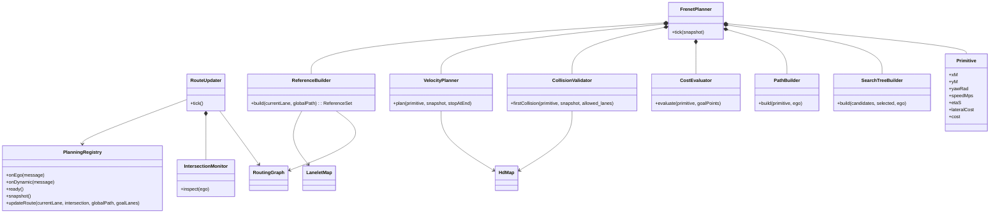
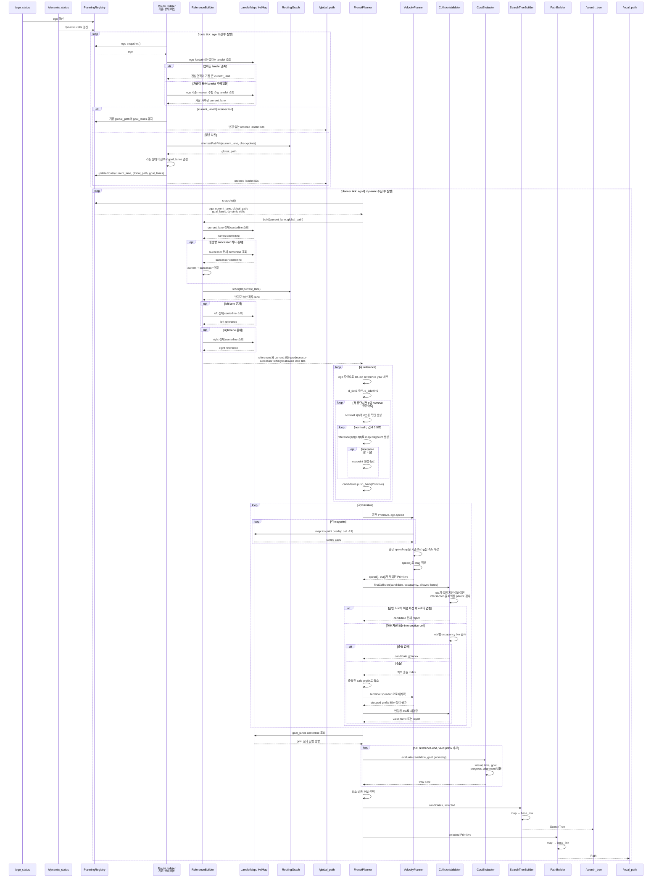

# Path Planner 설계

## 목표와 입출력

`path_planner`는 `/ego_status`와 `/dynamic_status`를 받아 Lanelet2 글로벌 경로와 시간 점유를 반영한 Frenet 로컬 경로를 생성한다.

| 방향 | 토픽 | 타입 |
|---|---|---|
| 입력 | `/ego_status` | `interfaces/msg/EgoStatus` |
| 입력 | `/dynamic_status` | `interfaces/msg/DynamicStatus` |
| 출력 | `/global_path` | `std_msgs/msg/Int64MultiArray` |
| 출력 | `/local_path` | `nav_msgs/msg/Path` |
| 출력 | `/search_tree` | `interfaces/msg/SearchTree` |

- `/global_path.data`는 순서 있는 lanelet ID 목록이며 `[0]`은 현재 lanelet이다.
- 글로벌 경로를 발행하기 위해 만든 `global_path.data`를 상태 머신과 Frenet planner가 그대로 참조한다. 이 노드는 `/global_path`를 자기 구독하지 않는다.
- `/local_path`는 `base_link` 기준 `nav_msgs/Path`이며 stamp는 계획에 사용한 ego 입력 시각이다.
- QoS는 `BEST_EFFORT / VOLATILE / KEEP_LAST(1)`이다.
- 이 문서의 클래스·메서드·분기에 나타나지 않은 방어 코드, validator, fallback, watchdog, 이전 결과 재사용은 구현하지 않는다. 설계를 바꿀 때는 이 README와 세 다이어그램을 먼저 갱신한다.

## Checkpoint와 글로벌 경로

- `checkpoint_bank/`에는 checkpoint 후보 CSV를 보관한다.
- `checkpoint/`에는 이번 실행에서 사용할 `seq,x,y` CSV 하나를 둔다.
- 노드는 시작할 때 `checkpoint/`의 CSV를 읽고 `seq` 순서대로 사용한다. 파일 교체는 다음 실행부터 반영한다.
- checkpoint 반경에 순서대로 진입하면 다음 checkpoint로 진행한다.
- 각 checkpoint 좌표는 `lanelet::geometry::findNearest()`로 lanelet에 대응시킨다.
- 로컬 계획과 같은 10Hz tick마다 현재 lanelet부터 남은 checkpoint lanelet까지 `RoutingGraph::shortestPathVia()`를 다시 호출한다. 별도 5Hz 글로벌 타이머는 두지 않는다.
- 반환된 lanelet ID를 순서와 중복을 유지한 채 `/global_path.data`에 넣는다.

### 현재 lanelet 선택

Lanelet2 `LaneletLayer::search(query_box)`는 bounding box가 겹치는 후보를 R-tree 탐색 순서로 반환한다. 겹침 면적순이 아니다. `lanelet::geometry::overlaps()`는 실제 중첩 여부를 반환하지만 후보 목록이나 중첩 면적순 결과를 반환하지 않는다.

현재 lanelet은 다음 순서로 선택한다.

1. ego 차량 footprint의 bounding box로 `LaneletLayer::search()`를 호출한다.
2. 후보 lanelet polygon과 ego footprint에 `lanelet::geometry::overlaps()`를 적용한다.
3. 겹치는 후보마다 Boost Geometry `intersection()` 결과의 면적을 계산한다.
4. 겹침 면적이 가장 큰 lanelet을 현재 lanelet으로 선택한다.

## Goal lane 상태 머신

상태 머신은 두 상태만 사용한다.

- `N: TRY TO FOLLOW LANE`: goal은 현재 `global_path[0]`과 선택한 longitudinal successor다.
- `K: ALLOW LANE CHANGE`: goal은 `global_path[1]`이다.

`following0 = routingGraph.following(global_path[0], false)`로 정의한다. `global_path[1]`이 `following0`에 포함되면 그것을 `N`의 successor로 선택하고, 아니면 `following0[0]`을 선택한다. 따라서 `N`에서도 현재 lanelet 끝을 지나 로컬 경로를 계속 생성한다.


10Hz마다 이전 경로 `P=[p0,p1,…]`와 새 경로 `Q=[q0,q1,…]`를 비교해 다음 이벤트 하나를 만든다.

| 이벤트 | 조건 | 상태 처리 |
|---|---|---|
| `routeStable` | `q0=p0`, `q1=p1` | 현재 상태 유지 후 heading·시간 이벤트 처리 |
| `nextChanged` | `q0=p0`, `q1≠p1` | `N / resetAlignment(); setFollowGoals()` |
| `advanced` | `q0=p1` | 현재 상태와 alignment clock 유지; `N`은 `setFollowGoals()`, `K`는 `setGoal(1)` |
| `currentChanged` | `q0≠p0`, `q0≠p1` | `N / resetAlignment(); setFollowGoals()` |
| `nextCreated` | 이전에는 `[p0]`만 있고 새 경로에는 `q1` 존재 | `N / resetAlignment(); setFollowGoals()` |
| `nextRemoved` | 새 경로가 `[q0]`만 포함 | `N / resetAlignment(); setFollowGoals()` |

heading과 교차로는 다음 이벤트로 변환한다.

| 이벤트 | 발생 조건 |
|---|---|
| `headingAligned` | ego heading과 현재 lanelet 중심선 접선 방향의 차이가 설정값 이하 |
| `headingLost` | 위 조건을 만족하지 않음 |
| `alignmentElapsed` | `N`에서 누적 alignment time이 3초 초과 |
| `intersectionObserved` | 현재 lanelet의 `intersection` attribute 값이 `yes` |

### 상태별 전체 진입

| 도착 상태 | 출발 상태 | 이벤트 | 액션 |
|---|---|---|---|
| `N` | 시작점 | `initialize` | `alignmentTime = 3; setFollowGoals()` |
| `N` | `N` | `routeStable` | 상태 유지 |
| `N` | `N` | `headingAligned` | `alignmentTime += dt` |
| `N` | `N` | `headingLost` | `alignmentTime = 0` |
| `N` | `N` | `intersectionObserved` | `alignmentTime = 0; setFollowGoals()` |
| `N` | `N` | `advanced` | `setFollowGoals()`; alignment clock 유지 |
| `N` | `N` | `nextChanged` | `resetAlignment(); setFollowGoals()` |
| `N` | `N` | `currentChanged` | `resetAlignment(); setFollowGoals()` |
| `N` | `N` | `nextCreated` | `resetAlignment(); setFollowGoals()` |
| `N` | `N` | `nextRemoved` | `resetAlignment(); setFollowGoals()` |
| `N` | `K` | `headingLost` | `alignmentTime = 0; setFollowGoals()` |
| `N` | `K` | `intersectionObserved` | `alignmentTime = 0; setFollowGoals()` |
| `N` | `K` | `nextChanged` | `resetAlignment(); setFollowGoals()` |
| `N` | `K` | `currentChanged` | `resetAlignment(); setFollowGoals()` |
| `N` | `K` | `nextCreated` | `resetAlignment(); setFollowGoals()` |
| `N` | `K` | `nextRemoved` | `resetAlignment(); setFollowGoals()` |
| `K` | `N` | `alignmentElapsed` | `setGoal(1)` |
| `K` | `K` | `routeStable` | `setGoal(1)` |
| `K` | `K` | `headingAligned` | 상태와 alignment clock 유지 |
| `K` | `K` | `advanced` | `setGoal(1)`; alignment clock 유지 |

### 상태별 전체 이탈

| 출발 상태 | 이벤트 | 액션 | 도착 상태 |
|---|---|---|---|
| `N` | `routeStable` | 상태 유지 | `N` |
| `N` | `headingAligned` | `alignmentTime += dt` | `N` |
| `N` | `headingLost` | `alignmentTime = 0` | `N` |
| `N` | `intersectionObserved` | `alignmentTime = 0; setFollowGoals()` | `N` |
| `N` | `advanced` | `setFollowGoals()`; alignment clock 유지 | `N` |
| `N` | `nextChanged` | `resetAlignment(); setFollowGoals()` | `N` |
| `N` | `currentChanged` | `resetAlignment(); setFollowGoals()` | `N` |
| `N` | `nextCreated` | `resetAlignment(); setFollowGoals()` | `N` |
| `N` | `nextRemoved` | `resetAlignment(); setFollowGoals()` | `N` |
| `N` | `alignmentElapsed` | `setGoal(1)` | `K` |
| `K` | `routeStable` | `setGoal(1)` | `K` |
| `K` | `headingAligned` | 상태와 alignment clock 유지 | `K` |
| `K` | `advanced` | `setGoal(1)`; alignment clock 유지 | `K` |
| `K` | `headingLost` | `alignmentTime = 0; setFollowGoals()` | `N` |
| `K` | `intersectionObserved` | `alignmentTime = 0; setFollowGoals()` | `N` |
| `K` | `nextChanged` | `resetAlignment(); setFollowGoals()` | `N` |
| `K` | `currentChanged` | `resetAlignment(); setFollowGoals()` | `N` |
| `K` | `nextCreated` | `resetAlignment(); setFollowGoals()` | `N` |
| `K` | `nextRemoved` | `resetAlignment(); setFollowGoals()` | `N` |


## 클래스 다이어그램



계획 후보는 별도 계층이나 factory 없이 `std::vector<Primitive>`에 보관한다.

## 객체 시퀀스 다이어그램



## Frenet 후보 생성

Reference는 다음 세 종류다.

- 현재 lanelet 전체 centerline과 종방향 successor 하나를 순서대로 연결한 reference
- `RoutingGraph::left(current)`가 반환한 차선의 전체 centerline
- `RoutingGraph::right(current)`가 반환한 차선의 전체 centerline

`goal_lanes`는 reference 생성에 사용하지 않고 비용 계산에만 사용한다. 허용 차선 집합은 현재 차선, 모든 `previous(current)`, 선택한 successor 하나와 `left/right(current)`로 구성한다. 후보 footprint가 이 집합 밖 일반 도로 parent lanelet의 cell과 하나라도 겹치면 후보 전체를 버린다. `intersection=yes` lanelet의 cell은 이 검사에서 제외한다. 좌우 결과가 없는 실선 경계에는 후보를 만들지 않는다. reference 자체는 자르지 않는다. 다항식의 `s(t)`가 reference 끝에 도달하면 그때까지 만든 waypoint를 짧은 후보로 보관한다.

시작 횡상태는 다음과 같다.

\[
d_0=\operatorname{signedOffset}(p_{ego},r),\qquad
\dot d_0=v_{ego}\sin(\psi_{ego}-\psi_r),\qquad
\ddot d_0=0
\]

종단은 각 reference 중심에 정렬한다.

\[
d(T)=0,\qquad \dot d(T)=0,\qquad \ddot d(T)=0
\]

`d(t)`는 5차, 종단 위치를 고정하지 않는 nominal `s(t)`는 4차 다항식이다. 두 다항식은 독립적으로 생성하고 같은 nominal `t`에서 결합한다.

\[
p(t)=r(s(t))+d(t)n(s(t))
\]

이 시간은 공간 후보를 만들기 위한 nominal parameter다. 최종 `speed_mps`와 `eta_s`는 `VelocityPlanner`가 다시 계산한다.

### Primitive

```cpp
struct Primitive {
  std::vector<double> x_m;
  std::vector<double> y_m;
  std::vector<double> yaw_rad;
  std::vector<double> speed_mps;
  std::vector<double> eta_s;
  double lateral_cost;
  double cost;
};
```

모든 좌표는 내부에서 map 기준이다. 한 `Primitive`가 한 다항식 후보 전체를 가진다. Hybrid A*의 parent, open queue, path store와 visited key는 사용하지 않는다.

## 속도 계획과 충돌 검사

`VelocityPlanner`는 각 waypoint footprint와 겹치는 cell의 `speed_cap_mps` 최솟값으로 상한 배열을 만든다. 첫 점은 현재 ego 속도로 고정한다. 이후 낮은 값을 기준으로 높은 값만 줄인다.

후방 감속 전파:

\[
v_i\leftarrow\min\left(v_i,\sqrt{v_{i+1}^2+2b_{max}\Delta s_i}\right)
\]

전방 가속 전파:

\[
v_i\leftarrow\min\left(v_i,\sqrt{v_{i-1}^2+2a_{max}\Delta s_i}\right)
\]

거리와 평균속도로 ETA를 적분한다.

\[
\eta_i=\eta_{i-1}+\frac{2\Delta s_i}{v_{i-1}+v_i}
\]

`CollisionValidator`는 속도를 수정하지 않는다. `lane_overlap_check_delay_s` 이후부터 map 좌표 footprint가 허용 차선 밖 일반 도로 parent lanelet의 cell과 겹치는지 검사한다. `intersection=yes` lanelet은 차선 검사 대상에서 제외하고, 모든 overlap cell의 occupancy는 0초부터 그대로 검사한다. occupancy가 양수인 최초 sample index를 반환한다.

충돌한 후보는 직전 안전 sample까지 줄이고 종단 속도를 0으로 설정한다. `VelocityPlanner`로 정지 프로파일과 ETA를 다시 만든 뒤 `CollisionValidator`로 재검증한다. full 후보, reference 끝 후보와 valid safe prefix를 같은 비용함수로 평가한다.

## 비용함수

\[
J=w_{lat}J_{lat}+w_tJ_t+w_gJ_g+w_pJ_p+w_aJ_a+w_cJ_c
\]

- `J_lat`: nominal `d(t)`의 횡가속도와 jerk 제곱 적분
- `J_t = eta_end`: `VelocityPlanner`가 만든 최종 도착시간
- `J_g`: 후보 종점과 goal lane 중심선 점 집합 사이의 최소 제곱거리
- `J_p = (L_desired-L_candidate)^2`: 짧은 경로의 진행량 부족
- `J_a`: 후보 종단 yaw와 가장 가까운 goal 중심선 구간 방향의 제곱 오차
- `J_c`: reference 중심선으로부터의 평균 제곱 횡오프셋. 중심선에서 0이고 멀어질수록 증가

\[
J_c=\frac{1}{N}\sum_{i=1}^{N}d_i^2
\]

\[
J_g=\min_{q\in C_{goal}}\|p_{end}-q\|^2
\]

\[
J_a=\operatorname{wrap}(\psi_{end}-\psi_{goal})^2
\]

장애물 비용, 목표 속도 비용, reference 종류에 따른 고정 차선 변경 비용은 두지 않는다. 장애물은 hard collision과 safe prefix로 처리한다. `J_p`가 정지와 우회 진행의 균형을, `J_a`가 차선 변경 도중 잘린 비스듬한 prefix의 선택을 억제한다.

## 좌표계와 SearchTree

`Primitive`와 footprint query는 map 좌표를 사용한다. `PathBuilder`와 `SearchTreeBuilder`만 계획 시각의 ego pose로 map 좌표를 `base_link`로 변환한다.

`SearchTree` 메시지는 바꾸지 않는다. 각 후보의 waypoint를 독립 parent chain으로 펼치고 선택 후보 마지막 waypoint를 `final_node_index`로 표시한다.

## 초기 설정

```yaml
path_planner:
  ros__parameters:
    route_update_hz: 10.0
    frenet_planner_hz: 20.0
    max_path_length: 50.0
    lateral_cost_weight: 1.0
    time_cost_weight: 1.0
    goal_cost_weight: 10.0
    progress_cost_weight: 1.0
    alignment_cost_weight: 10.0
    centerline_deviation_cost_weight: 1.0
    checkpoint_radius_m: 2.0
    heading_tolerance_deg: 10.0
    alignment_duration_s: 3.0
    frenet_horizon_candidates_s: [1.0, 1.1, 1.2, 1.3, 1.4, 1.5, 1.6, 1.7, 1.8, 1.9, 2.0, 2.1, 2.2, 2.3, 2.4, 2.5, 2.6, 2.7, 2.8, 2.9, 3.0, 3.1, 3.2, 3.3, 3.4, 3.5, 3.6, 3.7, 3.8, 3.9, 4.0]
    xy_resolution_m: 0.5
    time_resolution_s: 0.5
    lane_overlap_check_delay_s: 1.0
    planning_accel_limit_mps2: 5.45
    planning_decel_limit_mps2: 10.37
    wheelbase_m: 2.95
    maximum_curvature_per_m: 0.169492
    maximum_steering_deg: 26.565
```

`maximum_curvature_per_m`과 `maximum_steering_deg`는 최소 회전반경 5.9 m와 축거 2.95 m를 기준으로 한 후보 제한이다. 첫 segment와 ego heading의 불연속을 포함해 |Δyaw|/Δs로 이산 곡률을 계산하고, 한계를 넘는 후보는 비용 평가 전에 제외한다. current lane이 교차로이면 기존 global path와 goal lane을 유지한다.

`alignment_duration_s`는 기존 goal lane 상태 머신에만 사용한다. `time_resolution_s`는 nominal 다항식 결합 간격이고 `xy_resolution_m`은 그 사이 공간 보간 간격이다. 가감속 기본값은 각각 아이오닉 6 AWD의 공식 0–100 km/h 평균가속도와 아이오닉 6 N의 공식 100–0 km/h 제동거리에서 환산한 값이며 조정 가능한 planner parameter다.

## 확인

```bash
cmake --build build/path_planner -j2
ctest --test-dir build/path_planner --output-on-failure
```

회귀 테스트는 4차·5차 다항식 경계조건, reference projection과 map→base_link 변환을 확인한다. ROS smoke test는 `/global_path`, `/local_path`, `/search_tree` 발행을 확인한다.
