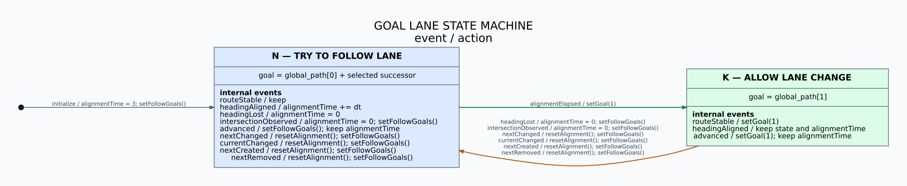
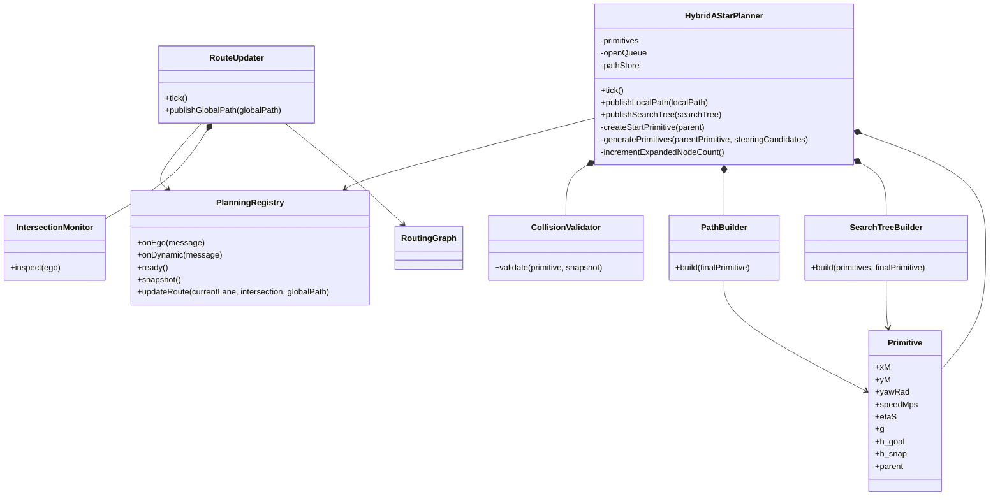
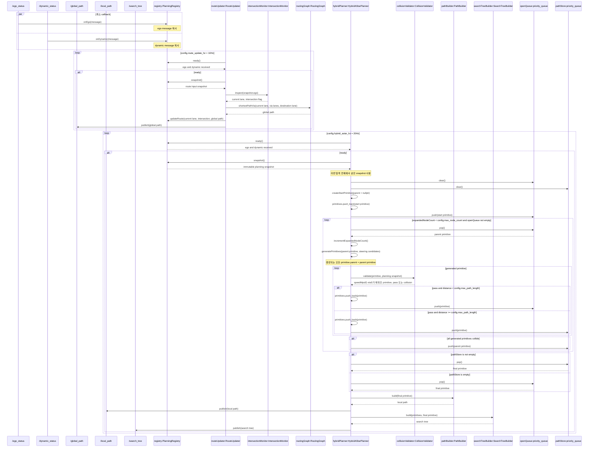

# Path Planner 설계

## 목표와 입출력

`path_planner`는 `/ego_status`와 `/dynamic_status`를 받아 Lanelet2 글로벌 경로와 시간 점유를 반영한 Hybrid A* 로컬 경로를 생성한다.

| 방향 | 토픽 | 타입 |
|---|---|---|
| 입력 | `/ego_status` | `interfaces/msg/EgoStatus` |
| 입력 | `/dynamic_status` | `interfaces/msg/DynamicStatus` |
| 출력 | `/global_path` | `std_msgs/msg/Int64MultiArray` |
| 출력 | `/local_path` | `nav_msgs/msg/Path` |
| 출력 | `/search_tree` | `interfaces/msg/SearchTree` |

- `/global_path.data`는 순서 있는 lanelet ID 목록이며 `[0]`은 현재 lanelet이다.
- 글로벌 경로를 발행하기 위해 만든 `global_path.data`를 상태 머신과 Hybrid A*가 그대로 참조한다. 이 노드는 `/global_path`를 자기 구독하지 않는다.
- `/local_path`는 `base_link` 기준 `nav_msgs/Path`이며 stamp는 계획에 사용한 ego 입력 시각이다.
- QoS는 `BEST_EFFORT / VOLATILE / KEEP_LAST(1)`이다.
- 이 문서의 클래스·메서드·분기에 나타나지 않은 방어 코드, validator, fallback, watchdog, 이전 결과 재사용은 구현하지 않는다. 설계를 바꿀 때는 이 README와 세 다이어그램을 먼저 갱신한다.

## Checkpoint와 글로벌 경로

- `checkpoint_bank/`에는 checkpoint 후보 CSV를 보관한다.
- `checkpoint/`에는 이번 실행에서 사용할 `seq,x,y` CSV 하나를 둔다.
- 노드는 시작할 때 `checkpoint/`의 CSV를 읽고 `seq` 순서대로 사용한다. 파일 교체는 다음 실행부터 반영한다.
- checkpoint 반경에 순서대로 진입하면 다음 checkpoint로 진행한다.
- 각 checkpoint 좌표는 `lanelet::geometry::findNearest()`로 lanelet에 대응시킨다.
- 로컬 계획과 같은 10Hz tick마다 현재 lanelet부터 남은 checkpoint lanelet까지 `RoutingGraph::shortestPathVia()`를 다시 호출한다. 별도 5Hz 글로벌 타이머는 두지 않는다.
- 반환된 lanelet ID를 순서와 중복을 유지한 채 `/global_path.data`에 넣는다.

### 현재 lanelet 선택

Lanelet2 `LaneletLayer::search(query_box)`는 bounding box가 겹치는 후보를 R-tree 탐색 순서로 반환한다. 겹침 면적순이 아니다. `lanelet::geometry::overlaps()`는 실제 중첩 여부를 반환하지만 후보 목록이나 중첩 면적순 결과를 반환하지 않는다.

현재 lanelet은 다음 순서로 선택한다.

1. ego 차량 footprint의 bounding box로 `LaneletLayer::search()`를 호출한다.
2. 후보 lanelet polygon과 ego footprint에 `lanelet::geometry::overlaps()`를 적용한다.
3. 겹치는 후보마다 Boost Geometry `intersection()` 결과의 면적을 계산한다.
4. 겹침 면적이 가장 큰 lanelet을 현재 lanelet으로 선택한다.

## Goal lane 상태 머신

상태 머신은 두 상태만 사용한다.

- `N: TRY TO FOLLOW LANE`: goal은 현재 `global_path[0]`과 선택한 longitudinal successor다.
- `K: ALLOW LANE CHANGE`: goal은 `global_path[1]`이다.

`following0 = routingGraph.following(global_path[0], false)`로 정의한다. `global_path[1]`이 `following0`에 포함되면 그것을 `N`의 successor로 선택하고, 아니면 `following0[0]`을 선택한다. 따라서 `N`에서도 현재 lanelet 끝을 지나 로컬 경로를 계속 생성한다.



10Hz마다 이전 경로 `P=[p0,p1,…]`와 새 경로 `Q=[q0,q1,…]`를 비교해 다음 이벤트 하나를 만든다.

| 이벤트 | 조건 | 상태 처리 |
|---|---|---|
| `routeStable` | `q0=p0`, `q1=p1` | 현재 상태 유지 후 heading·시간 이벤트 처리 |
| `nextChanged` | `q0=p0`, `q1≠p1` | `N / resetAlignment(); setFollowGoals()` |
| `advanced` | `q0=p1` | 현재 상태와 alignment clock 유지; `N`은 `setFollowGoals()`, `K`는 `setGoal(1)` |
| `currentChanged` | `q0≠p0`, `q0≠p1` | `N / resetAlignment(); setFollowGoals()` |
| `nextCreated` | 이전에는 `[p0]`만 있고 새 경로에는 `q1` 존재 | `N / resetAlignment(); setFollowGoals()` |
| `nextRemoved` | 새 경로가 `[q0]`만 포함 | `N / resetAlignment(); setFollowGoals()` |

heading과 교차로는 다음 이벤트로 변환한다.

| 이벤트 | 발생 조건 |
|---|---|
| `headingAligned` | ego heading과 현재 lanelet 중심선 접선 방향의 차이가 설정값 이하 |
| `headingLost` | 위 조건을 만족하지 않음 |
| `alignmentElapsed` | `N`에서 누적 alignment time이 3초 초과 |
| `intersectionObserved` | 현재 lanelet의 `intersection` attribute 값이 `yes` |

### 상태별 전체 진입

| 도착 상태 | 출발 상태 | 이벤트 | 액션 |
|---|---|---|---|
| `N` | 시작점 | `initialize` | `alignmentTime = 3; setFollowGoals()` |
| `N` | `N` | `routeStable` | 상태 유지 |
| `N` | `N` | `headingAligned` | `alignmentTime += dt` |
| `N` | `N` | `headingLost` | `alignmentTime = 0` |
| `N` | `N` | `intersectionObserved` | `alignmentTime = 0; setFollowGoals()` |
| `N` | `N` | `advanced` | `setFollowGoals()`; alignment clock 유지 |
| `N` | `N` | `nextChanged` | `resetAlignment(); setFollowGoals()` |
| `N` | `N` | `currentChanged` | `resetAlignment(); setFollowGoals()` |
| `N` | `N` | `nextCreated` | `resetAlignment(); setFollowGoals()` |
| `N` | `N` | `nextRemoved` | `resetAlignment(); setFollowGoals()` |
| `N` | `K` | `headingLost` | `alignmentTime = 0; setFollowGoals()` |
| `N` | `K` | `intersectionObserved` | `alignmentTime = 0; setFollowGoals()` |
| `N` | `K` | `nextChanged` | `resetAlignment(); setFollowGoals()` |
| `N` | `K` | `currentChanged` | `resetAlignment(); setFollowGoals()` |
| `N` | `K` | `nextCreated` | `resetAlignment(); setFollowGoals()` |
| `N` | `K` | `nextRemoved` | `resetAlignment(); setFollowGoals()` |
| `K` | `N` | `alignmentElapsed` | `setGoal(1)` |
| `K` | `K` | `routeStable` | `setGoal(1)` |
| `K` | `K` | `headingAligned` | 상태와 alignment clock 유지 |
| `K` | `K` | `advanced` | `setGoal(1)`; alignment clock 유지 |

### 상태별 전체 이탈

| 출발 상태 | 이벤트 | 액션 | 도착 상태 |
|---|---|---|---|
| `N` | `routeStable` | 상태 유지 | `N` |
| `N` | `headingAligned` | `alignmentTime += dt` | `N` |
| `N` | `headingLost` | `alignmentTime = 0` | `N` |
| `N` | `intersectionObserved` | `alignmentTime = 0; setFollowGoals()` | `N` |
| `N` | `advanced` | `setFollowGoals()`; alignment clock 유지 | `N` |
| `N` | `nextChanged` | `resetAlignment(); setFollowGoals()` | `N` |
| `N` | `currentChanged` | `resetAlignment(); setFollowGoals()` | `N` |
| `N` | `nextCreated` | `resetAlignment(); setFollowGoals()` | `N` |
| `N` | `nextRemoved` | `resetAlignment(); setFollowGoals()` | `N` |
| `N` | `alignmentElapsed` | `setGoal(1)` | `K` |
| `K` | `routeStable` | `setGoal(1)` | `K` |
| `K` | `headingAligned` | 상태와 alignment clock 유지 | `K` |
| `K` | `advanced` | `setGoal(1)`; alignment clock 유지 | `K` |
| `K` | `headingLost` | `alignmentTime = 0; setFollowGoals()` | `N` |
| `K` | `intersectionObserved` | `alignmentTime = 0; setFollowGoals()` | `N` |
| `K` | `nextChanged` | `resetAlignment(); setFollowGoals()` | `N` |
| `K` | `currentChanged` | `resetAlignment(); setFollowGoals()` | `N` |
| `K` | `nextCreated` | `resetAlignment(); setFollowGoals()` | `N` |
| `K` | `nextRemoved` | `resetAlignment(); setFollowGoals()` | `N` |


## 클래스 다이어그램

확정된 시퀀스 다이어그램의 패키지 객체를 그대로 표현한다. 토픽과 STL queue는 클래스에서 생략한다.



별도 checkpoint 클래스, route 클래스, global path planner와 publisher wrapper는 만들지 않는다.

## 객체 시퀀스 다이어그램

Publisher 객체는 생략한다. 토픽 열은 토픽 이름만 표시하고 생산자가 토픽에 `publish()`를 호출하는 것으로 발행을 나타낸다. 구독 callback은 메시지를 객체 멤버에 복사하기만 하며 계산을 시작하지 않는다. 계산은 config의 10Hz·20Hz timer loop가 시작한다.

`KEEP_LAST(1)`은 DDS queue에 최신 한 건만 남기는 설정이다. 메시지의 시간상 freshness를 판정하지는 않는다. 이 설계는 별도 stale 판정을 추가하지 않고 timer가 callback이 보관한 최신 값을 사용한다.



- `RouteUpdater`가 10Hz마다 intersection 검사와 `RoutingGraph::shortestPathVia()`를 직접 호출한다.
- registry에 넣은 global path 리스트를 그대로 `/global_path`에 발행한다. 자기 구독은 두지 않는다.
- `HybridAStarPlanner`는 20Hz tick 시작 시 snapshot을 한 번 받아 탐색 종료까지 유지한다.
- `HybridAStarPlanner`가 config의 조향 후보로 primitive를 생성한다.
- `CollisionValidator`는 sample footprint와 겹친 cell을 한 번 조회한다. 해당 cell들의 `speed_cap_mps` 최솟값으로 속도와 ETA를 적분한 뒤 같은 cell의 ETA time bin occupancy를 검사한다.
- 통과한 primitive 중 누적 거리가 `max_path_length` 미만이면 `openQueue`, 이상이면 `pathStore`에 넣는다.
- 생성한 primitive가 모두 collision이면 확장 직전의 유효한 parent primitive를 `pathStore`에 넣는다.
- `max_node_count`에 도달하거나 `openQueue`가 비면 `pathStore`의 최상위 primitive를 선택한다. `pathStore`가 비어 있으면 `openQueue`의 최상위 primitive를 선택한다.
- `PathBuilder::build()`가 최종 primitive의 `parent` 체인을 따라 `/local_path`를 만든다.
- `/local_path` 발행 후 `SearchTreeBuilder::build()`가 전체 primitive 객체를 메시지 인덱스로 매핑해 `parent_index`와 `final_node_index`를 만든다.
- 루트 `run.sh`는 `path_planner`를 빌드하고 `scripts/bringup.py`가 visualization과 path planner launch를 별도 프로세스로 실행한다.
- 루트 `run.sh`는 HDMap 코어와 colcon 패키지를 `CMAKE_BUILD_TYPE=Release`로 빌드한다.
- 모든 Hz 값은 config에서 읽는다.

## Hybrid A*와 시간 점유

- 시작 pose는 `/ego_status`의 후륜축 중심 `x`, `y`, `heading`이다.
- 후륜축 기준 kinematic bicycle model로 전진 primitive를 생성한다.
- 조향 후보는 `[-18, -9, 0, 9, 18]`도다.
- `g(x)`는 누적 이동거리다.
- `h_goal(x)`는 goal lane 중심선 **점 집합**까지의 최소 유클리드 거리(m)다. 선분 투영은 하지 않는다.
- `h_snap(x)`는 goal lane들과 각 goal의 `RoutingGraph::left/right()`로 얻은 바로 좌우 변경 허용 lane 중심선 점 집합까지의 최소 제곱 거리(m²)다. 재귀 확장이나 단순 인접 차선 추가는 하지 않는다.
- goal 목록이 바뀌면 lane ID를 중복 제거하고 두 점 집합을 다시 만든다. 빈 goal에서는 탐색하지 않는다.
- `f(x)=g_weight*g(x)+h_goal_weight*h_goal(x)+h_snap_weight*h_snap(x)`를 탐색·선택 큐 모두에 사용한다. 기존 `h_weight` 설정은 `h_goal_weight`로 이름을 변경했다.
- 두 휴리스틱은 primitive 끝점에서 계산하며 누적하지 않는다. 스냅 정규화 기준은 1m이고 가중치로 강도를 조절한다. 가중치는 유한한 음이 아닌 값이어야 한다.
- 누적 거리가 `max_path_length` 이상인 통과 후보는 `pathStore`에 넣는다. `max_node_count`에 도달하거나 `openQueue`가 비면 두 priority queue의 규칙에 따라 발행한다.
- 한 parent에서 생성한 조향 후보가 모두 collision이면 parent를 `pathStore`에 넣어 장애물 직전의 유효 경로를 보존한다.
- 탐색 key는 이산화한 `x`, `y`, `yaw`, `arrivalTime`, `speed`다.
- `CollisionValidator`가 현재 ego 속도에서 시작해 sample별 overlap cell의 `speed_cap_mps` 최솟값과 설정 가감속으로 `speed_mps`, `eta_s`를 적분한다.
- 차량 전체 footprint가 primitive를 따라 이동하며 만드는 swept polygon을 `CellTree::queryOverlaps()`로 조회한다.
- 각 cell의 통과 시간 bin에서 `occupancy_probability[cell_id * 13 + bin]`을 읽는다.
- 값이 양수인 cell과 겹치는 primitive는 버린다. `0`과 `-1`은 통과시킨다.
- 완성된 경로는 계획 입력 stamp의 `base_link` 좌표로 변환해 `/local_path`로 발행한다. 이어서 같은 stamp와 frame으로 `/search_tree`를 발행한다.

### Primitive

탐색 노드와 한 조향 구간을 `Primitive` 하나로 표현한다.

```cpp
struct Primitive {
  std::vector<double> x_m;
  std::vector<double> y_m;
  std::vector<double> yaw_rad;
  std::vector<double> speed_mps;
  std::vector<double> eta_s;
  double g;
  double h_goal;
  double h_snap;
  std::shared_ptr<const Primitive> parent;
};
```

- 각 배열 원소는 primitive 내부의 같은 시점 sample이다.
- 조향각은 `generatePrimitives()` 입력으로만 사용하고 생성 후 저장하지 않는다.
- 구간 길이는 sample 좌표의 누적 거리로 계산해 `g`에 반영하므로 별도 저장하지 않는다.
- `generatePrimitives()`는 `x_m`, `y_m`, `yaw_rad`만 채운다.
- `CollisionValidator`는 sample footprint와 겹친 cell을 한 번 조회해 `speed_mps`, `eta_s`를 채우고 같은 조회 결과로 occupancy를 검사한다.
- `DynamicStatus.speed_cap_mps[cell_id]`는 이미 lanelet 정적 제한속도와 동적 제한의 최솟값이다. 여러 cell이 겹치면 그 값들 중 최솟값을 사용한다.
- `eta_s`는 planning snapshot의 stamp부터 해당 sample까지의 예상 도달 시간이다.
- root의 `parent`는 `nullptr`이고, 나머지는 생성 시 부모 primitive 객체를 넣는다.
- `HybridAStarPlanner`는 `std::vector<std::shared_ptr<Primitive>> primitives`에 root와 충돌 검사를 통과한 primitive를 `push_back()`한다.
- `openQueue`와 `pathStore`에는 같은 `std::shared_ptr<Primitive>` 객체를 넣는다.
- `PathBuilder`는 `parent` 체인을 따라 primitive 배열을 이어 붙여 local path를 만든다.
- `SearchTreeBuilder`는 전체 primitive의 객체 주소를 메시지 인덱스로 매핑한 뒤 각 `parent`를 `parent_index`로 변환한다.

초기 설정은 다음과 같다.

```yaml
planner:
  route_update_hz: 10.0
  hybrid_astar_hz: 20.0
  max_path_length: 50.0
  max_node_count: 500
  g_weight: 1.0
  h_goal_weight: 10.0
  h_snap_weight: 1.0
  primitive_length_m: 1.0
  checkpoint_radius_m: 2.0
  heading_tolerance_deg: 10.0
  alignment_duration_s: 3.0
  steering_candidates_deg: [-18.0, -9.0, 0.0, 9.0, 18.0]
  xy_resolution_m: 0.5
  yaw_resolution_deg: 5.0
  time_resolution_s: 0.25
  speed_resolution_mps: 0.5
  acceleration_mps2: 2.0
  deceleration_mps2: 2.0
```

## 확인 항목과 알려진 동작

- checkpoint 순서대로 `shortestPathVia()`가 글로벌 lanelet ID 목록을 만드는지 확인한다.
- 현재 lanelet이 ego footprint와 가장 많이 겹치는 후보인지 확인한다.
- `/global_path.data[0]`이 현재 lanelet이고, 발행 데이터와 내부 참조가 같은 객체인지 확인한다.
- 후속 lanelet에서는 즉시 `[1]`, 옆 차선에서는 heading 정렬 3초 후 `[1]`이 goal인지 확인한다.
- 교차로에서는 `[0]`, `[1]`을 동시에 goal로 사용하는지 확인한다.
- 다섯 조향각만으로 primitive를 확장하고 `max_node_count` 도달 또는 `openQueue` 소진 시 탐색을 종료하는지 확인한다.
- primitive 중간의 차량 footprint가 시간별 점유 cell과 겹치면 후보를 버리는지 확인한다.
- 완성 경로가 입력 stamp 기준 `base_link`의 `/local_path`로 발행되는지 확인한다.
- `/local_path` 발행 후 `SearchTreeBuilder`가 전체 primitive의 부모 관계와 최종 primitive를 `parent_index`, `final_node_index`로 변환한 `/search_tree`가 같은 stamp로 발행되는지 확인한다.
- 스냅은 탐색 중 중앙을 선호하지만 경로 전체의 이탈 이력을 누적하지 않으며, 변경·추월·복귀 성공을 보장하지 않는다.
- 차선 경계와 실선 횡단을 제한하지 않는다.
- `max_path_length`에 도달한 후보는 `pathStore`에 들어가며, `max_node_count` 도달 또는 `openQueue` 소진 뒤 최상위 후보를 발행한다.
- `unknown=-1` cell은 통과시키고 양의 occupancy probability만 충돌로 처리한다.

- `PlanningRegistry::ready()`는 `/ego_status`와 `/dynamic_status`를 모두 수신한 뒤 두 주기 루프의 연산을 허용한다.

비용·라우팅 회귀 검증: 빌드 후 `ctest --test-dir build/path_planner --output-on-failure` (`BUILD_TESTING=ON`).
